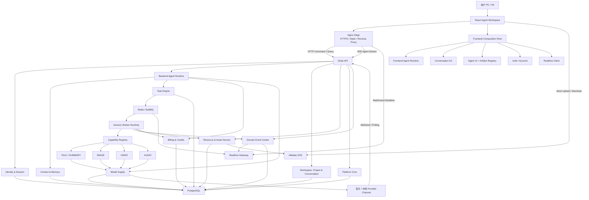
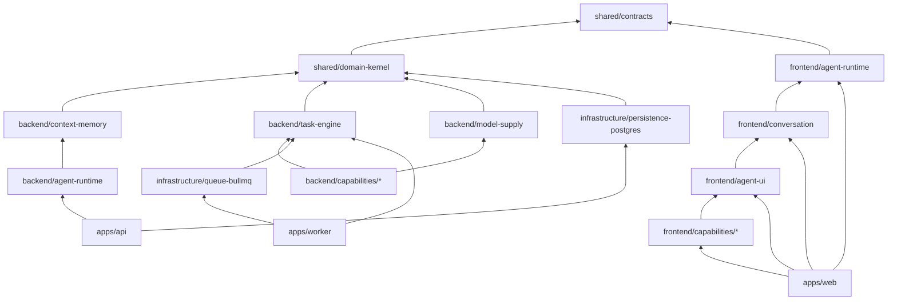
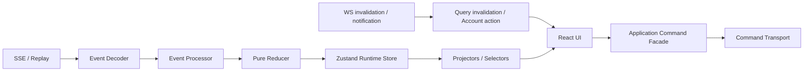
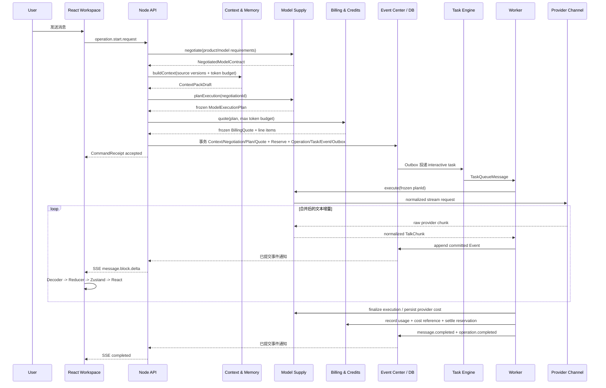

# AI Agent Platform Architecture V2.5

> 版本：2.5  
> 日期：2026-08-11  
> 技术基线：React + TypeScript + Vite + Zustand + Tailwind CSS + Node.js  
> 输入依据：`Agent-runtime-modenization.zip` 中的前端 Runtime v1.1 文档、Deep Module/统一 Agent Workspace 讨论，以及对账号、多设备、实时通道、OSS、模型供应链、产品计价与积分账本、可观察 Tool Runtime、模型规格协商、Context & Memory、Guided Skill UI、Project 信息架构、Execution Graph、批量任务、渐进素材、本地导出、状态/数据所有权、Contract 版本与 AI Engineering Governance 的多轮复审。

## 0. 架构结论

本项目采用：

> **响应式 React Web + Nginx Edge + Node 模块化单体 + Deep Module + 插件式 Capability + 事件驱动 Agent Runtime。**

完整逻辑架构固定为四层，单机和双机只改变模块部署位置：

1. Client：PC/H5 响应式 React Agent Workspace。
2. Edge：Nginx 提供 HTTPS、静态资源、反向代理、SSE/WS 转发与基础限流。
3. Application：Node API、Realtime Gateway、通用 Worker 与 Recovery Scheduler。
4. Infrastructure：PostgreSQL、Redis/BullMQ、Alibaba OSS 与外部 AI Provider。

`api`、`worker` 和 scheduler 不是微服务。它们属于同一个后端应用边界、同一数据库和同一发布版本；初期 scheduler 运行在 worker 进程中。拆进程是为了隔离连接和长任务，不是拆业务边界。

首版产品共享一套 Agent Workspace Runtime，不为生图、生视频、语音识别、总结分别复制聊天框；用户实际进入的是不同领域下的 Project：

```text
Default Assistant Agent
├── TALK       基础对话、流式文本、工具选择
├── SUMMARY    基于 TALK 模型的受约束 Skill
├── IMAGE      图片生成 Capability
├── VIDEO      视频生成 Capability
└── AUDIO      语音识别 Capability
```

其中 `IMAGE / VIDEO / AUDIO / TALK` 是模型能力类型；`SUMMARY` 是领域 Skill，不应再创造一套 Summary Model Supply、队列和聊天系统。

交互不是“所有能力都塞进纯聊天”，也不是“菜单等于一次性功能页”，而是统一 Platform Shell 下的 Project 工作单元和三种交互密度：TALK/SUMMARY 以 Chat 为主，IMAGE/VIDEO/AUDIO 使用 Guided Skill Card 进入任务，未来 Compound Domain 使用领域工作区并保留 AI Conversation。后端以十个 Deep Modules 为长期认知边界，其中 Context & Memory 统一构造受预算、可追溯的模型上下文；Model Supply 统一完成规格协商与供应路由；Billing & Credits 统一处理产品价格、报价、积分和结算；Agent Runtime 与 Task Engine 通过单一状态所有权协作有界 Execution Graph，前端 Task Center、Conversation 卡片和 Admin 只是同一执行事实的不同投影。V2.5 不增加一级模块，而是用 Module Manifest、Contract/数据所有权、Conformance Suite、统一错误协议和 AI Work Package 把这些边界变成可执行门禁。

### 0.1 首版技术选择

| 领域 | 选择 | 说明 |
| --- | --- | --- |
| Web | React 19 + TypeScript strict + Vite | SPA 首发；Agent Runtime 与 React 解耦 |
| 状态 | Zustand vanilla store + React binding | Runtime 只允许 Event Reducer 写入；UI Store 只保存交互态 |
| 样式 | Tailwind CSS + CSS Design Tokens | 先建设 Agent UI 模式，不重造 Button/Input |
| API | Node.js 24 LTS + NestJS + Fastify Adapter | Node 负责 IO 编排、SSE、Provider 调用和任务协调 |
| 数据库 | PostgreSQL + Prisma | Operation/Event/Artifact/幂等与事务事实 |
| 实时 | HTTP + SSE + WebSocket | HTTP 做命令/查询；SSE 做可恢复 Agent 流；WS 做用户级轻通知 |
| 队列与在线基础设施 | Redis + BullMQ | 队列、WS Pub/Sub、Presence、限流/缓存；不作为业务事实 |
| 对象存储 | Alibaba OSS（S3/OSS Port） | 浏览器直传直下；Provider 结果流式导入 |
| 边缘入口 | Nginx | HTTPS、静态资源、反向代理、SSE 关闭缓冲、WS Upgrade |
| 协议校验 | 共享 TypeScript Contract + Zod/JSON Schema | 所有网络输入仍从 `unknown` 开始校验 |
| 测试 | Vitest + React Testing Library + Node integration tests | Core、Contract、Adapter 和纵向切片分层验证 |

生产环境使用 Node Active/Maintenance LTS，而不是 Current。按 2026-08-11 的官方发布状态，Node 24 是 LTS，Node 26 仍是 Current。

## 1. 目标与非目标

### 1.1 首版能力范围

| Capability | 用户能力 | 执行形态 | 标准结果 |
| --- | --- | --- | --- |
| `talk.chat` | 基础多轮对话、流式回答 | 交互队列、流式事件 | Message |
| `talk.summary` | 总结文本、文件转写或会话 | 交互队列；复用 TALK Logical Model | Message + Summary Artifact |
| `image.generate` | 文生图；预留图生图 | 媒体队列、异步任务 | Image Artifact |
| `video.generate` | 文生视频；预留图生视频 | 媒体队列、异步任务 | Video Artifact |
| `audio.transcribe` | 上传音频后识别 | 媒体队列、异步任务 | Transcript Artifact |

首版 `AUDIO` 指文件型语音识别，不含电话式实时 ASR。实时 ASR 需要 WebSocket/WebRTC、音频分片、VAD 和断句协议，作为后续独立纵向切片。

### 1.2 非目标

- 不在首版拆微服务或为每个 Capability 建独立代码仓库。
- 不为每个 Agent 复制 Task、MQ、Worker、SSE、上传和聊天组件。
- 不让模型或后端下发 React 组件名、HTML、JavaScript 或任意函数。
- 不在 Node API 主线程执行 FFmpeg、图片处理、模型推理等 CPU 密集任务。
- 不在首版自研通用工作流编排器；只用有界 Execution Graph + Handler 支撑当前五种能力和受控批量执行。
- 不把 Redis、BullMQ Job 状态或 Zustand 持久化数据当业务事实来源。
- 不把 WebSocket 连接等同于登录状态；登录由持久化 Auth Session 决定，Presence 只表示暂时在线。
- 不让 Node 成为大文件中转站；上传、下载和 Provider 媒体导入均走 OSS 直传或流式管道。
- 不为未来 RN/Taro 预先实现大量平台代码；只保留端口边界和可测试的 Core。
- 不在首版建设 Campaign Engine、搜索研究平台、自动发布、营销监测或通用工作流 DSL；未来投流只是复用平台能力的业务组合。
- 不在首版引入独立向量数据库；先使用 PostgreSQL 的结构化查询/全文检索，确有语义召回需求后再启用 pgvector。
- 不让 Model Spec、Memory 或 UI Schema 成为可执行脚本；它们必须是版本化、可校验的声明式数据。

## 2. 核心原则

### 2.1 Deep Module，而不是按文件类型分层

每个一级模块必须隐藏大量实现，只公开少量稳定接口。禁止形成全局 `components/`、`hooks/`、`services/`、`utils/` 大杂烩。

一个模块至少包含：

```text
module/
├── README.md          # 职责、输入、输出、依赖、禁止依赖、故障语义
├── module.manifest.json # CI/AI 可读的所有权、公开入口、依赖与文件权限
├── index.ts           # 唯一公开入口
├── contract.ts        # 稳定接口或 Schema
├── ports/             # 本模块拥有的 inbound/outbound Port；不等于自动公开
├── internal/          # 不允许跨模块深层导入
├── testing/           # Fixture/Fake/Contract suite
└── tests/
```

`module.manifest.json` 必须通过共享 Schema 校验，至少声明 `name/kind/ownsState/ownsTables/readOnlyTables/migrationScopes/publicExports/allowedDependencies/forbiddenImports/fileZones`。它不是运行时服务发现机制，而是 Architecture Test、AI Work Package 和 Code Review 的机器可读依据。`README` 解释“为什么”，Manifest 冻结“允许什么”，`index.ts` 决定“实际暴露什么”；三者不一致时 CI 失败。

### 2.2 Command 是意图，Event 是事实

- Command 只能表达“请求执行”。`accepted` 不等于完成。
- 只有持久化并通过 Schema 校验的 Event 可以改变 Runtime 领域状态。
- UI 点击取消只发 `operation.cancel.request`；收到 `operation.cancelled` 后才显示已取消。
- 网络重试复用 `commandId + idempotencyKey`；用户主动重试创建新 Operation。

### 2.3 Reducer 是前端领域唯一写入口

```text
Command
  -> API
  -> Event Stream
  -> Decoder / Schema validation
  -> sequence check
  -> pure reduceEvent(state, event)
  -> Zustand Runtime Store
  -> Projector / selector
  -> React UI
```

React 组件、页面 Hook、Query 回调和 UI Store 都不得直接写 `operation.status`、`message.blocks`、`artifact.status` 或 `lastSequence`。

### 2.4 后端数据库事实与队列执行分离

- PostgreSQL 保存 Command 回执、Operation、Event、Artifact、TaskRun 和 ProviderJob。
- BullMQ 只负责“把哪个 TaskRun 送到哪个执行器”。
- Queue message 只携带 ID 和路由元数据，不携带大 Prompt、文件和二进制结果。
- Worker 崩溃、重复投递或 Redis 事件丢失时，可以根据数据库事实恢复。

### 2.5 Capability 是插件，不是新应用

新增能力时只需要注册：

```ts
interface CapabilityDefinition<TInput, TResult> {
  readonly code: CapabilityCode;
  readonly inputSchema: RuntimeSchema<TInput>;
  readonly executionProfile: 'interactive' | 'batch';
  readonly modelRequirement?: CapabilityModelRequirement;
  readonly admissionPolicy: 'free' | 'metered-inline' | 'metered-preflight';
  readonly handler: TaskHandler<TInput, TResult>;
  readonly producedArtifacts: readonly SchemaReference[];
}
```

它不拥有自己的 MQ、SSE、Worker 框架、上传系统或聊天状态。

### 2.6 统一 Workspace，动态 Artifact UI

PPT、图片、视频、转写、确认卡片和工具调用都进入统一 Timeline。聊天只是 Workspace 的一种交互方式；复杂产物可在右侧 Artifact Panel、Canvas 或全屏编辑器打开。

### 2.7 下游能力先确定，上游规划后生成

跨模型组合遵循：`目标 Capability -> 规格协商 -> 资源兼容计划 -> 上游 Context/Planner -> 执行`。Talk/Planner 不能先产生下游无法消费的任意输入，再把兼容问题留给 Adapter。用户选择的是分辨率、比例、时长等产品规格，不是 Provider Channel。

### 2.8 Profile、Memory 与 Conversation 不混用

- Conversation 是可审计的会话事实。
- Structured Profile 是所属业务域维护、用户可查看修改的权威事实。
- Memory 是带来源、置信度、作用域和生命周期的偏好/经验，不得覆盖权威 Profile。
- Context Pack 是某次 Operation 经过预算和策略选择后的不可变输入快照，不等于把全部历史塞进 Prompt。

## 3. 总体架构



### 3.1 运行拓扑

```text
Internet
  └─ Nginx
      ├─ /                 -> React static files
      ├─ /api/*            -> Node HTTP
      ├─ /api/ai/v1/sessions/*/stream -> Node SSE（关闭 proxy buffering）
      └─ /realtime         -> Node WebSocket Upgrade

Node deployment
  ├─ apps/api       x N：HTTP、SSE、WS、Webhook 和内部管理入口
  ├─ apps/worker    x N：通用 Worker + Recovery Scheduler
  └─ apps/migrator  x 1：数据库迁移（由部署 Job 执行）

Shared infrastructure
  ├─ PostgreSQL
  ├─ Redis：BullMQ / WS PubSub / Presence / RateLimit / Cache
  └─ Alibaba OSS
```

API 可以横向扩展。每个节点内存只保存本节点的 WS/SSE 连接；用户级跨节点通知通过 Redis 广播。SSE 只发送已提交 Event，断线后客户端从 PostgreSQL Event Log 补拉，所以不要求连接粘滞。Redis Pub/Sub 丢失一条通知不会丢业务事实，客户端仍能通过 Query/SSE Replay 收敛。

### 3.2 Runtime、Supply 与 Accounting Plane

```text
Product / Runtime Plane
  Identity / Workspace / Context & Memory / Agent Runtime / Task / Event / Asset

AI Supply Plane
  Model Catalog -> Version -> Offer -> Provider Channel -> Protocol Adapter

Accounting Plane
  Product SKU/Price Book -> Quote -> Reserve -> Usage/Upstream Cost -> Settle -> Credit Ledger

Capability Plugins
  TALK / SUMMARY / IMAGE / VIDEO / AUDIO
```

用户生成内容的链路属于 Data Plane；模型/渠道/价格/路由/凭证/积分调整后台属于 Control Plane。Control Plane 可以与 API 同进程部署，但必须使用独立 RBAC、Audit 和版本发布语义，不能让普通 Data Plane 请求直接修改供应或价格配置。

## 4. 一级模块与依赖边界

建议把人需要长期掌握的后端一级模块控制在十个；Capability 是插件集合，不计入平台一级模块：

| 模块 | 职责 | 对外公开 | 禁止承担 |
| --- | --- | --- | --- |
| Identity & Session | User、Credential、DeviceSession、Token、权限 | Auth/Session facade、`RequestPrincipal` | Presence、Agent 业务逻辑 |
| Workspace, Project & Conversation | Workspace、Project、Resource 关联、Session、Message、项目/历史查询 | Workspace/Project/Conversation facade | 解析模型流、OSS 密钥、执行调度 |
| Context & Memory | Context Pack、Token Budget、Session Context、长期偏好记忆、检索与遗忘 | `buildContext/remember/forget/search` | 冒充业务 Profile 权威库、保存全部 Prompt 历史 |
| Agent Runtime | Command 路由、Operation/Execution Graph 计划与状态推进、Agent/Skill/Tool Registry、用户可见执行投影 | `dispatch()`、`getOperation()`、Execution Tree/Public Trace | 厂商密钥、TaskRun Lease、产品计价 |
| Task Engine | 接收 Runtime 已判定可执行的节点、创建/领取 TaskRun、队列、重试、Lease、并发/限流、恢复调度、优雅停机 | `submit()`、`submitBatch()`、`claimRunnableRuns()`、`cancel()`、Handler registry | 计算 Graph 依赖、修改 ExecutionNode、图片/视频业务逻辑、通用 Workflow DSL |
| Event & Realtime | Event envelope/sequence、Outbox delivery、Replay、SSE、WS、Presence、Notification | EventWriter、Replay、Realtime facade | 定义其他模块的业务事件语义、以连接状态判断登录、决定业务终态 |
| Model Supply | Model Catalog、Capability Spec、Negotiation、Offer、Channel、协议适配、路由、成本价、健康和凭证池 | `negotiate()`、`planExecution()`、`execute()`、标准 Usage | 用户积分定价、保存 UI 状态 |
| Resource & Asset | OSS 直传、Resource/Artifact 元数据、Inspect、兼容计划、派生资源、权限与生命周期 | Upload/Download/Import/Prepare facade | 偷偷执行有损转换、Node 缓冲大文件 |
| Billing & Credits | Product Catalog/SKU、Price Book、Meter、Quote、Reservation、不可变 Ledger、Quota/Budget、成本对账投影 | `quote/reserve/settle/release/adjust` | 决定具体 Provider Channel、管理真实广告预算 |
| Platform Core | Config/Secret、日志、Health、审计、错误投影、Feature Flag、监控、内部 Admin | 纯技术横切 ports 与运维 facade | Agent/Project/Task/Model/Billing/Capability 业务语义、通用 utils 垃圾桶 |

Capabilities：`TALK / SUMMARY / IMAGE / VIDEO / AUDIO` 只提供输入 Schema、Handler、Artifact 和本地 Renderer，不拥有上述平台基础设施。

`domain-kernel` 不是第十一个模块，只是所有后端模块可依赖的最小稳定语义包。只允许后端稳定值对象/基础端口，例如 `Money`、`Clock/IdGenerator`、`RequestPrincipal`、`Result` 和 `DomainError` 基类；跨网络 Brand ID、`JsonValue`、`PageCursor` 仍以 `contracts` 为真源，Kernel 可以依赖但不得复制或反向让前端依赖后端包。禁止放入 Operation/Task/Model/Billing/Asset 服务、Helper、Repository 或“暂时不知道放哪里”的代码。Platform Core 同理只处理技术横切能力；任何包含业务名词的新增公共 API 必须回到相应 Owner 模块。

前端一级模块保持原压缩包的设计精神，但改为 React：

| 模块 | 职责 |
| --- | --- |
| `app-shell` | Router、响应式布局、Provider 和 Composition Root |
| `auth` / `account` | 登录、Refresh、设备会话、退出单台/全部设备 |
| `project` | Project 创建/切换/归档、领域分类、Project Shell 与路由组合 |
| `workspace` | Conversation/Artifact Panel/资源区的页面组合；作为 Project 内工作区 |
| `task-center` | 跨 Project 的 Operation/Execution Tree 查询投影、筛选、回跳与高亮 |
| `history` | 以已归档 Project 为单位的历史浏览与恢复 |
| `agent-runtime` | Domain、Command/Event Codec、Reducer、Recovery、Zustand Runtime Store |
| `conversation` | Timeline Projector、Composer、草稿、Viewport 状态机 |
| `agent-ui` | Message、ToolCall、Approval、Artifact、Task 等视觉模式 |
| `guided-skill` | Skill Card、受信控件 Registry、产品规格表单、提交摘要与可访问性交互 |
| `asset` | OSS 直传、上传状态、Project 素材关联、全局素材库、打包与受控下载 |
| `memory` | 用户可见的长期偏好列表、修正/遗忘和隐私设置；不保存 Runtime Context |
| `realtime` | SSE Agent Stream、WS 用户通道、重连和 invalidation |
| `billing` | 产品套餐/明细 Quote、余额、消费确认、Reservation 展示和用户 Ledger |
| `admin` | 受 RBAC 保护的 Model Supply/Billing/Task Control Plane |
| `frontend/capabilities/*` | 各 Artifact Schema 的可信 Renderer 与本地 AgentDefinition |
| `agent-ui` | Tailwind Token 与可访问基础组件；不包含 Agent 领域状态 |

### 4.1 依赖图



任何跨包调用只允许从包根 `index.ts` 导入。CI 使用目录层和 Manifest 同时阻止 `frontend -> backend/infrastructure`、`backend -> frontend/infrastructure`、`shared -> runtime layer`、Capability 直接使用 BullMQ/Prisma/Provider SDK，以及跨模块内部路径导入。Infrastructure 实现 Backend Port，但 Backend 不反向依赖具体 Adapter；`apps/api`/`apps/worker` 是装配两者的 Composition Root。

### 4.2 State Ownership Matrix

一份可变状态只能有一个 Writer Owner。其他模块只能通过公开 Command/Port 请求变更，或报告由 Owner 消费的事实；“同一事务”不等于“同一模块可以直接 UPDATE 所有表”。

| 状态 | 唯一 Writer Owner | 其他模块允许做什么 |
| --- | --- | --- |
| User/AuthSession/RefreshToken | Identity & Session | 查询 `RequestPrincipal`、请求撤销 |
| Workspace/Project/Conversation/Message | Workspace, Project & Conversation | 通过 facade 创建/查询；引用 ID |
| Operation/ExecutionGraph/ExecutionNode 逻辑状态 | Agent Runtime | Task Engine/Tool/Capability 报告执行事实，不直接更新 |
| TaskRun/attempt/Lease/checkpoint | Task Engine | Runtime 请求调度/取消并读取公开状态 |
| Domain Event payload/type | 产生该事实的领域 Owner | Event & Realtime 校验 envelope 后记录/投递，不重新解释业务 |
| Event sequence/delivery position/Outbox delivery | Event & Realtime | Producer 提交合法领域事件草案 |
| ModelNegotiation/ExecutionPlan/ProviderExecution/ProviderJob | Model Supply | Capability 使用 opaque plan/execution ID |
| Resource/Artifact/derivation/storage lifecycle | Resource & Asset | Runtime/Capability 引用 ID、请求创建/导入/归档 |
| Quote/Reservation/Settlement/CreditAccount/Ledger | Billing & Credits | 只提交 Billable Item/Usage/Cost reference，不能改余额 |
| MemoryRecord/ContextPackSnapshot | Context & Memory | Runtime 请求 build/remember/forget，不能直接写正文 |
| Config/Secret/FeatureFlag/Audit technical record | Platform Core | 通过 typed port 读取；业务模块拥有 flag key 的产品语义 |

特别冻结：Agent Runtime 拥有 Execution Graph 的逻辑节点状态；Task Engine 只拥有 TaskRun/Lease，并以 `TaskAttemptStarted/Progressed/Succeeded/Failed` 事实报告。Agent Runtime 根据事实和冻结 Graph 迁移 ExecutionNode/Operation。Resource & Asset 独立裁决 Artifact 是否 ready，Billing 独立裁决 Settlement；Worker 不能因为拿到数据库连接就顺手修改 Operation、Artifact 或 Credit。

### 4.3 Table 与 Repository Ownership

- 每张业务表在一个且仅一个 Module Manifest 的 `ownsTables` 中声明；Migration 文件归该 Owner 审核。
- Repository Port 定义在状态 Owner 模块内部，PostgreSQL 实现在 `persistence-postgres/<owner>/`；`PrismaClient`、生成的 Prisma model 和 transaction client 不从包根导出。
- Capability、API Controller、Worker Handler 与其他领域模块禁止 import Prisma、执行原始 SQL或直接读取他域 Repository。
- 禁止以“都在同一个 PostgreSQL”为理由跨模块 UPDATE/JOIN。跨域写入必须走 Owner Port；跨域输入使用版本化 snapshot/reference DTO，例如 Billing 消费 `ModelCostSnapshot`，不查询 `model_offer`。
- 跨域读模型只能由具名 Owner 声明。Task Center 的投影语义属于 Agent Runtime，通过 Workspace facade 获取 Project 摘要；若 PostgreSQL Adapter 为性能使用只读 View/JOIN，Manifest 必须列出 `readOnlyTables`、返回稳定 Projection DTO，且禁止由该 Adapter 写入这些表。
- `persistence-postgres` 是 Adapter 集合，不是第十一个领域模块或全局数据库服务；只有 Composition Root 装配具体 Repository。

同库短事务由应用层 `UnitOfWorkPort` 提供不透明 scope。`ExecutionCoordinator` 可以在一个短 Unit of Work 中调用各 Owner 的 transaction-aware Port 和 Event Outbox，但不能获得 Prisma API，也不能绕过 Owner invariant。任何 Provider/OSS/网络 IO 都必须在事务外完成。

## 5. Monorepo 目录

```text
agent-platform/
├── AGENTS.md                           # 短仓库宪法与渐进上下文入口
├── CONTRIBUTING.md                     # 人类贡献入口，与 AGENTS 解释同一规则
├── .github/
│   └── pull_request_template.md        # Work Package、边界、验证证据清单
├── apps/
│   ├── web/                            # React + Vite SPA 与前端 Composition Root
│   ├── api/                            # NestJS/Fastify HTTP、SSE、WS、Webhook、Admin
│   └── worker/                         # BullMQ consumer + Recovery Scheduler
├── packages/
│   ├── shared/                         # 极少量真正跨 Runtime 的稳定语义
│   │   ├── contracts/                  # 跨网络运行时 Schema、DTO、Brand ID
│   │   └── domain-kernel/              # 极小后端值对象/基础端口；禁止 helpers
│   ├── frontend/                       # 浏览器交互世界；禁止依赖 backend/infrastructure
│   │   ├── agent-runtime/
│   │   ├── conversation/
│   │   ├── agent-ui/
│   │   ├── guided-skill/
│   │   ├── project/
│   │   ├── workspace/
│   │   ├── task-center/
│   │   ├── history/
│   │   ├── realtime/
│   │   ├── asset/
│   │   ├── auth/
│   │   ├── billing/
│   │   └── capabilities/{talk,image,video,audio,summary}/
│   ├── backend/                        # 后端权威与十个 Deep Modules
│   │   ├── identity-session/
│   │   ├── workspace-conversation/
│   │   ├── context-memory/
│   │   ├── agent-runtime/
│   │   ├── task-engine/
│   │   ├── event-realtime/
│   │   ├── model-supply/
│   │   ├── resource-asset/
│   │   ├── billing-credits/
│   │   ├── platform-core/
│   │   └── capabilities/{talk,image,video,audio,summary}/
│   └── infrastructure/                 # 技术 Adapter；不拥有产品业务策略
│       ├── persistence-postgres/
│       ├── queue-bullmq/
│       ├── storage-oss/
│       ├── redis/
│       └── observability/
├── deploy/
│   ├── docker-compose.yml              # 2C4G 单机首发
│   ├── nginx/                          # HTTP/SSE/WS 路由配置
│   └── backup/                         # PostgreSQL 备份与恢复脚本/说明
├── prisma/
│   ├── schema.prisma
│   └── migrations/
├── docs/
│   ├── architecture/
│   ├── adr/
│   ├── contracts/
│   ├── contract-changes/              # CR proposal 与迁移记录
│   ├── work-packages/                 # AI/人工任务的允许范围与验收证据
│   └── governance/                    # Manifest/Work Package Schema、Retention policy
├── scripts/                            # Phase 0 工程与架构门禁
│   ├── check-module-manifest.mjs
│   ├── check-boundaries.mjs
│   ├── check-public-api.mjs
│   ├── check-contract-changes.mjs
│   └── check-architecture.mjs
├── pnpm-workspace.yaml
├── tsconfig.base.json
└── package.json
```

首版使用 `pnpm workspace` 即可，不要求先引入复杂构建平台。包边界稳定后再决定是否加入 Turborepo/Nx。

## 6. 共享领域与协议

### 6.1 聚合关系

```text
User
  ├─ DeviceSessions -> RefreshTokens
  └─ Owner/Tenant
      ├─ MemoryRecords（可治理偏好）
      └─ Workspace
          ├─ Resources / Artifacts（全局事实与素材库）
          └─ Projects
              ├─ ProjectResource / ProjectArtifact（关联，不复制二进制）
              └─ Sessions / Conversations
                  └─ Operations
                      ├─ ContextPackSnapshot
                      ├─ ExecutionGraph
                      │   └─ ExecutionNodes / Dependencies
                      │       ├─ Steps / ToolCalls
                      │       └─ TaskRuns（后端执行尝试）
                      ├─ Messages -> ContentBlocks
                      └─ Artifacts（由关联表进入 Project）
```

- Auth Session：一次设备登录；与 WS 是否连接相互独立。
- Workspace：Owner/Tenant 下的权限、全局文件和素材事实边界。
- Project：用户持续推进的一件事，是导航、关注与归档单位，例如“七夕海报”“新品推广”“日常咨询”。
- Session：Project 内的连续交互边界，对前端即一个 Conversation；一个 Project 可有一条主 Conversation 和零到多条辅助 Conversation。
- Operation：一次用户可感知执行，例如一次回答或一次视频生成。
- Execution Graph：一次 Operation 的有界执行计划，表达依赖、并行、批次和用户可理解的执行树，不是通用 Workflow 平台。
- TaskRun：某个可执行节点的一次后端尝试；系统重试新增 TaskRun，但不新增 Operation。
- Resource：用户输入文件或 URL；Artifact：AI 生成的版本化输出。

#### 6.1.1 Project 是正式领域对象

产品对象模型固定为：

```text
Workspace
  -> Project
     -> Conversation
        -> Operation
           -> Execution Graph（Step / Child Operation / ToolCall）
              -> TaskRun / ProviderJob / BullMQ Job（后端内部）
```

`Project` 不是目录标签，也不是 Conversation 的别名。它至少包含 `domain`、`title`、`lifecycle=active|archived`、`primarySessionId`、最近活动时间和乐观锁版本。创建“图片 Project”时，应用事务性创建 Project 与主 Conversation；PC 与 H5 使用同一模型和 API，只更换布局：

```text
PC：领域分组侧栏 -> Project -> Conversation/Workspace
H5：领域入口 -> Project 列表 -> Project Workspace
```

归档只改变用户注意力生命周期，不改变执行生命周期。允许 `Project=archived` 且 `Operation=running`；归档不得隐式取消 TaskRun。取消任务必须使用独立 Command。History 按 Project 展示并可按 `AI/IMAGE/VIDEO/CAMPAIGN/...` 过滤、恢复。

Project 创建/改名/归档/恢复使用 Project HTTP API、`expectedVersion` 和独立 Project Domain Event/Outbox；它们不伪装成必须带 `operationId` 的 Agent Event。WS 只发送 `project.updated` invalidation，客户端随后 Query 最新 Project 投影。

Resource/Artifact 的规范归属仍是 Workspace，以便跨 Project 复用和形成全局素材库；Project 通过关联实体组织自己的素材集合。删除 Project 默认只删除关联或进入软删除流程，不直接物理删除仍被其他 Project 引用的 OSS 对象。

#### 6.1.2 用户世界与执行世界严格分层

| 用户/产品世界 | 后端执行世界 |
| --- | --- |
| Project | 无对应队列对象 |
| Conversation | SSE 查询/投递范围 |
| Operation | 一次用户请求、报价、结果与主动重试边界 |
| Execution Node / Step / ToolCall | 可选地映射为可执行节点 |
| 进度与执行树 | TaskRun -> BullMQ Job -> Worker -> ProviderExecution/ProviderJob |

不是每个可见 Step 都必须创建 TaskRun，也不能把 BullMQ Job 暴露成“子任务”。只有需要独立排队、重试、Lease、并发或检查点的节点才创建 TaskRun。用户主动重试创建新 Operation 并设置 `retryOfOperationId`；系统/Provider 重试保持同一 Operation 与 Execution Node，仅增加 attempt/TaskRun。

#### 6.1.3 有界 Execution Graph

Execution Graph 是 Agent Runtime 的计划事实和 Task Engine 的调度输入，支持 `dependsOn`、有限并行、重试策略与并发键：

```ts
interface ExecutionGraph {
  readonly id: ExecutionGraphId;
  readonly operationId: OperationId;
  readonly version: number;
  readonly nodes: readonly ExecutionNode[];
  readonly dependencies: readonly ExecutionDependency[];
}

interface ExecutionNode {
  readonly id: ExecutionNodeId;
  readonly kind: 'inline-step' | 'task' | 'tool' | 'child-operation' | 'batch-unit' | 'artifact-package';
  readonly handlerCode?: string;
  readonly ordinal?: number;
  readonly concurrencyKey?: string;
  readonly retryPolicyRef?: string;
  readonly inputFingerprint: string;
}
```

它必须在入队前通过无环、节点数、深度、fan-out、并发和输入大小校验，并冻结版本。首版禁止条件表达式脚本、任意循环和用户上传 DSL；动态扩展只能由受信 Planner 在限制内追加节点并产生新图版本。简单 TALK 可只有一个节点，批量图片可有多个 batch-unit，研究任务可由并行搜索节点汇聚到报告节点。

只有当一段子工作需要独立用户生命周期、单独 Quote/Approval、可单独取消或主动重试时才建立 Child Operation；纯实现阶段使用 Step/Tool/Task Node，避免把内部函数都升级成用户任务。Child Operation 自己拥有 Execution Graph，父图只保存引用，并对跨 Operation 关系做深度和环校验。

根 Operation 的进度使用持久化计数 `expected/completed/failed/skipped` 与阶段权重投影，要求单调，不直接平均 Provider 返回的随机百分比。每个节点的幂等键至少绑定 `operationId + nodeId + ordinal + inputFingerprint`，重放不得产生重复 Artifact。

### 6.2 Operation 状态

```ts
type OperationStatus =
  | 'created'
  | 'queued'
  | 'running'
  | 'waiting_user'
  | 'completed'
  | 'failed'
  | 'cancelled'
  | 'interrupted';

type OperationOutcome = 'success' | 'partial' | null;
```

`status` 表达生命周期；`outcome` 只在 `completed` 时表达结果完整度。例如请求 100 张图、成功 96 张时为 `status=completed, outcome=partial`，而不是伪造一种新的终态。没有任何可用结果且无法继续时才是 `failed`。失败子集的用户主动重生成创建新 Operation，并引用原 Operation 与失败 ordinal。

Capability 的业务进度放在 `phase`，不能无限扩充通用 status：

```text
common admission: validating -> negotiating -> compatibility_check -> context_building -> quoting
image: validating -> submitting -> provider_processing -> storing
video: validating -> submitting -> provider_processing -> downloading -> storing
audio: uploading -> transcribing -> normalizing
talk: routing -> generating -> finalizing
summary: extracting -> summarizing -> structuring
```

有损转换确认使用 `status=waiting_user, phase=compatibility_approval`；此时没有付费 Task/Reservation。确认后进入 quoting/queued，拒绝或过期则 cancelled/failed 并保留可审计原因。

### 6.3 Command Envelope

```ts
interface UserCommandEnvelope<TType extends string, TPayload> {
  readonly schemaVersion: '1.0';
  readonly commandId: CommandId;
  readonly idempotencyKey: string;
  readonly type: TType;
  readonly workspaceId: WorkspaceId;
  readonly projectId: ProjectId;
  readonly sessionId: SessionId;
  readonly operationId: OperationId | null;
  readonly expectedVersion?: number;
  readonly issuedAt: string;
  readonly payload: TPayload;
}
```

首版命令：

- `operation.start.request`
- `operation.cancel.request`
- `operation.retry.request`
- `operation.user-input.provide`
- `workspace.resource.attach.request`
- `artifact.revise.request`
- `artifact.archive.request`

`operation.start.request` 的 input 由 `capabilityCode + inputSchema + input` 描述，不为每种能力增加一套 HTTP Controller。

### 6.4 Event Envelope

```ts
interface AgentEventEnvelope<TType extends string = string, TPayload = unknown> {
  readonly schemaVersion: '1.0';
  readonly eventId: EventId;
  readonly type: TType;
  readonly workspaceId: WorkspaceId;
  readonly projectId: ProjectId;
  readonly sessionId: SessionId;
  readonly operationId: OperationId;
  readonly rootOperationId: OperationId;
  readonly parentOperationId?: OperationId;
  readonly correlationId: string;
  readonly causationEventId?: EventId;
  readonly sequence: number;             // 单 Operation 连续递增
  readonly occurredAt: string;
  readonly payload: TPayload;
  readonly critical?: boolean;
}
```

标准事件类别：

```text
operation.created/queued/started/phase.changed/progress.changed
operation.user-input.required/user-input.accepted
operation.completed/failed/cancelled/interrupted
execution-graph.planned/node.queued/node.started/node.completed/node.failed

message.created/block.added/block.delta/block.completed/completed/failed
skill-invocation.created/validated/approval-required/submitted/failed
tool-call.created/queued/started/progress.changed/public-trace.appended/completed/failed/cancelled
agent-step.created/started/progress.changed/completed/failed/cancelled
artifact.created/processing/updated/ready/failed/archived
authorization.denied/protocol.warning
```

### 6.5 流传输游标与领域顺序分离

- `sequence` 只在单个 Operation 内保证连续，用于 Reducer 去重、补洞和冲突判断。
- Session SSE 使用服务端不透明 `deliveryCursor`，用于一条连接投递多个 Operation 的 Event。
- 客户端收到 Event 后仍按 `(operationId, sequence, eventId)` 做领域校验，不能把 SSE cursor 当领域顺序。

这允许一个 Project/Conversation 同时生成图片、视频并继续聊天，而不需要为每个 Operation 打开一条永久连接；跨 Project 的运行状态由 WS invalidation 与 Task Center Query 汇总，不把所有 Project 事件塞进当前 SSE。

### 6.6 Message 与 Artifact

```ts
type MessageContentBlock =
  | { id: MessageBlockId; type: 'text'; text: string }
  | { id: MessageBlockId; type: 'reasoning-summary'; text: string }
  | { id: MessageBlockId; type: 'resource-reference'; resourceId: ResourceId }
  | { id: MessageBlockId; type: 'skill-invocation-reference'; skillInvocationId: SkillInvocationId }
  | { id: MessageBlockId; type: 'tool-call-reference'; toolCallId: ToolCallId }
  | { id: MessageBlockId; type: 'artifact-reference'; artifactId: ArtifactId }
  | { id: MessageBlockId; type: 'citation-group'; citations: readonly Citation[] }
  | { id: MessageBlockId; type: 'unknown-safe-fallback'; originalType: string };
```

首版 Artifact Schema：

| Schema | 内容 | Renderer |
| --- | --- | --- |
| `media.image@1` | 图片资源、尺寸、prompt 摘要、模型信息 | ImageResultCard |
| `media.video@1` | 视频资源、封面、时长、状态 | VideoResultCard |
| `audio.transcript@1` | 分段文本、时间戳、语言 | TranscriptCard |
| `summary.document@1` | 标题、摘要、要点、来源引用 | SummaryCard |
| `interaction.approval@1` | 请求说明、选项、过期时间 | ApprovalCard |
| `interaction.billing-quote@1` | Product SKU 明细、预计/最大积分、fallback/partial-settlement policy 和 expiry | BillingQuoteCard |

Message 只引用 ArtifactId，不复制 Artifact 大数据。

### 6.7 安全动态 UI

后端只返回：

```json
{
  "schemaName": "media.video",
  "schemaVersion": "1.0.0",
  "data": {},
  "intents": [
    { "type": "artifact.download", "payload": { "artifactId": "..." } }
  ]
}
```

前端本地可信 Registry 决定使用哪个 React Renderer。Intent 必须通过 Application 的白名单执行器重新校验 owner、workspace、operation、artifact、capability 和 payload；Renderer 不直接导航、不直接请求 Provider。

### 6.8 Guided Skill Schema

Guided Skill 复用同一 Command/Operation，不是另一套页面协议：

```ts
interface GuidedSkillDefinitionDTO {
  readonly code: SkillCode;
  readonly version: number;
  readonly capabilityCode: CapabilityCode;
  readonly inputSchema: SchemaReference;
  readonly uiSchema: SafeUiSchema;
  readonly defaults: Readonly<Record<string, JsonValue>>;
  readonly optionSetVersion: string;
}
```

`SafeUiSchema` 只能声明字段顺序、分组、帮助文字以及本地 allowlist 控件（text/select/radio/resource-picker 等），不能携带 React 组件名、HTML、表达式或 JavaScript。可选分辨率、比例、时长等由后端根据 Product Policy 与 Model Capability Spec 投影为安全 `CapabilityOptionsDTO`；前端用于引导，提交时仍由后端重新协商和校验。

## 7. React 前端规范

### 7.1 数据流



### 7.2 Auth 与设备会话

前端启动顺序：

```text
load app shell
-> POST /auth/refresh（Refresh Cookie 自动携带）
-> Access Token 只保存在内存
-> 拉取 current user / device session
-> 申请单次 realtime ticket 并创建用户级 WS
-> 创建 owner/workspace/project Runtime
-> 打开当前 Session SSE
```

- Refresh Token 使用 host-only、窄 Path 的 `HttpOnly + Secure + SameSite` Cookie，并进行轮换/撤销；不得放入 localStorage。
- Access Token 为短期 token，保存在内存；刷新失败时原子销毁 Runtime、SSE、WS、Query Cache 和 owner 草稿命名空间。
- Account 页面展示当前和其他 `DeviceSession`，支持退出指定设备和退出全部设备。
- 收到 WS `auth.session.revoked` 后立即停止新 Command、清理本地敏感状态并进入登录页。
- WS 断开只表示离线或网络切换，不能触发本地“登出”。

### 7.3 Realtime Client

浏览器长期连接分工：

```text
HTTP   Command / Query / Auth / Upload credential / realtime ticket
WS     使用单次 ticket 鉴权；用户级轻通知、设备控制、跨端 invalidation
SSE    使用带 Authorization 的 fetch stream；当前 Session 完整可恢复事件
```

WS 收到 `conversation.invalidated`、`operation.updated` 或 `notification.created` 时，只更新轻量徽标或使 Query 失效；如果当前页面已订阅对应 Session，完整事实仍由 SSE/Event Reducer 接收。这样 WS 不复制一套 Agent 领域协议。

### 7.4 Zustand 的正确边界

使用两个类别的 Store，不使用一个全局万能 Store。

#### Runtime Store：领域事实

使用 `zustand/vanilla` 创建，每个活动的 `ownerId + workspaceId + projectId` 一个实例。公开入口只暴露 `getState()`、`subscribe()` 和 Command facade；`setState()` 只在 Runtime 内部 EventProcessor 可见。切换 Project 时可释放或缓存只读 Snapshot，禁止把整个 Workspace 的所有历史 Project 长驻内存。

```ts
interface RuntimeStoreState {
  readonly runtime: ReadonlyRuntimeState;
  readonly lifecycle: RuntimeLifecycle;
}

function commitEvent(event: AgentEventEnvelope): void {
  runtimeStore.setState(current => ({
    ...current,
    runtime: reduceEvent(current.runtime, event),
  }));
}
```

React 使用细粒度 selector：

```ts
const operation = useStore(runtimeStore, s => s.runtime.operations[operationId]);
```

禁止组件获得 `setState`。不要对 Runtime Store 使用 Zustand `persist` 中间件；EventRepository + SnapshotRepository 才负责正确性和恢复。

#### UI Store：可丢弃交互态

按功能拆小 Store：

- Workspace layout：侧栏、Artifact Panel、当前选中项。
- Composer view：弹层、工具菜单、录音 UI。
- Message view：展开、选择、动画、已读。
- Preferences：主题、密度、语言。

这些状态可以重置，不代表任务真实状态。草稿可持久化，但按 `ownerId/sessionId` 隔离。

### 7.5 Conversation Kit

Conversation Kit 保持 headless：

- `ConversationProjector`：把 Message、ToolCall、Artifact 投影成稳定 Timeline。
- `ComposerController`：文本、Resource、IME、提交、停止与草稿。
- `ViewportController`：`following | detached | restoring | loading_history`。
- `PresentationScheduler`：16–50ms 合并 React 通知，不丢领域 Event。

Timeline 稳定项：

```ts
type TimelineItem =
  | MessageTimelineItem
  | SkillInvocationTimelineItem
  | ToolCallTimelineItem
  | ArtifactTimelineItem
  | ApprovalTimelineItem
  | OperationNoticeTimelineItem;
```

### 7.6 Agent UI

优先沉淀的不是基础按钮，而是 AI 交互模式：

```text
AgentWorkspace
├── ConversationViewport
│   ├── MessageBubble
│   ├── MessageBlockRenderer
│   ├── StreamingText
│   ├── ReasoningSummary
│   ├── AgentStepTree
│   │   ├── ToolCallSummaryCard
│   │   ├── ToolPublicTrace
│   │   └── GenericToolCallCard
│   ├── ApprovalCard
│   ├── BillingQuoteCard
│   ├── TaskProgressCard
│   └── ArtifactCard
├── Composer
│   ├── ResourceAttachments
│   ├── CapabilityPicker
│   ├── LogicalModelPicker
│   ├── VoiceInputTrigger
│   └── SendOrStopButton
└── ArtifactPanel
    ├── ImageViewer
    ├── VideoPlayer
    ├── TranscriptViewer
    └── SummaryViewer
```

基础可访问性行为可以复用成熟 headless primitives；Tailwind 负责视觉层和 Token 映射，不从零实现焦点管理、Dialog、Popover 和键盘导航。

### 7.7 Observable Tool UI

前端使用本地可信 `ToolRendererRegistry`，按 Tool Schema/major version 将 `search.web`、`model.query`、`publish.post` 等映射到专用 Renderer，未知类型回退到 GenericToolCallCard。图标使用本地 `actorIconRegistry[publicActor.code]`；不加载服务端任意图标 URL。

默认视图只显示 Step 摘要、状态、参与的公开 Actor、调用数量和总耗时，例如“互联网搜索 · Google/百度 · 14 个问题 · 已完成”。展开一级看到 ToolCall，再展开看到 public query、结果计数、关键 Citation、耗时和 Quote line 解释。Public Trace 使用增量序号、分页/虚拟列表和折叠策略，避免大量工具调用拖垮 Timeline。

任务级费用只在 BillingQuoteCard 与最终 Settlement Summary 显示“预计/实际/释放”；Tool 卡上的 SKU/credits 只是解释归属，不直接驱动余额动画。失败 Tool 显示可理解错误和重试归属，但不暴露堆栈、密钥、内部 Prompt 或隐藏推理。

### 7.8 Guided Skill UI

产品交互按复杂度分三级，但都运行在同一个 Agent Workspace：

| 层级 | 适用能力 | UI 组合 |
| --- | --- | --- |
| Level 1 Chat | TALK、SUMMARY、追问和修改 | Conversation + Composer |
| Level 2 Guided Skill | IMAGE、VIDEO、AUDIO，未来 PPT | Skill Card + Conversation + Task + Artifact |
| Level 3 Compound Workspace | 未来 Campaign、研究、编辑器 | Guided Steps + Progress + Artifact Workspace；按真实需求增加业务域 |

首页的“问 AI / 生成图片 / 生成视频 / 语音转文字”创建或进入相应 Project。进入 Project Workspace 后先插入 `GuidedSkillCard`；提交后将规范化输入快照保存为 `SkillInvocationTimelineItem`，随后出现 TaskProgress 和 Artifact，用户继续用自然语言修改。刷新和多设备恢复仍能看到当时选择的规格与 Resource 引用；禁止形成 image/video/audio 各自独立聊天 Runtime。

```text
SkillDefinition + CapabilityOptionsDTO
-> SkillFormRenderer（本地可信控件 Registry）
-> client-side UX validation
-> command/quote preflight
-> backend schema + spec negotiation
-> Timeline input summary
-> Task / Artifact / follow-up Chat
```

前端展示的是产品规格，不展示 Offer、Channel、Credential 或上游价格。选项变化时保留仍合法的值，非法值回退到明确默认并告知用户，不允许静默改参数。面向老年用户优先采用大点击区域、通俗标签、渐进披露、合理默认值、提交前摘要和高费用二次确认，同时保留键盘与屏幕阅读器语义。

#### 7.8.1 Project-first 信息架构

一级入口管理 Project，而不是跳转到互不相干的功能页：

```text
AI 助手  [+]   最近 Project...
图片     [+]   最近 Project...
视频     [+]   最近 Project...
推广     [+]   未来 Campaign Project...
────────────
任务中心 [运行中数量]
素材库
历史
账户 / 积分
```

`+` 创建对应 `domain` 的 Project 和主 Conversation；点击已有项恢复该 Project 的 Timeline、运行中 Operation 与 Artifact Panel。路由固定为 `/project/{projectId}/conversation/{sessionId}?operation={operationId}`，`operation` 仅用于定位和高亮，页面事实仍从 Query/SSE 恢复。H5 不复制领域模型，只将侧栏改成“领域入口 -> Project 列表 -> Project”的逐层导航。

#### 7.8.2 Task Center 是跨 Project 读模型

Task Center 按 `Project -> Root Operation -> Execution Tree` 分组，支持领域、状态、Project/Conversation 文本和时间筛选。它查询 Project、Operation、Execution Graph 的服务端投影，不读取 BullMQ，不成为新的领域事实源。点击任一节点回到原 Project/Conversation 并定位 Operation；Conversation 只展示压缩的 Task/Tool 卡，Task Center 展示完整用户执行树，Admin 才展示 TaskRun、Worker、ProviderExecution 和 ProviderJob。

```ts
interface TaskCenterItem {
  readonly project: ProjectSummary;
  readonly rootOperation: OperationSummary;
  readonly graph: ExecutionTreeProjection;
  readonly attention: 'running' | 'waiting_user' | 'failed' | 'none';
}
```

徽标统计的是当前用户需要关注或运行中的 root Operation 数量，不统计内部 TaskRun attempt，避免系统重试让数字跳动。

#### 7.8.3 素材保存与本地导出

平台保证的默认行为是：每个成功批次立即写入 OSS、创建 Artifact，并关联到当前 Project；全局素材库通过 Workspace 归属同时可见。浏览器/H5 不能承诺静默写入用户任意本地目录。

- PC Web 可通过 `LocalExportPort` 检测 `showDirectoryPicker`，仅作为 HTTPS、用户手势触发、获得权限且浏览器支持时的渐进增强。
- 不支持或用户拒绝权限时，回退到单文件下载或服务端生成 ZIP Artifact。
- H5 以平台素材库为可靠真源，支持把选中/本次结果打包为 ZIP 后下载。
- ZIP 打包是 `artifact-package` 执行节点，流式读取 OSS 对象并生成带 manifest/checksum 的 Artifact；打包失败不删除原 Artifact，也不把已经成功的图片改成失败。
- 本地写入失败属于导出交互失败，不反向篡改已完成的生成 Operation。

### 7.9 Tailwind Design Tokens

Token 层先于业务组件：

```css
@import "tailwindcss";

@theme {
  --color-surface: oklch(0.99 0 0);
  --color-surface-muted: oklch(0.96 0 0);
  --color-content: oklch(0.2 0 0);
  --color-accent: oklch(0.62 0.19 255);
  --radius-card: 0.875rem;
  --spacing-composer: 0.75rem;
}
```

组件禁止散落任意品牌色和 magic number。Dark mode、错误/等待/完成状态、流式光标、Artifact 宽度和聊天密度都由语义 Token 控制。

### 7.10 前端 Composition Root

只有 `apps/web` 的 Composition Root 可以：

- 创建当前 owner/workspace/project Runtime。
- 注入 Auth、Command、SSE、WS、Persistence、Clock、Id、Logger、Asset ports。
- 注册可信 AgentDefinition、Skill/Artifact/Tool Schema、Form/Artifact/Tool Renderer、Actor Icon 和 IntentExecutor。
- 在登录切换时按 `stop -> flush -> dispose -> clear memory -> recreate` 执行。

页面只获得：

```ts
interface AgentApplication {
  getWorkspace(workspaceId: WorkspaceId): Promise<WorkspaceApplication>;
  getConversation(sessionId: SessionId): Promise<ConversationController>;
  dispatch(command: UserCommandEnvelope<string, unknown>): Promise<CommandReceipt>;
  executeIntent(intent: UiIntent, context: IntentContext): Promise<void>;
  dispose(): Promise<void>;
}
```

### 7.11 请求缓存边界

Agent/Logical Model 列表、Guided Skill Definition/Capability Options、Project/History 列表、Task Center 只读投影、用户资料、Memory 管理列表、Product Catalog/Price Book 公共投影、Credit Account/Ledger 和上传凭证可以使用 Query Cache；短期 Quote 由 billing feature 管理且以服务端 expiry 为准。当前 Project 中正在运行的 Operation、流式 Message、ToolCall 与 Artifact 仍由 Runtime Store 管理。Task Center Query 只用于导航和摘要，进入 Project 后由 SSE/Runtime 恢复细节；禁止同一 Operation 同时存在两份可写真相。

### 7.12 未来多端边界

首版只实现 PC/H5 响应式 React Web。`packages/frontend/agent-runtime`、`packages/frontend/conversation` 和 `packages/shared/contracts` 的平台无关内核仍不得访问 `window`、DOM、`fetch`、`File`、`Blob` 或 `localStorage`，平台差异通过 Transport、Persistence、File、Clock 和 Viewport ports 注入；但首版不为 RN/Taro 编写 Adapter 或 UI。

未来 React Native/Taro 接入时可复用协议、Reducer、Projector、Composer 和 conformance tests；平台 UI、文件选择、持久化和滚动 Adapter 分别实现。目标是复用领域与交互逻辑，不承诺 Web JSX 在 App/小程序无损复用。

## 8. Node 后端规范

### 8.1 为什么选择 Node

当前系统主要是模型 API、对象存储、数据库、Redis、SSE 和 Webhook 的 IO 编排，Node + TypeScript 与 React/Contract 共用语言，开发和 AI Coding 成本最低。

Node 的边界必须写清：

- 适合：HTTP/SSE、Provider 调用、任务编排、流解析、Webhook、轻量校验。
- 不适合：本地模型训练、长时间 CPU 推理、复杂媒体计算、在 API 线程同步运行 FFmpeg。
- CPU 工作必须交给外部模型/媒体服务、独立进程、Worker Thread 或后续 Python 服务。

采用 NestJS 是为了模块封装、依赖注入、Guard/Interceptor、测试替换和 SSE 入口；使用 Fastify Adapter 降低 HTTP 框架开销。Nest 模块默认封装 Provider，只有显式 exports 才构成公共接口，这与 Deep Module 的边界目标一致。

### 8.2 Identity & Session

登录状态由数据库中的 DeviceSession 决定，与 SSE/WS 连接状态解耦：

```text
POST /auth/login
-> verify credential
-> create auth_session（一次设备登录）
-> issue short-lived Access Token
-> issue rotating Refresh Token
-> set Refresh Token HttpOnly/Secure/SameSite Cookie
```

```ts
interface IdentitySessionService {
  login(input: LoginInput, device: DeviceContext): Promise<LoginResult>;
  refresh(refreshToken: string, device: DeviceContext): Promise<TokenPair>;
  listDeviceSessions(userId: UserId): Promise<readonly DeviceSessionView[]>;
  issueRealtimeTicket(sessionId: AuthSessionId): Promise<OneTimeRealtimeTicket>;
  revokeSession(userId: UserId, sessionId: AuthSessionId): Promise<void>;
  revokeAllSessions(userId: UserId, except?: AuthSessionId): Promise<void>;
}
```

- Access Token 建议 10–30 分钟，用于 API/SSE 和 realtime ticket 申请；Refresh Token 建议 7–30 天并设置绝对过期时间。
- Access Token 必须携带 `authSessionId`；Guard 通过短 TTL session cache（数据库回源）确认未撤销。撤销时写数据库并立即刷新/写入 revoke cache，不能只等待 JWT 自然过期。
- Refresh Token 只保存哈希、family 和轮换关系；每次刷新进行 rotation，复用旧 token 时撤销整个 family。
- `auth_session.revoked` 写数据库事实并通过 WS 通知对应设备；设备即使 WS 离线，下次 refresh/API 校验也必须失败。
- 浏览器原生 WebSocket 不能可靠设置 Authorization Header；客户端先使用 Access Token 获取短期、单次 realtime ticket，再完成 WS handshake。Ticket 使用后立即作废且不得写入日志。
- `last_active_at` 低频合并更新；在线心跳不持续写 PostgreSQL。
- Authorization 每次从服务端 principal/资源归属判断，不能信任客户端传入 ownerId。

### 8.3 Context & Memory

Context & Memory 是平台级 Deep Module，但不是“把所有聊天永久塞进 Prompt”。它统一组装模型所需上下文，并管理可控的长期偏好记忆：

首版它只是 Node 模块化单体中的一个 package，共用 PostgreSQL 和现有 Worker；不是独立 Memory Service，也不增加新的数据库进程。

```ts
interface ContextMemoryService {
  buildContext(request: BuildContextRequest): Promise<ContextPackDraft>;
  remember(command: RememberCommand, principal: RequestPrincipal): Promise<MemoryRecord>;
  revise(memoryId: MemoryId, patch: MemoryPatch, expectedVersion: number, principal: RequestPrincipal): Promise<MemoryRecord>;
  forget(memoryId: MemoryId, principal: RequestPrincipal): Promise<void>;
  search(query: MemorySearchQuery, principal: RequestPrincipal): Promise<readonly MemoryRecord[]>;
}

interface ContextPackDraft {
  readonly sourceRefs: readonly VersionedContextSourceRef[];
  readonly sections: readonly ContextSection[];
  readonly tokenBudget: TokenBudget;
  readonly renderedHash: string;
  readonly policyVersion: string;
}
```

Context 分四层：

1. Working Context：当前 Operation 的解析结果、所选 Artifact、Tool 输出和目标 Model Spec；Operation 结束后大部分可丢弃。
2. Session Context：当前 Session 的近期 Message、Summary、Artifact 和 Operation；事实仍由 Workspace, Project & Conversation 持有。
3. Long-term Memory：跨 Session 的偏好与经验，必须带 `source/provenance/scope/confidence/status/retention`，允许用户查看、修正和遗忘。
4. Semantic Retrieval：历史规模增长后，从长期记忆和允许检索的资料中召回相关片段；首版用 PostgreSQL 结构化标签/全文检索，指标证明有需要后再启用 pgvector。

权威业务资料与 Memory 严格分离。未来店铺名称、地址、主营商品、联系方式等 `BusinessProfile` 由 Campaign/Business Domain 持有，并通过 `AuthoritativeContextSourcePort` 向 Context Builder 提供版本化只读事实；Memory 只保存“中国风偏好、偏爱简短文案”等非权威偏好，不能覆盖 Profile。

Context Builder 按明确优先级和 Token Budget 组装：System Policy → authoritative profile/source → relevant memory → session summary/recent messages → relevant resources/artifacts → current request。每个 Operation 保存 `ContextPackSnapshot` 的来源 ID/版本、选择理由、预算、policy version 和 rendered hash；完整敏感正文按加密与保留策略存储或仅在执行期生成，不能无限期复制全部 Prompt。

Memory 不得把模型输出自动当事实。首版只接受用户明确保存、用户确认的提取建议或经过 allowlist policy 的低风险偏好；敏感属性默认不推断、不跨 tenant、不过度保留。来自 Resource、网页或 Memory 的文本一律视为不可信内容，与 System Instruction 分区，避免 Prompt Injection 把“资料内容”升级成系统指令。

### 8.4 Backend Agent Runtime

```ts
interface BackendAgentRuntime {
  dispatch(
    command: UserCommandEnvelope<string, unknown>,
    principal: RequestPrincipal,
  ): Promise<CommandReceipt>;

  getOperation(
    operationId: OperationId,
    principal: RequestPrincipal,
  ): Promise<OperationView>;
}
```

`dispatch()` 固定流水线：

```text
authenticate
-> authorize workspace/session
-> decode command as unknown
-> check idempotency
-> resolve Agent + Capability manifest
-> validate product input schema and entitlement
-> evaluate Capability admissionPolicy
-> [需要模型] ModelSupply.negotiate() validates Product Requirements against versioned Model/Offer Specs
-> [包含资源] AssetService.checkCompatibility() returns direct/safe-transform/approval-required/reject
-> [需要上下文] ContextMemory.buildContext() freezes source versions and token budget
-> ModelSupply.planExecution() freezes negotiation/spec/offer/routing/cost/compatibility snapshots
-> [需要计费] validate preflight quote 或 Billing.quote() freezes SKU/Price Book/billing policy
-> transactionally reserve Credits（若需要）+ create Operation/ContextPack/Plan/Quote/CompatibilityPlan/TaskRun/Event/Receipt/Outbox
-> Outbox publisher 将 TaskRun 投递给 TaskEngine/Queue
-> return accepted receipt
```

这条准入流水线只适用于创建 Operation 的执行命令。取消、Approval 回答、Artifact Intent 和纯查询按照各自 Command Policy 执行，不应为了它们创建 Model Plan 或冻结积分。`free` Capability 可以没有 Quote/Reservation；当前五种调用付费模型的 Capability 使用 `metered-inline` 或 `metered-preflight`。

存在有损转换时，Runtime 原子创建未计费的 `waiting_user` Operation + CompatibilityPlan + Approval Event，不创建 Task、不 Reserve、不调用 Provider；Approval Command 校验用户、过期时间、input/resource fingerprint 和 expectedVersion 后，才继续 Context/Plan/Quote/Reserve/Task。若是提交前 Quote UI，也可先确认转换选项再创建 Operation。两种入口最终必须产生同一种持久 CompatibilityPlan，不能静默修改输入或长时间占用积分。

Credit Reservation 与 Operation 创建必须原子完成，拒绝时不创建可执行 Task；同一幂等 Command 重试必须复用已经冻结的 Plan/Quote/Reservation，不能重新选便宜或昂贵渠道。Task 投递同样使用 Transactional Outbox，避免数据库已提交但进程在入队前崩溃造成任务永久不执行。Command Handler 不直接等待模型完成。

#### Observable Tool Runtime

ToolCall 从简单状态升级为 Agent Runtime 内部的 Deep Domain Object，但不增加第十一个基础模块。Tool Registry 定义可调用能力，Tool Execution 记录事实，Step/parent 关系形成可展开树；真正的异步、并行、重试和恢复仍复用 Task Engine。

```ts
interface ToolDefinition<TInput, TOutput> {
  readonly code: ToolCode;
  readonly kind: 'web-search' | 'model-query' | 'platform-search' | 'resource' | 'publish' | 'other';
  readonly inputSchema: RuntimeSchema<TInput>;
  readonly outputSchema: RuntimeSchema<TOutput>;
  readonly approvalPolicy: 'none' | 'required-before-side-effect';
  readonly publicTraceProjector: PublicTraceProjector<TInput, TOutput>;
  readonly defaultSkuCode?: ProductSkuCode;
}

interface ToolExecutionPort {
  execute<TInput>(toolCode: ToolCode, input: TInput, context: ToolExecutionContext): Promise<ToolExecutionHandle>;
}

interface ToolExecutionView {
  readonly id: ToolCallId;
  readonly operationId: OperationId;
  readonly stepId: AgentStepId;
  readonly parentToolCallId: ToolCallId | null;
  readonly toolCode: ToolCode;
  readonly kind: ToolDefinition<unknown, unknown>['kind'];
  readonly status: 'queued' | 'running' | 'completed' | 'failed' | 'cancelled';
  readonly publicActor: { code: string; displayName: string; iconKey: string } | null;
  readonly publicInput: JsonValue;
  readonly publicOutput: JsonValue | null;
  readonly billingQuoteLineId: BillingQuoteLineId | null;
  readonly startedAt: string | null;
  readonly completedAt: string | null;
  readonly durationMs: number | null;
}
```

`publicInput/publicOutput` 是经过 Tool 专属 Schema、脱敏、截断和引用化后的用户可见投影，不是 raw request/response。用户可以看到“搜索了什么、查到多少条、关键来源、耗时、对应报价项”，但看不到 API Key、内部认证参数、System Prompt、隐藏推理、其他租户数据或完整厂商原始响应。内部审计使用独立加密 locator、严格 RBAC 和保留策略；两层数据不得复用同一 DTO。

Tool Tree 使用 `AgentStep(parentStepId)` 与 `ToolCall(stepId,parentToolCallId)` 表达，数据库约束同一 Operation、禁止环、限制最大深度；前端默认折叠 Step，逐级展开 Tool 和 Public Trace。50 次调用不会生成 50 张顶层聊天卡。未知 Tool 使用 GenericToolCallCard 安全降级。

用户可见 Actor 是 Google/百度/逻辑模型等产品身份，不暴露 Relay/Provider Channel；`iconKey` 只索引前端本地可信 Icon Registry，服务器不得下发任意 icon URL/HTML。Tool public trace 是可验证执行证据，不是 Chain of Thought。搜索结果优先保存 Citation/Resource/Artifact 引用，而不是复制整页内容。

Tool 的 BillingQuoteLine 只用于解释总价和最终结算。系统/Provider 重试沿用同一收费语义；用户主动新研究或 revision 才产生新 Billable Item。具有外部副作用的 `publish` Tool 必须先产生 Approval，Approval 之前不能调用平台 API。

### 8.5 Task Engine

Task Engine 是基础设施 Deep Module，所有能力复用：

```ts
interface TaskEngine {
  submit(request: SubmitTaskRequest): Promise<TaskRunId>;
  submitBatch(requests: readonly SubmitTaskRequest[]): Promise<readonly TaskRunId[]>;
  claimRunnableRuns(limit: number): Promise<readonly TaskRunId[]>;
  cancel(operationId: OperationId, reason?: string): Promise<void>;
  recoverStalled(limit: number): Promise<number>;
}

interface SubmitTaskRequest {
  readonly operationId: OperationId;
  readonly nodeRef: {
    readonly graphId: ExecutionGraphId;
    readonly graphVersion: number;
    readonly nodeId: ExecutionNodeId;
  };
  readonly handlerCode: string;
  readonly inputRef: JsonValue;
  readonly retryPolicy: FrozenRetryPolicySnapshot;
  readonly concurrencyKey?: string;
  readonly idempotencyKey: string;
}

interface TaskHandler<TInput = unknown, TResult = unknown> {
  readonly code: string;
  execute(context: TaskExecutionContext, input: TInput): Promise<HandlerOutcome<TResult>>;
}

interface HandlerOutcome<TResult> {
  readonly result: TResult;
  readonly producedArtifactIds: readonly ArtifactId[];
}

interface TaskExecutionContext {
  readonly operation: AgentOperation;
  readonly signal: AbortSignal;
  readonly contextPack: ContextPackRef | null;
  readonly output: CapabilityOutputPort;   // typed delta/result；由 Runtime 转成合法 Event
  readonly progress: TaskProgressReporter; // 只报告 attempt/progress fact，不迁移 Operation
  readonly models: ModelExecutionPort;
  readonly tools: ToolExecutionPort;
  readonly assets: ResourceAssetService;
  checkpoint(value: JsonValue): Promise<void>;
}
```

业务 Handler 只能通过 typed ports 报告结果，不能直接写 SSE 或他域状态；只能通过 Model Supply/Tool Runtime/Asset ports 使用平台能力，不能 import BullMQ、Prisma、Billing Repository 或具体厂商 SDK。Quote、Reservation、Usage、Cost 和 Settlement 由 Runtime 准入层与 Agent Runtime/Application Layer 的 `ExecutionCoordinator` 统一编排，避免各 Handler 复制扣费代码。

Agent Runtime 根据冻结 Graph 唯一计算 `ready` ExecutionNode，并通过 `TaskEngine.submit/submitBatch` 提交只读 Node Reference；Task Engine 不重新计算依赖，只为这些引用创建/领取 TaskRun。Planner、Quote/Reservation、Operation、冻结 Graph、首批 ready TaskRun、Event 与 Outbox 在短事务内建立；后续 TaskAttempt outcome 由 ExecutionCoordinator 交给 Runtime 推进节点，Runtime 再提交新一批 ready references。图中 inline-step 可由 Runtime 直接完成，不强制创建 BullMQ Job。

### 8.6 队列与 Worker 复用

首版一个 Redis 集群、两个执行 lane：

| Lane | Capability | 目标 |
| --- | --- | --- |
| `agent.interactive` | TALK、SUMMARY | 低延迟、高并发、短超时 |
| `agent.media` | IMAGE、VIDEO、AUDIO | 长任务、较长超时、较低并发 |

这样避免视频任务淹没对话，又没有为每种能力复制 Task/MQ/Worker 代码。

这里的 concurrency 是“同时处理多少个异步业务任务”，不是创建多少个操作系统线程。Node 主要依赖 Event Loop + Async IO；FFmpeg、图片 CPU 处理等才进入 Worker Thread、Child Process 或外部媒体/Python 服务，绝不进入 Node API 主线程。

Queue message：

```ts
interface TaskQueueMessage {
  readonly taskRunId: TaskRunId;
  readonly operationId: OperationId;
  readonly handlerCode: string;
  readonly attempt: number;
}
```

通用 Worker 流程：

```text
load TaskRun + Operation
-> acquire/verify execution ownership
-> open ExecutionAccountingScope from frozen Plan/Quote/Reservation
-> prepare approved ResourceCompatibilityPlan（若存在）
-> resolve handlerCode from local registry
-> execute with AbortSignal
-> collect normalized Usage and Model/Tool Upstream Cost facts
-> checkpoint providerJobId/result locator
-> Task Engine marks TaskRun attempt completed/failed
-> publish typed TaskAttempt outcome through Outbox
-> Agent Runtime/Application ExecutionCoordinator consumes outcome
-> owner Ports confirm Artifact/Cost/Settlement/Graph/Operation
-> Event & Realtime commits envelope/outbox delivery facts
```

`ExecutionCoordinator` 属于 Agent Runtime/Application Layer，不属于 Worker、Task Engine 或 Capability。Worker/Task Engine 只提交 attempt 事实；Coordinator 依据冻结计划调用 Resource & Asset、Billing、Agent Runtime 与 Event & Realtime 的公开 Port，协调 Artifact 确认、Usage/Cost 归档、Settlement、Graph/Operation 迁移和 Outbox。它不能直接 UPDATE ledger/artifact/task/operation，也不能获得 Prisma；需要原子提交时通过 `UnitOfWorkPort` 让各 Owner 在同一短事务内执行自己的 invariant。任何外部 Provider/OSS IO 都不得放进数据库事务。

当视频流量独占大部分资源时，只修改 QueueRouter 配置：

```text
agent.interactive
agent.image
agent.video
agent.audio
```

Capability、HTTP API、Operation 模型和 Handler 接口均不变。Worker 仍是同一二进制，通过 `WORKER_CAPABILITIES=video` 和并发配置形成专用池。

#### 批量生成与背压

批量生成不能在 Capability 内用无限制 `Promise.all` 或手写循环直接轰击 Provider。以“生成 100 张、冻结执行计划每次最多 4 张”为例：

```text
Operation(quantity=100)
-> Negotiation: maxOutputsPerRequest=4
-> Batch Planner: 25 batch-unit nodes
-> Agent Runtime: 计算 ready batch-unit refs
-> Task Engine: 只接收 refs 并调度 TaskRuns
-> Queue lane concurrency
-> Model Supply: Offer/Credential QPS、并发、quota、429 backoff
-> 每批成功立即 Artifact + Event + Project relation
```

有效并发上限取 `产品/租户配额、Graph concurrency、queue lane、Offer 限流、Credential 限流、实例容量` 的最小值。429 进入带 jitter 的退避或冻结 Offer 内 fallback，不允许 Capability 自行加并发。每个输出绑定稳定 ordinal；重试同一 batch-unit 时先检查 ProviderExecution/Artifact 幂等事实，避免重复生成或重复入库。

完成时按实际成功输出结算：例如 Quote/Reservation 为 1000 credits，96 个有效结果产生 960 的结算且按冻结 policy 释放 40；若上游对失败请求已收费，Provider Cost 仍独立记录。用户选择“仅重生成失败 4 张”时创建新 Operation、新 Quote，并以 `retryOfOperationId + failed ordinals` 建立来源关系。

### 8.7 重试语义

- 同一 Channel 的传输级临时错误：同一 ProviderExecution 复用 upstream idempotency key；需要新 TaskRun attempt 时不重复 Quote/Reserve。
- 切换 fallback Offer：必须符合冻结 Routing/Billing Policy，并创建新的 ProviderExecution；原执行错误、Usage 和 Cost 不覆盖。
- 用户点击“重新生成”：创建新 Operation、新 Quote/Reservation，设置 `retryOfOperationId`。
- 非幂等 Provider 在提交后超时：先用 provider execution/request/job id 查询，不可盲目二次生成、二次成本或二次扣分。
- 取消与完成竞态：数据库乐观锁决定唯一终态；晚到结果可保存为审计/孤立资源，但不得把 cancelled 改成 completed。

重试与计费 reason 固定映射：Worker 崩溃恢复、系统失败重试为 `system-retry`，同一上游请求恢复/fallback 为 `provider-retry`，均不得凭 TaskRun attempt 自动新增用户收费；用户明确“重新生成/重写”创建新 Operation 和 `user-revision` Billable Item。局部文字修改是否免费由 Product SKU/Settlement Policy 判断，Runtime 不解析自然语言后擅自定价。

### 8.8 Model Supply

Model Supply 是“模型供应链”Deep Module，不只是 Provider API Adapter。内部关系固定为：

```text
Capability
  -> Product Requirements
  -> Logical Model
  -> Model Version
  -> Model Capability Spec
  -> Model Offer
  -> Offer Transport Spec
  -> Provider Channel
  -> Protocol Adapter
  -> Endpoint / Credential
```

- Model 表示用户/Agent 选择的逻辑模型，与供应渠道无关。
- Model Capability Spec 表示该 Model Version 能接受/产生的业务规格，如输入媒体、数量、尺寸、时长、分辨率、比例、格式和上下文窗口。
- Provider 表示官方厂商或中转商组织。
- Provider Channel 表示一个具体 region/baseUrl/protocol/credential pool 的接入渠道。
- Model Offer 表示“某个 Channel 可以供应某个 Model Version”，包含 upstream model code 和优先级；Offer Transport Spec 补充该渠道特有的 URL/Base64、请求体和文件限制。
- Protocol Adapter 表示 API 协议。多个 OpenAI-compatible 中转渠道复用同一个 Adapter，不为 Relay-A/Relay-B 复制客户端。

内部模块包括 Model Catalog、Model Capability Registry/Negotiation、Provider Registry、Channel/Offer、Cost Price Catalog、Routing Policy、Credential Pool、Health/RateLimit、Protocol Adapter、Usage Normalizer 和 ProviderJob；外部只看到少量接口：

```ts
interface ModelNegotiationPort {
  negotiate(request: ModelNegotiationRequest): Promise<NegotiatedModelContract>;
  getProductOptions(request: ProductOptionRequest): Promise<CapabilityOptionsDTO>;
}

interface ModelPlanningPort {
  planExecution(request: ModelPlanRequest): Promise<ModelExecutionPlanRef>;
}

interface ModelExecutionPort {
  execute(planId: ModelExecutionPlanId, input: unknown, context: ModelExecutionContext): Promise<ModelExecutionHandle>;
  resume(providerJobId: ProviderJobId, context: ModelExecutionContext): Promise<ModelExecutionState>;
  cancel?(providerJobId: ProviderJobId, context: ModelExecutionContext): Promise<void>;
}

interface ModelExecutionPlanRef {
  readonly id: ModelExecutionPlanId;
  readonly negotiationId: ModelNegotiationId;
  readonly logicalModelId: ModelDefinitionId;
  readonly modelVersionId: ModelVersionId;
  readonly capabilitySpecVersionId: ModelCapabilitySpecVersionId;
  readonly expiresAt: string;
}

interface InternalModelExecutionPlanSnapshot extends ModelExecutionPlanRef {
  readonly primaryOffer: FrozenOfferSnapshot;
  readonly fallbackOffers: readonly FrozenOfferSnapshot[];
  readonly routingPolicyVersion: string;
  readonly maxUpstreamCost: Money | null;
  readonly maxCostIncreaseRatio: number | null;
  readonly createdAt: string;
}
```

Capability 只在 Definition 中声明模型要求：

```ts
modelRequirement: {
  capabilityCode: 'image.generate',
  allowedLogicalModels: ['IMAGE_MODEL_V2'],
  requiredFeatures: ['text-to-image'],
  meters: ['image_count'],
}
```

Agent Runtime 根据该声明先调用 `ModelNegotiationPort`，再调用 `ModelPlanningPort`；Handler 执行时只向 `ModelExecutionPort.execute(operation.modelExecutionPlanId, input, context)` 传 opaque plan id。完整 `InternalModelExecutionPlanSnapshot` 只属于 Model Supply 内部和受控 Control Plane；Capability 不知道 OpenAI、豆包、Relay-A、Offer 或 Credential。

#### Capability Spec 与 Negotiation

```ts
interface ModelCapabilitySpec {
  readonly id: ModelCapabilitySpecVersionId;
  readonly modelVersionId: ModelVersionId;
  readonly capabilityCode: CapabilityCode;
  readonly input: {
    readonly resourceKinds: readonly ResourceKind[];
    readonly maxResourceCount?: number;
    readonly maxFileBytes?: number;
    readonly maxTotalBytes?: number;
    readonly mimeTypes?: readonly string[];
    readonly maxWidth?: number;
    readonly maxHeight?: number;
    readonly maxDurationSeconds?: number;
  };
  readonly output: {
    readonly maxOutputsPerRequest?: number;
    readonly resolutions?: readonly string[];
    readonly aspectRatios?: readonly string[];
    readonly formats?: readonly string[];
    readonly durationsSeconds?: readonly number[];
  };
  readonly contextWindowTokens?: number;
}
```

业务能力规格与传输规格分开，是因为同一个 Model Version 在官方渠道和中转渠道可能拥有相同的 4K/16:9 能力，却分别只接受 URL 或 Base64。`ModelCapabilitySpec` 描述模型语义能力；`OfferTransportSpec` 描述某个 Offer/Channel 的交付约束。二者均版本化、Schema 校验并进入冻结 Negotiation/Plan 快照。

```text
Product Requirements（4K / 16:9 / references）
-> 过滤符合 ModelCapabilitySpec 的 Model Versions
-> 过滤符合 OfferTransportSpec/region/compliance 的 Offers
-> 返回 NegotiatedModelContract（不含 Provider 供应细节）
-> Asset Compatibility Plan
-> Routing + Pricing + frozen ModelExecutionPlan
```

后端 Spec 是唯一真源。前端获得的 `CapabilityOptionsDTO` 只是 Product Policy、Entitlement 和当前可用 Model Spec 的安全投影，用于少走弯路；API 请求仍必须重新 Negotiation。跨模型编排时，Runtime 把下游 `NegotiatedModelContract` 的安全约束提供给上游 Planner，使它先按目标模型可接受的数量、尺寸和格式规划，而不是生成后再碰运气。

Capability Options 以 published Spec 与产品策略为主，避免瞬时健康波动让表单选项不停闪烁；执行健康仍由 Routing 实时处理。提交携带 `optionSetVersion`，配置已变化时返回 `CAPABILITY_OPTIONS_STALE`、最新安全选项和可解释差异；`MODEL_INPUT_NOT_SUPPORTED` 返回字段级原因与可选替代方案，但不能把用户选择的 4K/16:9 静默降级为 2K/1:1。

#### Model 路由

```text
Model request
-> Negotiation 找到满足 Product Requirements 的 Model Version/Spec
-> 生成 enabled Offers
-> 过滤 capability spec/transport/resource/region/credential/health/quota/compliance
-> 按 Routing Policy 对 priority/cost/latency/reliability 排序
-> 冻结 primary/fallback offer snapshots
-> 返回 ModelExecutionPlan
```

Routing Policy 必须显式包含：`allowFallback`、允许的 provider/channel、`maxUpstreamCost`、`maxCostIncreaseRatio`、地区/合规约束和稳定性阈值。不能因为便宜渠道失败就无条件切换到四倍成本渠道。

Model/Offer/Channel/Price/Policy 配置以 PostgreSQL 为事实；短期健康、熔断窗口、Credential rate limit 和并发计数可以放 Redis/进程缓存。每次 plan 保存候选过滤原因和路由版本，不改写已经冻结的审计快照。

Plan 冻结的是“允许候选集、顺序、成本规则和 fallback 边界”，不是对渠道永远可用的承诺。真正执行前仍要重新检查 Channel/Credential 是否启用、合规硬约束、实时健康、并发与 rate limit；只能在冻结候选中跳过不可用项，不能临时加入报价时不存在的新 Offer。安全禁用和 Credential 撤销始终优先于旧 Plan；无合法候选时进入可重试失败或 `waiting_user`，不得绕过策略。

Control Plane 配置采用 `draft -> validated -> published -> retired` 生命周期。只有 published 且处于生效区间的 Model/Capability Spec/Offer/Transport Spec/Policy Version 可以生成新 Negotiation/Plan；被 Negotiation、Plan、Quote 或 ProviderExecution 引用的版本保持不可变。Channel/Credential 的紧急 enabled/status 属于运行安全开关，可以阻断新调用，但不能删除历史执行快照。

用户售价在 Quote 时冻结，fallback 有三种明确策略：保持原售价由平台承担差价、在冻结上限内按原规则结算、超过上限请求用户重新确认。禁止执行后临时改变用户价格。

#### 协议与凭证

```ts
interface ModelProtocolAdapter {
  readonly protocol: 'openai-compatible' | 'volcengine' | 'gemini' | 'custom-video';
  execute(request: NormalizedModelRequest, channel: ResolvedChannelContext): Promise<RawExecutionHandle>;
  normalizeUsage(raw: unknown): readonly UsageMeasurement[];
  normalizeError(raw: unknown): NormalizedProviderError;
}
```

Credential Pool 只向 Adapter 提供短生命周期的解析结果；Capability、Event、Admin API 和日志永远看不到密钥明文。Credential 具有 enabled/status、配额窗口、并发、最后错误和 secret reference；实际 Secret 由 Config/Secret Adapter 解密获取。

#### 成本价版本与执行事实

上游价格不能写在 Adapter 或代码常量中。每个 Offer 对应有生效区间的 `cost_price_version + pricing_rule`。ModelExecutionPlan 冻结候选 Offer 的成本规则版本；每次真实调用再创建不可变 ProviderExecution：

```ts
interface ProviderExecutionSnapshot {
  readonly providerExecutionId: ProviderExecutionId;
  readonly operationId: OperationId;
  readonly taskRunId: TaskRunId;
  readonly offerId: ModelOfferId;
  readonly providerChannelId: ProviderChannelId;
  readonly credentialId: ProviderCredentialId;
  readonly logicalModelId: ModelDefinitionId;
  readonly modelVersionId: ModelVersionId;
  readonly costPriceVersionId: CostPriceVersionId;
  readonly upstreamIdempotencyKey: string;
}
```

若 fallback，创建新的 ProviderExecution，并保留前一次失败事实；Operation 链接冻结的 plan 和实际执行列表。这样既能解释“最初报价为什么这样算”，也能解释“最终实际走了哪个渠道”。

Provider 返回经 Adapter 归一为标准 Result、ProviderJob、UsageMeasurement 和 NormalizedProviderError。Model Supply 根据被冻结的 Cost Price Version 生成并持久化 Provider Cost；Billing & Credits 只消费可验证的 Usage/Cost reference 来执行产品价格和用户积分结算，不负责选择渠道或改写上游成本。原始响应可进入受控加密审计存储，但不得直接进入前端 Event。所有提交使用由 `operationId/taskRunId/providerExecutionId` 派生的稳定幂等键；非幂等调用超时后先查询 upstream job，禁止盲目重提。

Plan/Quote 的 `expiresAt` 只限制“尚未 Reserve 的准入窗口”。Operation 一旦原子 Reserve 并 accepted，已经冻结的 Plan 不会因排队或长视频生成跨过过期时间而失效；后续重试仍受该 Plan 的候选、成本和 fallback 上限约束。

### 8.9 各 Capability Handler

#### TALK

```text
validate context
-> operation.started
-> message.created + text block
-> ModelExecutionPort.execute(frozen planId)
-> 30–100ms/合理字符数合并 message.block.delta
-> 返回领域结果和标准 Usage
-> message.completed
-> return HandlerOutcome
```

不应为每个 token 写一条数据库 Event；合并只改变传输粒度，不得改变最终文本。Provider Cost 持久化、Billing settle 和 `operation.completed/failed` 终态由外层 ExecutionCoordinator 统一完成。

#### SUMMARY

复用 TALK 类 Logical Model 和 Model Supply，但使用独立输入 Schema、Prompt Policy、长度预算和结构化输出校验。总结文件时先消费 Resource/Transcript，不直接在 Summary Handler 重新实现上传和语音识别。

#### IMAGE

校验 prompt/resource -> 执行冻结 ModelExecutionPlan -> 轮询或立即得到结果 -> AssetService 入库 -> 创建 `media.image@1` -> 返回领域结果。ExecutionCoordinator 再按冻结 Quote 统一 settle，最后提交 completed。

#### VIDEO

Model Supply 提交后保存 `providerExecutionId + providerJobId`，支持 Webhook 优先、轮询兜底。Worker 可释放执行槽，由恢复调度器定时推进 ProviderJob；不能用一个 Node Promise 持有几分钟作为唯一状态。

#### AUDIO

输入必须是已完成上传的 ResourceId。Provider 输出统一为分段 transcript，生成 `audio.transcript@1`；需要总结时由另一个 Summary Operation 引用该 Artifact。

### 8.10 Event & Realtime

该一级模块内部必须分清事实与投递：

```text
Committed Domain Event
├─ Agent Stream Projector -> SSE（完整、可 replay）
├─ Realtime Projector     -> WS（轻通知/invalidation）
├─ Notification Projector -> notification table -> WS badge
└─ Background Consumer    -> Outbox/异步副作用
```

Event Center 决定并保存“发生了什么”；Realtime Gateway 只决定“如何尽快通知在线客户端”，不得反向修改领域终态。

写事件必须在一个短事务内完成：

```text
lock/update operation last_sequence
-> validate state transition
-> insert ai_event
-> update current projection
-> insert outbox
-> commit
-> outbox publisher wakes SSE and Realtime consumers
```

SSE 只发送已提交事件：

```text
GET /ai/v1/sessions/{sessionId}/stream?afterCursor=<opaque>

event: agent-event
id: <deliveryCursor>
data: <AgentEventEnvelope JSON>
```

连接步骤：先从数据库 replay，建立实时订阅，再补一次交界区间，避免“查询完成到订阅建立”之间丢事件。SSE 承担当前 Session 的高频、完整、可恢复 Agent Event Stream。

WebSocket 从首版进入 Realtime Gateway，但只承担用户级轻通知和控制：

```text
device.presence.changed
conversation.invalidated
operation.updated
notification.created
auth.session.revoked
account.status.changed
memory.changed
```

PostgreSQL 是多端状态真相，WS 只做 invalidation/notification；离线客户端漏掉 Redis Pub/Sub 消息后，通过下一次 Query/SSE Replay 收敛。双机时每个 Node 只保存本节点 socket，跨节点 `user:{userId}` 广播通过 Redis。

Presence 使用 Redis TTL，例如 `presence:{userId}:{authSessionId}`，客户端 20–30 秒 heartbeat、TTL 约 60 秒；Auth Session 表示“是否登录”，Presence 表示“最近是否在线”，两者不得合并。

Redis 在平台中承担四类非事实角色：BullMQ、WS Pub/Sub、Presence、RateLimit/Cache。Redis 丢失后允许在线状态和通知瞬时降级，Task Engine 必须从 PostgreSQL/Outbox 重建待投递任务。

### 8.11 Resource & Asset Service

Resource 是用户输入，Artifact 是 AI 输出；二者共享对象存储和授权能力，但生命周期不同。

```ts
interface ResourceAssetService {
  createUpload(input: CreateUploadInput, principal: RequestPrincipal): Promise<PresignedUpload>;
  finalizeUpload(resourceId: ResourceId, proof: UploadProof): Promise<WorkspaceResource>;
  inspect(resourceId: ResourceId, principal: RequestPrincipal): Promise<ResourceInspection>;
  checkCompatibility(input: CompatibilityCheckInput): Promise<ResourceCompatibilityPlan>;
  authorizeDownload(assetId: ResourceId | ArtifactId, principal: RequestPrincipal): Promise<SignedDownload>;
  importProviderResult(input: ProviderImportInput): Promise<StoredAsset>;
  archive(assetId: ResourceId | ArtifactId): Promise<void>;
  delete(assetId: ResourceId | ArtifactId): Promise<void>;
  cleanupExpiredUploads(limit: number): Promise<number>;
}

interface ModelResourcePreparationPort {
  prepareForModel(planId: ResourceCompatibilityPlanId, context: PreparationContext): Promise<readonly PreparedModelResource[]>;
}
```

上传与下载固定走控制面/数据面分离：

```text
Browser -> Node：申请凭证 / 权限校验 / 保存 metadata
Browser <-> Alibaba OSS：大文件直传直下
```

Node 不接收 2GB 视频再转发 OSS。Provider 临时视频也不得整文件读入 Buffer；Media Worker 使用 backpressure stream + OSS multipart upload，checkpoint 保存 external URL、uploadId 和已完成 part。缩略图、封面、转码和元数据提取先冻结 Port，只有真实需求出现后实现。

资源进入模型前固定经过：

```text
Resource metadata/inspection
-> Negotiated Model Contract + frozen Offer Transport Specs
-> Compatibility Check
   ├─ direct                  直接使用
   ├─ safe-transform          可按策略自动生成派生 Resource
   ├─ approval-required       等待用户确认转换影响
   └─ reject                  MODEL_INPUT_NOT_SUPPORTED
-> prepareForModel(compatibilityPlanId)
-> PreparedModelResource（只交给 Model Supply）
```

Compatibility Plan 记录 source resource/version、目标 negotiation/spec/offer candidates、变换步骤、效果等级、输出约束和 fingerprint。派生 Resource 保存 `derived_from_resource_id + transform_spec_version + checksum`，相同输入和转换幂等复用；源文件不覆盖。

当候选 Offers 的传输约束不同，Compatibility Plan 为每个 frozen Offer 保存 preparation branch，共享一次内容级派生，再分别生成 URL/Base64 等短期传输材料。Fallback 只能切换到已有且已批准的 branch；如果备用渠道需要更高 effect class 的新转换，必须重新 Approval，不能借 fallback 绕过用户授权。

自动转换仅允许内容不变的传输/封装处理和产品策略明确允许的无损变换。JPEG 有损压缩、降分辨率等属于 `bounded-loss`，只有用户已在 Skill 中明确选择或审批过阈值才可执行；裁切、截断视频、PDF 丢图转纯文本等 `semantic-loss` 必须 Approval 或 Reject。不能用“兼容处理”偷偷改变作品含义。

URL、Base64、multipart 等是 Offer Transport Spec，不应污染 Agent。URL 输入使用短期最小权限地址；Base64 只允许在冻结大小上限内由 Media Worker 通过受控流/临时文件准备，禁止在 Node API 主线程聚合大型文件。

`prepareForModel()` 是 Worker/Model Supply 与 Resource & Asset 之间的内部端口。Capability Handler 仍只持有原始 ResourceId 和 opaque planId，不读取 Base64、不选择转换器，也不看 Provider Transport Spec；Model Supply 执行时按 CompatibilityPlan 获取短生命周期的 PreparedModelResource。

### 8.12 Billing & Credits

本模块不是简单的 `balance -= credits`，而是 Product Catalog + Price Book + Quote Engine + Credit Account/Ledger 的 Deep Module。它把四类经济事实严格分开：

```text
Usage Measurement   使用了多少：tokens / images / video seconds / audio seconds
Upstream Cost       平台调用模型/搜索/外部工具实际付了多少法币成本
Product Price       本平台的能力/SKU 对用户卖多少，体现算法、编排和产品价值
Customer Credits    用户以积分被预留、扣除、释放或退回多少

External Spend      未来真实广告媒体预算；独立资金账户/账本，不是 AI Credits（首版不实现）
```

模型成本价属于 Model Supply，非模型 Tool 的上游成本由对应 Tool Adapter 产生；Billing & Credits 只建立只读成本对账投影。产品售价属于 Product SKU/Price Book Version，可以等于成本换算值，也可以包含编排、Prompt、报告和产品体验价值。成本、产品价和积分流水不能共用字段或用 Operation 状态相互推断。

内部固定包含：Product Catalog/SKU、Package/Billable Item Resolver、Price Book、Quote Engine、Usage Meter、Credit Account/Reservation/Ledger、Settlement/Refund/Adjustment 和 Upstream Cost Reconciliation；外部仍只暴露少量接口。

#### 外部接口

```ts
interface BillingCreditsService {
  quote(request: BillingQuoteRequest): Promise<BillingQuote>;
  reserve(quoteId: BillingQuoteId, operationId: OperationId): Promise<CreditReservation>;
  recordUsage(input: UsageMeasurementInput): Promise<void>;
  settle(reservationId: CreditReservationId, input: SettlementInput): Promise<CreditSettlement>;
  release(reservationId: CreditReservationId, reason: string): Promise<void>;
  adjust(command: CreditAdjustmentCommand, operator: RequestPrincipal): Promise<CreditLedgerEntry>;
}
```

`quote()` 接受的是 Billable Items，不是 Agent 名或任意价格；`recordUsage()` 记录统一 Meter。Provider/Tool Cost 由实际执行模块按冻结成本规则写入，Billing 只能引用不可变 Usage/Cost facts进行产品结算与成本对账，不能反向修改它们。

标准执行顺序：

```text
resolve ModelExecutionPlan
-> freeze Cost Price Versions and Routing Policy
-> resolve Product SKU / package into Billable Items
-> Billing.quote() freezes Price Book Version / line items / billing policy
-> Billing.reserve() atomically checks available balance
-> create Operation / Task / Outbox
-> execute Provider
-> record normalized Usage
-> record actual Provider Cost
-> Billing.settle() charges eligible line items and releases unused reservation
```

`INSUFFICIENT_CREDIT` 必须在调用付费 Provider 前失败。`reserve()` 与 Operation/Task 创建在同一个数据库事务边界内，使用账户行锁或乐观版本防止两个并发视频任务同时花掉同一份余额。

#### Product Catalog、SKU 与 Price Book

Product SKU 是计费单位，不是 Agent、Capability 或 Tool。当前五种能力也应使用 SKU，例如 `talk.turn`、`summary.document`、`image.generate`、`video.generate`、`audio.transcribe`；未来才可能增加 `campaign.research.base`、`search.google`、`campaign.content.initial/revision`。Campaign/Capability 只声明消费项，不知道单价、会员折扣或成本。

```ts
interface BillableItemRequest {
  readonly skuCode: ProductSkuCode;
  readonly quantity: number;
  readonly dimensions: Readonly<Record<string, string | number | boolean>>;
  readonly reason: 'initial' | 'user-revision' | 'system-retry' | 'provider-retry';
  readonly sourceRef: OperationId | ToolCallId | ArtifactId;
}

interface BillingQuoteLine {
  readonly id: BillingQuoteLineId;
  readonly skuCode: ProductSkuCode;
  readonly displayName: string;
  readonly quantity: number;
  readonly priceBookVersionId: PriceBookVersionId;
  readonly estimatedCredits: number;
  readonly maximumCredits: number;
  readonly settlementPolicy: 'fixed' | 'metered' | 'included' | 'conditional';
}
```

Product Catalog 定义 SKU 的名称、计量维度、可售状态和默认结算策略；Price Book Version 定义用户分群/套餐/生效期的价格；Package 只是多个 SKU 的用户友好预设。例如“快速分析/深度分析/自定义”最终都解析为可解释 Billable Items，不能把复杂底层查询次数直接暴露成云计算价目表。

系统重试和同一 ProviderExecution 的恢复不创建新用户收费项；Provider fallback 默认沿用原 Quote；用户主动“重新生成/重写”产生 `user-revision` 项。何种小修改免费、首次生成与 revision 价格、部分完成如何结算都属于版本化 Pricing/Settlement Policy，不写进 Agent Runtime。

#### Quote 与统一 Meter

```ts
type UsageMeter =
  | 'request_count'
  | 'input_tokens'
  | 'cached_input_tokens'
  | 'output_tokens'
  | 'image_count'
  | 'audio_seconds'
  | 'video_seconds'
  | 'video_720p_seconds'
  | 'video_1080p_seconds';

interface BillingQuote {
  readonly id: BillingQuoteId;
  readonly accountId: CreditAccountId;
  readonly modelExecutionPlanId: ModelExecutionPlanId;
  readonly requestFingerprint: string;
  readonly lines: readonly BillingQuoteLine[];
  readonly estimatedCredits: number;
  readonly maximumCredits: number;
  readonly partialSettlementPolicy: 'all-or-nothing' | 'completed-items' | 'manual-review';
  readonly fallbackBillingPolicy: 'platform-absorbs' | 'within-frozen-limit' | 'require-approval';
  readonly expiresAt: string;
}
```

Quote 绑定 principal/tenant、账户、Capability/Skill/optionSet version、Negotiation/Model Plan、Compatibility Approval、规范化输入与所引用 Resource/Artifact 版本的 fingerprint，以及过期时间，不能换参数或换资源复用。昂贵或需用户确认的能力先调用 Quote API，`operation.start.request` 携带 quoteId；常规 TALK 可在用户授权的 auto-spend limit 内由 Runtime 内联 quote。Reserve 时必须重新校验 Quote 未过期、未使用、归属一致且 request fingerprint 相同，防止报价后替换输入造成 TOCTOU。

Quote UI 显示用户可理解的 line items、套餐包含项、预计/最大总额和余额；执行期间 ToolCall 可以引用对应 `billingQuoteLineId` 解释“这一步包含/消耗多少”，但余额只按 Operation Reservation/Settlement 更新，不让每个底层 Query 在界面上反复跳账。最终展示“预计、实际、释放/退款”三项即可。

TALK 等用量后置能力按请求上限预留，例如最多 500 credits，实际 173 时 charge 173、release 327；Provider 请求中的 max output/token budget 必须与该上限一致，避免实际用量无界超过 Reservation。若产品允许超额，需要在执行前追加 Reservation 或停止生成，不能事后制造负余额。IMAGE/VIDEO/AUDIO 根据分辨率、质量、时长、音轨等输入生成 Quote。Pricing Rule 是经过 Schema 校验的声明式数据和版本，不允许后台注入任意 JavaScript。

#### Credit Account、Reservation 与不可变 Ledger

- `credit_account` 保存 `available_balance + reserved_balance + version` 的当前投影。
- `credit_reservation` 以 Operation 唯一，状态为 `active | settled | released | expired`。
- `credit_ledger` 是不可变流水；禁止 UPDATE/DELETE 历史。扣错时追加 REFUND/ADJUSTMENT，不篡改原 CHARGE。
- Ledger 使用整数 credits，法币使用整数最小货币单位 + currency，禁止浮点金额。
- `ADMIN_GRANT`、`ADMIN_DEBIT`、`RESERVE`、`CHARGE`、`RELEASE`、`REFUND`、`ADJUSTMENT` 都记录 operator、reason、operation 和幂等键。
- 首版人工发积分只调用 `adjust(ADMIN_GRANT)`；未来微信/支付宝/Stripe 只是新的 credits source，不改变账本核心。

Reservation 的 expiry 只回收“已 Reserve 但 Operation 从未合法启动”的孤儿准入。运行中长任务不能因为墙钟过期自动释放余额；Scheduler 回收前必须锁定 Reservation 并核对 Operation/TaskRun/ProviderExecution 状态。任何 settle/release/expire 竞争都由状态条件更新和幂等键保证只有一个结果。

#### 失败与成本策略

Operation 失败不等于上游没有收费。每次 ProviderExecution/ToolExecution 独立记录 usage/cost status：

```text
Provider/Tool 已收费 + 后续聚合或 OSS 导入失败
-> Upstream Cost 保留
-> Operation failed
-> Customer Billing Policy 决定 charge / release / refund / manual_review
```

平台必须能表达 `upstream_cost > 0` 且 `customer_charge = 0`。Fallback 成本上涨也不能自动转嫁给用户：售价以 Quote 冻结，超过 policy 上限时由平台承担差价或进入 `waiting_user` 重新确认。

部分渠道只能按 Price Version 计算预计成本，部分渠道会返回真实账单用量。因此 Upstream Cost 状态区分 `estimated | confirmed | adjusted`；后续对账通过追加 adjustment 记录修正，不覆盖原成本事实。

Quota、Budget 和并发限制仍属于本模块：持久规则在 PostgreSQL，高频 Rate Limit 可在 Redis；拒绝、预留、结算和调整事实必须落库。同一 `operationId/providerExecutionId/meter` 的 Usage/Cost 和同一 Reservation 的结算均幂等。

#### External Spend 边界

未来抖音/百度等真实广告预算属于受监管的外部资金，不是积分、Product Price 或 Upstream API Cost。首版不创建 Ad Wallet、不代扣媒体费，也不把“500 元广告预算”换成 credits 混入 Credit Ledger。未来若实现，必须由 Campaign/Payment 侧独立的 External Spend Account/Ledger、充值退款、对账和审批机制承担，Billing & Credits 只引用预算授权结果。

### 8.13 Recovery Scheduler 与 Lease

Scheduler 是 Task Engine 的明确内部角色，初期运行在 `apps/worker`：

```text
re-publish pending outbox
recover stalled task runs
poll provider_job.next_poll_at
timeout operations
retry eligible failures
cleanup orphan uploads
deliver pending notifications
```

不能依赖“只有一个 Scheduler”。多个实例使用带 `lease_owner/lease_until` 的原子抢占，或 PostgreSQL `FOR UPDATE SKIP LOCKED` 领取批次；任务操作保持幂等。这样一台 2C4G 与两台 4C8G 使用相同代码。

### 8.14 Graceful Shutdown 与 Platform Core

API 收到 SIGTERM：停止接收新请求，拒绝新 WS，等待短请求，关闭 SSE/WS，flush 日志与 telemetry 后退出。

Worker 收到 SIGTERM：

```text
pause queue consumption
-> stop claiming scheduler leases
-> wait bounded short tasks
-> abort/checkpoint long tasks
-> release lease / leave recoverable TaskRun
-> close Redis/DB/telemetry
-> exit
```

Platform Core 统一提供 Config/Secret、RequestId、结构化错误、Health/Readiness、日志/Trace、审计和内部 Admin。Capability 不得直接读取 `process.env`；只有 Model Supply、OSS Adapter 等基础设施 Adapter 能通过 ConfigService 获得对应 Secret。

### 8.15 统一 Error Contract 与 Feature Flag

所有跨模块/API/Worker 边界使用统一错误语义，禁止前端、Task Engine 或 Billing 解析异常 message 字符串：

```ts
interface PlatformErrorDTO {
  readonly code: PlatformErrorCode;
  readonly category:
    | 'validation' | 'authorization' | 'conflict' | 'provider'
    | 'quota' | 'billing' | 'temporary' | 'internal';
  readonly retry: {
    readonly kind: 'never' | 'backoff' | 'fallback' | 'after-user-action';
    readonly retryAfterMs?: number;
  };
  readonly userMessageKey: string;
  readonly safeDetails?: JsonValue;
  readonly correlationId: string;
}
```

`retryable: boolean` 可作为 UI 派生值，但不能成为调度真源，因为“可重试”还需要区分同 Offer 退避、冻结策略内 fallback 和用户修正输入。Adapter 将未知异常映射为 `INTERNAL_UNEXPECTED/retry.kind=never`，并仅在内部日志保存 cause；只有 allowlist safeDetails 进入客户端。Task Engine 同时检查 Error Contract、节点 retry policy、attempt 上限、幂等能力和取消状态，不能仅凭 category 自动重试。

Platform Core/`contracts` 拥有 Error envelope、分类和安全投影；各领域模块在 Manifest 中拥有自己的稳定 error code namespace 与含义，例如 `MODEL_*`、`BILLING_*`。Code 全局唯一，跨模块只能返回已注册的 typed error；Platform Core 不替领域决定错误语义。

最小错误码必须在 Phase 0 冻结：`VALIDATION_FAILED`、`AUTHORIZATION_DENIED`、`VERSION_CONFLICT`、`MODEL_INPUT_UNSUPPORTED`、`PROVIDER_RATE_LIMITED`、`PROVIDER_TEMPORARY_UNAVAILABLE`、`INSUFFICIENT_CREDITS`、`QUOTA_EXCEEDED`、`OPERATION_CANCELLED`、`INTERNAL_UNEXPECTED`。错误码语义变更按 Public Contract 版本策略处理。

Platform Core 从 Phase 1 提供极简 `FeatureFlagPort`，初期使用 PostgreSQL 配置与短 TTL cache，无需外部平台。Flag key 由使用模块在 Manifest 声明，例如 `image.batch.enabled`、`memory.auto-suggest.enabled`；变更需 RBAC、Audit、默认值和失败安全值。Feature Flag 只能控制发布/回滚，不能取代权限、Billing、Schema Migration 或长期业务状态。

## 9. 数据模型

### 9.1 核心表

| 表 | 关键字段/约束 |
| --- | --- |
| `app_user` | email/phone、password_hash、status、版本与审计时间 |
| `auth_session` | `user_id, device_id/name, user_agent, ip, last_active_at, expires_at, revoked_at` |
| `auth_refresh_token` | token hash、family、rotation parent、expires/revoked/used_at；不保存明文 |
| `ai_workspace` | `id, owner_id, tenant_id, version` |
| `ai_project` | `workspace_id, domain, title, lifecycle(active/archived), primary_session_id, last_activity_at, version`；注意力生命周期独立于任务状态 |
| `ai_resource` | `workspace_id, kind, mime_type, storage_key, checksum, status`，以及 inspect 后的尺寸/时长/页数/codec 元数据 |
| `ai_resource_derivation` | `source_resource_id, derived_resource_id, transform_spec_version, fingerprint, effect_class`；保留派生链 |
| `ai_project_resource` | `(project_id, resource_id)` 唯一、role/created_at；只关联 Workspace 资源 |
| `ai_project_artifact` | `(project_id, artifact_id)` 唯一、role/created_at；支持同一 Artifact 被多个 Project 引用 |
| `ai_session` | `workspace_id, project_id, agent_type, title, version` |
| `ai_operation` | `project_id, session_id, root_operation_id, parent_operation_id, retry_of_operation_id, capability_code, ... , status/outcome/phase/progress/version` |
| `ai_execution_graph` | `operation_id, graph_version, status, limits_snapshot, counters, plan_fingerprint`；版本冻结 |
| `ai_execution_node` | `graph_id, kind, handler_code, ordinal, status, concurrency_key, retry_policy_ref, input_fingerprint, progress` |
| `ai_execution_dependency` | `(graph_id, predecessor_node_id, successor_node_id)` 唯一；同图且禁止成环 |
| `ai_event` | `operation_id, sequence, event_id, type, payload, occurred_at, delivery_position` |
| `ai_message` | 当前 Message 投影 |
| `ai_message_block` | 当前 ContentBlock 投影；流式文本可分段或最终合并 |
| `ai_agent_step` | `operation_id, parent_step_id, code/title, status/progress, sequence`；可展开阶段树 |
| `ai_tool_call` | `operation_id, step_id, parent_tool_call_id, tool_code/kind, status, public_actor, public_input/output, billing_quote_line_id, timing` |
| `ai_tool_public_trace` | `tool_call_id, sequence, schema/version, safe payload`；只追加的用户可见证据 |
| `ai_tool_execution_audit` | Tool 原始请求/响应的受控加密 locator、retention、access classification；不进入普通 Query/Event |
| `ai_skill_invocation` | `operation_id, skill_code/version, input_schema_version, option_set_version, normalized_input, resource refs, status`；Timeline 可恢复输入事实 |
| `ai_artifact` | `workspace_id, operation_id, execution_node_id, schema_name, schema_version, ordinal, version, status, data/storage_locator` |
| `ai_command_receipt` | `(principal_scope, idempotency_key)` 唯一 |
| `ai_task_run` | `operation_id, execution_node_id, handler_code, attempt, status, checkpoint, lease_owner/until, error`；attempt 是内部事实 |
| `context_pack_snapshot` | Operation 的 source refs/versions、token budget、policy version、rendered hash、敏感正文 retention locator |
| `memory_record` | owner/tenant/scope、kind、content、source/provenance、confidence、status、retention、用户确认/删除时间；可选 embedding |
| `model_definition` | logical model code、display name、family、status；不绑定 Provider/单一 Capability |
| `model_version` | `model_id, version_code, release metadata, lifecycle`；能力约束只进入独立 Spec Version |
| `model_capability_spec_version` | `model_version_id, capability_code, version, declarative input/output/context constraints, lifecycle` |
| `provider` | 官方厂商或中转商组织 code/name/status |
| `provider_channel` | `provider_id, protocol, base_url, region, enabled` |
| `model_offer` | `model_version_id, channel_id, upstream_model_code, priority, enabled` |
| `offer_transport_spec_version` | `offer_id, version, url/base64/multipart/request constraints, lifecycle` |
| `provider_credential` | `channel_id, secret_ref/encrypted_secret, status, quota/concurrency metadata` |
| `cost_price_version` | `offer_id, version, effective_from/to, currency, declarative_pricing_rule` |
| `model_routing_policy` | allowFallback、候选过滤/排序、成本涨幅、地区和可靠性约束的版本 |
| `model_negotiation` | product requirements、spec/transport versions、eligible model versions/offers、拒绝原因和安全下游约束快照 |
| `model_execution_plan` | Operation 冻结的 primary/fallback offer、cost versions、routing policy snapshot、过滤原因和 admission expiry |
| `resource_compatibility_plan` | resource/version、negotiation/spec/transport refs、direct/transform/approval/reject、步骤与 fingerprint |
| `provider_execution` | 每次实际调用的 offer/channel/credential/cost version/idempotency/status |
| `ai_provider_job` | `provider_execution_id, provider_channel_id, external_job_id, status, next_poll_at, lease_owner/until, raw_locator` |
| `ai_outbox` | 已提交待发布事件/任务/Realtime 通知，含 status/attempt/next_attempt_at |
| `usage_measurement` | `operation/provider_execution/meter/quantity/dimensions`，只记录使用量 |
| `provider_cost_record` | `provider_execution, offer, cost_price_version, currency, amount_minor, status` |
| `tool_upstream_cost_record` | `tool_call_id, adapter/external provider, cost rule version, currency, amount_minor, status` |
| `product_sku` | 稳定 sku code、display name、meter/dimensions、settlement policy、status；不是 Agent |
| `price_book_version` | 用户分群/套餐、currency=credits、生效区间、published lifecycle |
| `price_book_entry` | `price_book_version_id, sku_id, declarative pricing rule, min/max` |
| `credit_account` | `owner_id, available_balance, reserved_balance, version` |
| `billing_quote` | principal/account、Capability/Skill、request fingerprint、price book version、estimated/max credits、partial/fallback policy、expiry |
| `billing_quote_line` | `quote_id, sku_id, quantity/dimensions, source_ref, reason, estimated/max credits, settlement policy` |
| `credit_reservation` | `account_id, operation_id, billing_quote_id, amount, status, expires_at` |
| `billing_settlement` | quote/reservation、actual line results、charge/release/refund/manual-review、policy version、idempotency key |
| `credit_ledger` | 不可变积分流水，含 type、available/reserved delta、operation、operator、reason、balance_after |
| `quota_policy` | user/tenant/plan 的次数、媒体量、并发和预算规则 |
| `notification` | 用户通知类型、关联实体、已读/未读、创建时间 |
| `feature_flag` | `key, enabled, conditions/version, safe_default, owner_module, updated_by`；Platform Core 技术存储、业务 key 由 Owner 声明 |
| `audit_log` | 登录、设备撤销、后台操作、权限/配置敏感变更 |

唯一约束：

- `(operation_id, sequence)` 唯一。
- Project、Session、Operation、Resource 和 Artifact 必须位于同一 Workspace；Project 归档不改变 Operation/TaskRun 状态。
- Execution Graph 依赖的两端必须属于同一 graph；提交前校验 DAG、最大节点数/深度/fan-out/concurrency。
- `(execution_node_id, attempt)` 唯一；同一节点同一 attempt 只能有一个 TaskRun。
- `(operation_id, execution_node_id, ordinal, artifact_fingerprint)` 唯一，保证批次重放不重复产物。
- Agent Step 的 parent 必须属于同一 Operation；ToolCall 的 step/parent 必须属于同一 Operation，禁止环并限制最大深度。
- `(tool_call_id, public_trace_sequence)` 唯一；Public Trace 只追加，Audit locator 不允许出现在普通 Event payload。
- `event_id` 唯一。
- `idempotency_scope + idempotency_key` 唯一。
- `provider_channel + external_job_id` 唯一。
- Refresh token hash 唯一；同一个 token 只能成功消费一次。
- Model/Provider/Channel/Offer 使用稳定 code；历史 ID 不复用。
- Capability/Transport Spec Version 一经 Negotiation/Plan 引用不可修改；发布新版本，不覆盖历史约束。
- Resource derivation 以 `source version + transform fingerprint` 幂等；派生文件不覆盖源文件。
- Memory 读取/修改/遗忘必须带 owner/tenant scope；已删除或过期记录不能进入新 Context Pack。
- ProviderExecution 的 upstream idempotency key 唯一；fallback 创建新 ProviderExecution。
- Usage 以 `operation_id + provider_execution_id + meter + dimensions_hash` 幂等。
- Provider Cost 以 `provider_execution_id + cost_component` 幂等。
- Tool Upstream Cost 以 `tool_call_id + cost_component` 幂等。
- 每个 Operation 最多一个 active Credit Reservation；Ledger command idempotency key 唯一。
- Product SKU code 稳定；Price Book Version/Entry、Billing Quote/Line 和 Settlement 一经引用不可修改，变价新增版本。
- Artifact revise 使用 `expectedVersion` 乐观并发。

首版数据库至少建立并以 `EXPLAIN`/集成查询验证以下访问路径：`ai_project(workspace_id, domain, lifecycle, last_activity_at)`、`ai_operation(project_id, status, updated_at)`、`ai_event(operation_id, sequence)`、`ai_event(delivery_position)`、`ai_task_run(status, lease_until)`、`ai_provider_job(status, next_poll_at)`、`ai_outbox(status, next_attempt_at)`、`credit_ledger(account_id, created_at)` 和 `ai_execution_node(graph_id, status, ordinal)`。只有真实查询量证明需要时才增加物化投影，不预建 ElasticSearch 或独立任务中心数据库。

credits 与法币金额都使用整数；法币同时保存 currency，不能使用浮点金额。大文件、完整厂商响应和大 Artifact data 存对象存储，数据库只存可查询元数据和受控 locator。

当前基础平台不创建 `business_profile/campaign/post/metrics` 表。未来 Campaign Domain 出现时由该业务域拥有这些权威表，Context & Memory 仅通过版本化 Context Source 引用，避免提前把营销模型塞进通用 Memory。

### 9.2 Event Log 不是极端 Event Sourcing

Event 是协议事实与恢复依据，同时维护 Operation/Message/Artifact 当前投影以便查询。二者必须同事务更新。读取页面不需要每次从零重放全历史；客户端恢复仍可通过 Event + Snapshot 验证一致性。

### 9.3 前端持久化

- IndexedDB：Runtime Snapshot、Event cursor、Workspace 元数据、草稿。
- localStorage：只保存主题、语言等轻量偏好。
- Snapshot 按 owner/workspace 命名空间隔离。
- 恢复顺序：校验 owner -> 加载兼容 Snapshot -> 本地 delta -> 服务端 replay -> 建立 SSE。
- Snapshot 只是加速，不替代服务端事实。

### 9.4 Redis 数据分类

```text
BullMQ keys                       可从 PostgreSQL Outbox/TaskRun 恢复投递
realtime:user:{userId}            Pub/Sub，不持久化业务事实
presence:{userId}:{authSessionId} TTL 在线心跳
realtime-ticket:{ticketHash}       单次、短 TTL 的 WS 握手票据
ratelimit:{scope}:{key}           短期计数/令牌桶
model-health:{channel/offer}       短期健康/熔断视图，历史指标另行持久化
cache:*                           可丢弃派生缓存
revoked-session:{sessionId}       可选的短期拒绝缓存，数据库仍是最终事实
```

Redis Pub/Sub 是 at-most-once；因此 WS 消息必须是轻通知，不能成为 Message/Operation/Notification 的唯一副本。

### 9.5 Retention Matrix

保留策略由数据 Owner 在 Manifest 引用版本化 Policy，Scheduler 只执行，不自行决定删除。具体天数由法务、客服、成本与产品配置冻结；开工前必须先明确“长期/周期归档/短期/用户控制”类别：

| 数据 | 默认类别 | 删除/归档原则 |
| --- | --- | --- |
| Project/Conversation/Message | 用户控制的长期数据 | 软删除、恢复窗口、随后按 policy 清理 |
| Resource/Artifact | 用户控制的长期数据 | 引用计数/关系检查后清 OSS；法务冻结例外 |
| MemoryRecord | Policy + 用户可治理 | 过期/遗忘后不进入新 Context，异步物理清理 |
| Event/Public Tool Trace | 周期归档 | 保留恢复窗口；旧 delta 可压缩为 snapshot/final block |
| Raw Tool Audit/Provider raw response | 短期高敏 | 加密、严格 RBAC，到期删除正文 locator |
| TaskRun/ProviderJob | 周期归档 | 保留故障与账务引用，checkpoint 可压缩 |
| Completed Outbox/Notification | 短期或周期清理 | 仅在确认投递/可重建后清理 |
| Refresh Token history/Audit Log | 安全审计周期 | 不保存 token 明文；按安全 policy 清理 |
| OSS multipart/orphan temp object | 短期 | Scheduler 定期中止/删除，不影响已确认 Artifact |
| Billing Quote/Settlement/Credit Ledger/Cost | 财务审计 policy | Ledger 不可变；删除受账务与法规策略约束 |

任何 retention 变更都写 Audit；跨表删除使用 Owner 的清理命令和幂等批次，禁止通用 Scheduler 直接级联删除他域数据。

## 10. HTTP API

除 `/realtime` 外，下面所有 HTTP/SSE 路径在公网统一挂载于 `/api` 前缀；表中省略该公共前缀。

```text
POST   /auth/register
POST   /auth/login
POST   /auth/refresh
POST   /auth/logout
POST   /auth/realtime-ticket
GET    /auth/sessions
DELETE /auth/sessions/{id}
DELETE /auth/sessions

GET    /ai/v1/agents
GET    /ai/v1/skills
GET    /ai/v1/capabilities/{code}/options?logicalModel=...

POST   /ai/v1/workspaces
GET    /ai/v1/workspaces/{id}
POST   /ai/v1/workspaces/{id}/projects
GET    /ai/v1/workspaces/{id}/projects?domain=...&lifecycle=...
GET    /ai/v1/projects/{id}
PATCH  /ai/v1/projects/{id}
POST   /ai/v1/projects/{id}/archive
POST   /ai/v1/projects/{id}/restore
GET    /ai/v1/projects/{id}/artifacts
POST   /ai/v1/workspaces/{id}/resources/uploads
POST   /ai/v1/workspaces/{id}/resources/{resourceId}/complete
GET    /ai/v1/resources/{id}/inspection
POST   /ai/v1/compatibility-checks
GET    /ai/v1/resources/{id}/download

POST   /ai/v1/sessions
GET    /ai/v1/sessions/{id}
GET    /ai/v1/sessions/{id}/events?afterCursor=...
GET    /ai/v1/sessions/{id}/stream?afterCursor=...

POST   /ai/v1/commands
POST   /ai/v1/quotes
GET    /ai/v1/operations/{id}
GET    /ai/v1/operations/{id}/execution-tree
GET    /ai/v1/operations/{id}/tool-tree
POST   /ai/v1/operations/{id}/retry-failed
GET    /ai/v1/tool-calls/{id}/public-trace?afterSequence=...

GET    /ai/v1/task-center?domain=...&status=...&query=...&cursor=...

GET    /ai/v1/artifacts/{id}
GET    /ai/v1/artifacts/{id}/download
POST   /ai/v1/artifact-bundles

POST   /ai/v1/provider-webhooks/{provider}

GET    /notifications
POST   /notifications/{id}/read

GET    /credits/account
GET    /credits/ledger
GET    /billing/products?capability=...
GET    /billing/quotes/{id}
GET    /billing/settlements/{operationId}

GET    /memory
POST   /memory
PATCH  /memory/{id}
DELETE /memory/{id}

WS     /realtime

GET    /admin/tasks
GET    /admin/provider-jobs
GET    /admin/queues
GET    /admin/events/{operationId}
GET    /admin/models
POST   /admin/models
POST   /admin/model-versions
POST   /admin/models/{id}/publish
GET    /admin/model-capability-specs
POST   /admin/model-capability-specs
POST   /admin/model-capability-specs/{id}/publish
GET    /admin/providers
POST   /admin/providers
GET    /admin/model-offers
POST   /admin/model-offers
GET    /admin/offer-transport-specs
POST   /admin/offer-transport-specs
POST   /admin/offer-transport-specs/{id}/publish
GET    /admin/provider-channels
POST   /admin/provider-channels
GET    /admin/provider-credentials
POST   /admin/provider-credentials
POST   /admin/provider-credentials/{id}/disable
GET    /admin/cost-price-versions
POST   /admin/cost-price-versions
GET    /admin/sell-price-versions
POST   /admin/sell-price-versions
GET    /admin/routing-policies
POST   /admin/routing-policies
POST   /admin/routing-policies/{id}/publish
GET    /admin/usage
GET    /admin/provider-costs
GET    /admin/tool-executions
GET    /admin/tool-upstream-costs
GET    /admin/product-skus
POST   /admin/product-skus
GET    /admin/price-books
POST   /admin/price-books
POST   /admin/price-books/{id}/publish
GET    /admin/credits/accounts/{userId}
GET    /admin/credits/ledger
POST   /admin/credits/adjustments
GET    /health/live
GET    /health/ready
```

所有路径都从认证上下文获取 owner/tenant，并再次验证 workspace/project/session/resource 归属。客户端传来的 ownerId 不作为授权依据。Task Center 返回用户执行投影，禁止包含 TaskRun lease、BullMQ job id、Credential 或 Provider Channel。`/admin` 只允许内部角色并写 `audit_log`；Webhook 使用独立验签和重放保护，不能复用普通用户鉴权。

`POST /artifact-bundles` 接收已授权 Artifact IDs、目标 Project、命名策略和幂等键，创建关联 Operation/`artifact-package` 节点并最终返回 ZIP Artifact；API 不同步等待或在 Node API 内存中拼 ZIP。`retry-failed` 只读取原 Graph 的失败 ordinal 并重新走 Quote/Command 准入，客户端不得伪造“失败项”获得低价。

## 11. 关键交互时序

### 11.1 基础对话



### 11.2 视频生成

```text
用户命令
-> accepted + operation.queued
-> media worker 提交 Provider
-> 保存 providerJobId/checkpoint
-> Webhook 或 Poll Scheduler 更新进度
-> 流式校验并 multipart 导入 Alibaba OSS
-> artifact.ready(media.video@1)
-> operation.completed
-> Conversation 出现 VideoResultCard，Artifact Panel 可展开
```

刷新浏览器不会丢任务；Worker 重启也可以从 ProviderJob/TaskRun 恢复。

### 11.3 语音识别后总结

```text
上传音频 Resource
-> audio.transcribe Operation
-> Transcript Artifact
-> 用户点击“总结” Intent
-> IntentExecutor 转成新的 operation.start.request(talk.summary)
-> 新 Operation 引用 Transcript Artifact
-> Summary Artifact
```

这是两个可组合 Operation，不在 Audio Handler 内硬编码 Summary。

### 11.4 登录、刷新与设备撤销

```text
登录：Browser -> HTTP login -> auth_session + refresh token hash -> Refresh Cookie + Access Token
刷新：Browser -> HttpOnly Cookie -> rotate token -> 新 Cookie + 新 Access Token
撤销：Account -> DELETE auth_session -> DB revoked -> WS auth.session.revoked
离线设备：下次 API/refresh 从数据库或 revoke cache 发现 revoked，仍然无法继续使用
```

WS 心跳失败不撤销 Auth Session；用户主动退出、管理员禁用或 Refresh Token 风险事件才改变登录事实。

### 11.5 多设备任务同步

```text
设备 A 创建 VIDEO Operation
-> PostgreSQL 写 Operation/Event
-> SSE A 接收完整进度
-> Event consumer 通过 Redis 发布 user-level operation.updated
-> WS Gateway 推给设备 B
-> B invalidates operation/conversation query
-> B 打开会话后通过 Query + SSE Replay 获得完整事实
```

WS payload 不复制完整 Message/Artifact；Notification 同样先落 PostgreSQL，再推 `notification.created`。

### 11.6 OSS 直传和 Provider 结果导入

```text
用户文件：Browser -> Node 申请 presign -> Browser 直传 OSS -> Node finalize/checksum
用户下载：Browser -> Node 鉴权 -> 短期 signed URL -> Browser 直下 OSS
Provider 媒体：Provider URL -> Media Worker stream -> OSS multipart -> Artifact locator
```

任何路径都不允许将完整大文件聚合到 Node API 内存。

### 11.7 Model Supply 与积分结算

```text
User Command
-> Model Supply 用 Capability/Transport Spec 协商 Product Requirements
-> Asset Compatibility 固定 direct/transform/approval/reject
-> Context Builder 冻结 source versions/token budget（需要上下文时）
-> 冻结 ModelExecutionPlan（negotiation/spec/routing/cost/compatibility/fallback limits）
-> Billing.quote 冻结 Product SKU/Price Book/line items 和最大扣分
-> 事务内 Reserve credits + 创建 Operation/Task
-> ProviderExecution 记录实际 Offer/Channel/Credential/Cost Version
-> UsageMeasurement 记录 tokens/图片/媒体秒数
-> ProviderCostRecord 记录真实上游成本
-> Credit settle 追加 CHARGE/RELEASE Ledger
```

如果 primary Offer 失败，Model Supply 只能在冻结 plan 和 routing policy 内 fallback。Fallback 超出用户冻结价格政策时，Operation 进入 `waiting_user` 或由平台承担差价，不得静默提高扣分。

如果 Provider/Tool 已收费但后续聚合或 OSS 导入失败，Upstream Cost 仍然保留；Customer Billing 根据冻结策略 charge、partial settle、release、refund 或进入人工复核。Usage、Upstream Cost、Product Price、Customer Credits 不能由 `operation.failed` 一个状态推断。

### 11.8 Guided IMAGE 与规格协商

```text
用户点击“生成图片”
-> React 获取本地可信 SkillDefinition + 服务端 CapabilityOptionsDTO
-> GuidedSkillCard 填写 prompt/2K/9:16/style/reference resources
-> 前端即时 UX 校验并展示提交摘要
-> POST quote/command（规范化 Product Requirements）
-> Backend Schema Validation
-> Model Supply Negotiation（Capability Spec + Offer Transport Spec）
-> Asset Compatibility Check
   -> direct/safe-transform：继续
   -> approval-required：Timeline 显示影响与确认按钮
   -> reject：MODEL_INPUT_NOT_SUPPORTED + 可理解建议
-> 冻结 Plan/Quote/CompatibilityPlan 并 Reserve
-> Worker prepareForModel() 生成/复用派生 Resource
-> ModelExecutionPort.execute(planId)
-> TaskProgress + Image Artifact 进入同一 Conversation
-> 用户继续说“文字放大一点”创建新的关联 Operation
```

Skill Card 负责降低输入门槛，Conversation 负责追问和迭代，Artifact Panel 负责查看结果；三者共享同一个 Project、Workspace、Operation、Event 和权限模型。

### 11.9 批量 IMAGE、渐进 Artifact 与部分完成

```text
用户在 Image Project 请求 100 张
-> Quote/Reserve 最大数量
-> Negotiation 冻结 maxOutputsPerRequest 与 Offer 限流快照
-> Planner 生成 25 个 batch-unit + 可选 artifact-package 节点
-> Task Engine 按依赖与并发键逐批入队
-> 每批 ProviderExecution 完成
   -> 流式导入 OSS
   -> 按稳定 ordinal 创建 Artifact
   -> 关联 Project + 全局素材库
   -> artifact.ready + execution-node.completed
   -> 前端立即追加结果并更新 4/100、8/100...
-> 全部可运行节点收敛
   -> 100/100: completed + success
   -> 96/100: completed + partial，结算 96，释放未使用预留
-> 用户可“仅重生成失败项”或“打包已成功结果”
```

Task Center 展示完整 25 个 batch-unit 及失败子集；Conversation 默认只显示聚合进度和最近产物，避免 100 张任务卡淹没 Timeline。ZIP 节点失败时可单独重试，已经生成并入库的 Artifact 不回滚。

## 12. Agent 与 Capability 注册

采用服务端 Descriptor 与前端可信 Definition 的双层交集：

```ts
interface AgentDescriptorDTO {
  readonly agentType: string;
  readonly enabled: boolean;
  readonly protocolMajor: number;
  readonly capabilities: readonly CapabilityDescriptorDTO[];
  readonly guidedSkills: readonly GuidedSkillReference[];
  readonly inputSchemas: readonly SchemaReference[];
  readonly outputSchemas: readonly SchemaReference[];
}
```

前端只启用同时满足以下条件的能力：

- 服务端 enabled。
- 协议 major 兼容。
- 本地已注册输入/输出 Schema。
- 本地存在安全 Form/Artifact Renderer 或明确 fallback。
- 平台 Capability、用户 Entitlement 和服务端 Authorization 均满足。

客户端最多看到允许用户选择的 `logicalModelCode/modelVersion/displayName`、产品级 `CapabilityOptionsDTO` 和估算 Quote；Provider、Channel、Offer、Credential、上游成本与路由评分只属于服务端 Control Plane。Capability Definition 声明所需模型能力和 Meter，不声明具体厂商：

```ts
interface CapabilityModelRequirement {
  readonly capabilityCode: CapabilityCode;
  readonly allowedLogicalModels: readonly LogicalModelCode[];
  readonly requiredFeatures: readonly string[];
  readonly meters: readonly UsageMeter[];
}
```

服务端不能动态下发代码。后续新增 PPT 时：

```text
Server: ppt.generate CapabilityDefinition + Handler + Model Requirements + Artifact Schema
Web:    GuidedSkillDefinition + trusted Form controls + ppt.outline/document Renderer
Shared: Input/Artifact Contract Schema + Fixtures
```

Conversation、Task Engine、Worker Runtime、SSE 和 Workspace 不变。

## 13. 安全规范

- 密码使用专用慢哈希并带唯一 salt；登录、刷新、找回密码和验证码接口独立限流。
- Access Token 短期且只驻留内存；Refresh Token 使用 HttpOnly/Secure/SameSite Cookie、轮换、绝对过期与复用检测。
- SSE 使用可设置 Authorization Header 的 fetch streaming Adapter；WS 使用短期单次 ticket，禁止把长期 Access/Refresh Token 暴露在可记录的 URL 查询参数中。
- Cookie 刷新/退出端点校验 Origin/CSRF 策略；CORS 采用显式 allowlist，不能使用任意 origin + credentials。
- Auth Session 撤销和 User 禁用由数据库裁决，WS Presence 不参与登录判定。
- Provider Credential 只存在 Model Supply 的 Secret/Credential Pool 中，不进入 Capability、Event、普通 Admin 响应、日志或浏览器；后台只显示掩码、状态和 secret reference。
- Model/Transport Spec 与 Guided Skill UiSchema 必须经过版本化 Schema 校验；禁止表达式、脚本、远程 React 组件和客户端自报能力绕过后端 Negotiation。
- Prompt、资源和 Artifact 做 tenant/owner/workspace 强归属检查。
- Resource 派生转换必须保留 lineage/checksum/effect class；有损或语义变化必须记录 Approval，短期 URL/Base64 传输材料不得写入普通日志。
- Memory 和 Context Source 强制 tenant/owner/scope 隔离；用户能查看、修改、遗忘长期记忆，敏感推断默认禁止，已删除/过期 Memory 不得进入新 Context Pack。
- Profile/Memory/Resource 文本都按不可信数据注入 Context，不能覆盖 System Policy；Context Pack 记录来源版本但遵循最小化、加密和保留期限。
- 上传采用预签名 URL、MIME/大小白名单、checksum 和恶意文件扫描。
- 下载使用短时签名 URL；数据库不保存永久公开 URL。
- Artifact Renderer 禁止原始 HTML；Markdown 必须消毒，链接协议白名单。
- Intent 只允许本地枚举动作；危险 URL、伪造 ID、过期 Approval、重复点击必须拒绝。
- 不向客户端暴露隐藏思维链，只允许安全的 `reasoning-summary`。
- Event payload、结构化日志和 trace attribute 做敏感字段脱敏。
- Tool public trace 与 internal audit trace 使用不同 Schema/Repository/权限；Public Trace 禁止密钥、Cookie、System Prompt、隐藏推理、原始个人数据和 Provider Channel，Audit 正文默认加密且短期保留。
- Tool/Actor 图标只能使用前端本地 Registry；`publish` 等有副作用 Tool 必须校验一次性 Approval、目标账号和最终内容 fingerprint。
- Command、Webhook、Provider callback 全部幂等；Webhook 验签并防重放。
- Price/Route/Offer/Credential 的管理操作需要独立 RBAC、二次确认和 Audit；已被 Quote/Execution 引用的价格版本、路由快照和 Ledger 禁止修改或删除。
- Quote、配额检查、Reservation 和 Ledger 全由服务端完成；前端余额/报价只用于展示，不能决定是否允许付费调用。
- Product SKU、Price Book、套餐展开、retry/revision 分类和部分结算全部由 Billing 服务端冻结；客户端和 Tool 不得提交单价或伪造免费 reason。

## 14. 可观测性与运维

统一关联字段：

```text
requestId
traceId
correlationId
commandId
workspaceId
sessionId
operationId
agentStepId / toolCallId / parentToolCallId
taskRunId
providerJobId
providerExecutionId
modelExecutionPlanId
modelNegotiationId / capabilitySpecVersionId
contextPackSnapshotId / compatibilityPlanId
modelOfferId / providerChannelId
billingQuoteId / billingQuoteLineId / creditReservationId / billingSettlementId
authSessionId
userId / tenantId
```

核心指标：

- Command accepted/rejected、幂等命中率。
- 各 Capability 排队时长、首事件时长、总耗时、成功率、取消率。
- TALK 首 token 延迟与 delta 合并比。
- Model/Offer/Channel 的候选过滤原因、路由命中、fallback、健康、429/5xx、延迟和 Credential 限额。
- Spec Negotiation 成功/拒绝原因、Capability Options 版本命中、direct/transform/approval/reject 比例和派生资源耗时。
- Context Pack token 预算/截断、source 类型、Memory 召回/采纳/遗忘及过期记录误召回（目标为零）。
- Tool/Step 数量与树深度、各 Tool 成功率/耗时/重试、Public Trace 投影失败/脱敏拒绝、用户展开率和 Citation 覆盖率。
- Quote/Reservation/Settlement/Release 失败率、余额不足、过期预留和 Ledger 对账差异。
- Usage、Model/Tool Upstream Cost、Product Price、Customer Credits 分层汇总，以及按 SKU/模型/工具/用户的成本和毛差。
- Worker active/stalled/retry、各 lane backlog。
- Execution Graph 节点数/深度/ready backlog、batch unit 吞吐、有效并发、429/backoff、partial outcome 与失败 ordinal 重生成率。
- SSE 在线数、重连率、replay 事件数、sequence gap/conflict。
- WS 在线连接数、Presence 数、跨节点广播延迟、设备撤销送达率。
- 登录/Refresh 成功率、token reuse、设备撤销和异常登录。
- Outbox backlog、Scheduler claim/recovery、lease 超时、优雅停机恢复数。
- Artifact Renderer 缺失率、Schema 不兼容率。
- tokens、图片/视频时长、语音分钟数、上游实际成本与用户积分消耗。

结构化日志不得打印完整用户文件、完整 Prompt、模型密钥和厂商原始响应。

### 14.1 内部运维控制台

`/admin` 是 Platform Core 的内部视图，不是另一个业务服务。首版至少支持：

- Project/Operation/Execution Graph/Node 与 TaskRun attempt、FAILED Task、ProviderJob、Worker/Lease、Operation/Event 时间线。
- AgentStep/ToolCall 树、Public Trace、安全摘要、Tool upstream cost 和严格授权的 Audit locator 状态。
- Model、Model Version、Capability/Transport Spec、Provider、Channel、Offer、Routing Policy、Cost Price、Product SKU/Price Book Version 和 Credential 状态。
- interactive/media queue backlog、Worker 心跳和 scheduler lease。
- 当前 WS/SSE 连接数、Provider 错误率和延迟。
- Product SKU/Price Book/Package、Billing Quote/Line/Settlement、用户 Credit Account、人工增减积分、不可变 Ledger、Reservation、Usage/Upstream Cost 和对账视图。
- Context Policy/Token Budget/Memory retention 指标和删除审计；管理员默认不能浏览用户 Memory/Context 正文，支持流程需独立授权并全量审计。
- Artifact/Resource 元数据。
- Notification、Outbox 重试和受审计的人工恢复/取消操作。

这部分是平台 Control Plane；聊天、生成和 Worker 是 Data Plane。所有变更型后台操作必须二次确认、幂等并写 `audit_log`。价格/路由采用“新建版本并发布”，不能原地修改已经被执行引用的版本。

### 14.2 Backup、Recovery 与 OSS 生命周期

- 2C4G 自建 PostgreSQL：每日自动备份到 OSS，至少保留 7 个日备和 4 个周备；定期执行恢复演练，而不是只检查备份文件存在。
- 双机阶段优先迁移 Alibaba RDS PostgreSQL 和托管 Redis；两台应用服务器不得各自维护独立数据库。
- Redis 不是关键备份对象；Redis 丢失后由 PostgreSQL Outbox/TaskRun 恢复投递，Presence/Cache 自然重建。
- OSS 开启适合的版本、生命周期和未完成 Multipart 清理；Resource/Artifact 删除遵循业务保留与审计策略。
- 备份中 Secret 与用户数据按最小权限加密，恢复权限与日常应用权限分离。

### 14.3 Secret 与配置

OpenAI/Kimi/豆包、OSS、JWT/Session 和数据库 Secret 不进入 Git、Event 或普通日志。开发可使用本地环境文件且不提交；生产由部署环境/Secret Manager 注入 ConfigService。启动时校验必要配置，缺失或格式错误直接 fail fast；`/admin` 只显示脱敏状态，不回显 Secret。

## 15. 测试与架构门禁

### 15.1 测试层级

```text
Unit
  Codec / Reducer / StateMachine / Projector / QueueRouter
  Tool tree invariants / PublicTrace projector and redaction / retry charge reason
  Capability/Transport Spec negotiation / Compatibility classification / Context token budget
  Offer filter / Routing Policy / Cost Price / Product SKU & Price Book / Meter normalizer
  Billing Quote lines / Credit Account / Reservation / Settlement / Ledger invariants

Contract
  Auth token rotation / Command/Event Schema / SSE chunks / WS notification
  AgentStep/ToolExecution/PublicTrace Schema / Tool Renderer fallback
  Skill UiSchema / CapabilityOptions / ContextPack / Memory lifecycle
  PlatformError / Repository / Billing / TaskEngine / QueuePort / EventStore / OSS multipart
  Protocol Adapter / Provider Channel；Fake 与真实 Adapter 运行共同 Conformance Suite

Architecture
  Module Manifest schema / ownsTables uniqueness / public export / allowed dependency
  forbidden import / Frozen-Controlled file authorization / Contract owner/version

Integration
  Login -> Refresh -> Device revoke
  Guided Skill -> Negotiation -> Context/Compatibility -> Model plan -> Billing quote/reserve -> DB/Outbox -> Worker
  -> nested Tool/Provider execution -> Usage/Upstream Cost -> Billing settle -> Event -> SSE/WS

Frontend integration
  Skill Form -> Command/Event -> Runtime Store -> Conversation/Tool Tree Projector -> Renderer -> Intent

Recovery
  browser refresh / SSE reconnect / WS reconnect / replay / duplicate / gap
  corrupted snapshot / Redis loss / worker crash / SIGTERM / scheduler concurrency

Security
  refresh reuse / CSRF / cross-tenant / forged intent / dangerous URL
  webhook replay / credential leak / price tamper / ledger mutation
  upload abuse / lossy transform approval / prompt injection / memory isolation and deletion
  public/internal tool trace separation / publish approval / forged SKU or retry reason
  signed URL expiry / unsafe UiSchema / admin audit

Vertical slice
  TALK / SUMMARY / IMAGE / VIDEO / AUDIO 的正常、失败、取消与超时
```

### 15.2 必须存在的 Contract Fixture

- 每个 Command/Event/Artifact Schema 至少一组 valid、invalid、unknown-field 和 incompatible-major Fixture。
- Platform Error fixture 覆盖 code/category/retry directive、未知异常安全映射、safeDetails 脱敏、backoff/fallback/after-user-action 和前端 unknown code fallback。
- Project fixture 覆盖创建主 Conversation、归档时 Operation 继续、恢复、跨 Workspace 拒绝和素材关系去重。
- Execution Graph fixture 覆盖环、跨图依赖、节点/深度/fan-out/concurrency 超限、Runtime ready-node 计算、重复 submit 不重复 TaskRun、Child Operation 深度和图版本冻结。
- Batch fixture 覆盖 100/4 分片、并发背压、429 退避、节点重放不重复 Artifact、稳定 ordinal、96/100 partial、失败子集新 Operation 与按量 Settlement。
- 每个 Guided Skill Input/UiSchema 与 CapabilityOptions 至少覆盖受信控件、未知控件降级、旧选项失效和后端二次校验。
- Model Capability Spec 与 Offer Transport Spec 覆盖边界大小/数量/时长/格式、多个 Offer 交集、无候选和版本冻结。
- Resource Compatibility 覆盖 direct、无损转换、已批准 bounded-loss、未批准 semantic-loss、reject 和派生幂等。
- Context Pack 覆盖 token 截断优先级、权威 Profile 高于 Memory、跨 tenant 隔离、过期/删除 Memory 不召回及 Prompt Injection 分区。
- Tool Tree 覆盖跨 Operation parent、环/深度拒绝、并行/嵌套、Public Trace sequence、未知 Renderer 和 50+ ToolCall 折叠性能。
- PublicTrace projector 覆盖 API key/System Prompt/PII/Provider Channel 脱敏，Internal Audit DTO 永远不能通过普通 Event/Query 序列化。
- 每个 Protocol Adapter 使用录制后脱敏的响应 Fixture，不在单元测试调用真实厂商。
- Protocol Adapter/Provider Channel 通过同一 conformance suite；Capability Handler 只针对 `FakeModelSupply` 测试，不绑定某个真实渠道。
- Event Decoder 覆盖任意 chunk 切分和 UTF-8 跨 chunk。
- 同一 OpenAI-compatible Adapter 对多个 Channel 通过共同 conformance suite，不为中转商复制协议实现。
- Product SKU/Price Book 边界时刻、套餐展开、TALK 上限预留/实际释放、并发双扣、Ledger adjustment 和余额投影对账通过。
- system/provider retry 不重复收费；user revision 新建 Quote；included/minor-edit/partial-settlement 策略分别有 Fixture。
- Primary Offer 失败时只在冻结 policy 内 fallback；成本超限分别覆盖 platform-absorbs、waiting_user 和拒绝。
- Provider/Tool 已收费但 Operation 失败时，Usage/Cost/Product Price/Ledger 能表达 partial charge、refund 和平台承担等独立结果。
- 两个 Scheduler 并发执行相同扫描时，`SKIP LOCKED`/lease 保证一条记录只被一个 owner 领取。
- WS 丢通知、Redis 重启和设备离线不影响 Query/SSE Replay 得到最终正确状态。
- OSS multipart 中断可继续或安全清理，不在 Node 内存聚合完整视频。
- ZIP Artifact 失败不影响源 Artifact；不支持/拒绝 `showDirectoryPicker` 时安全回退下载，本地导出失败不改 Operation 终态。
- Billing、TaskEngine/Queue、AssetStorage、EventStore/Replay、Repository 与 Protocol Adapter 的 Fake/真实实现通过同一行为 Conformance Suite；至少验证幂等、冲突、取消和标准 Error。
- State Ownership fixture 阻止 Task Engine 直接迁移 Operation/ExecutionNode、Runtime 写 TaskRun/Lease、Worker 写 Artifact/Ledger。

### 15.3 CI 门禁

```text
format/lint
-> TypeScript strict typecheck（Vite 只转译，不代替类型检查）
-> module manifest schema + state/table ownership uniqueness
-> import/export/file-zone architecture tests
-> contract/schema tests
-> contract change authorization + SemVer compatibility check
-> conformance suites（Fake + real adapters）
-> unit/integration tests
-> web build + api build + worker build
-> migration owner + expand/migrate/contract + N/N-1 validation
-> Docker Compose config + Nginx config validation
-> architecture docs/API export check
```

禁止出现：

- 通用 Contract 的 `any`。
- 外部 JSON 未校验即进入 Domain。
- 跨包深层 import。
- Manifest 未声明依赖/表/Flag/公开 export，或实现与 Manifest 不一致。
- 未经 Work Package/Proposal 授权修改 Frozen/Controlled 文件。
- React 包被 `domain-kernel` 或任何后端模块依赖。
- 除所属 Adapter 外 import Prisma/raw SQL/BullMQ/厂商 SDK，或跨模块直接查写他域表。
- 页面直接 fetch Provider 或解析 SSE。
- UI 直接修改 Operation/Artifact 终态。
- Capability/页面硬编码 Provider 规格，或 Adapter 内复制产品表单校验。
- Agent/Capability/Tool 硬编码 SKU 单价、修改余额或根据 Task attempt 自行扣费。
- Raw Tool input/output、Credential、System Prompt 或 Provider Channel 进入 Public Trace/Event。
- 服务端下发任意 Tool icon URL/HTML，或未知 Tool 无安全 fallback。
- 后端下发可执行 UiSchema/React 组件，或未获 Approval 执行有损资源转换。
- 把 Structured Profile 写成模糊 Memory，或把全部聊天无预算塞进 Prompt。
- `throw new Error` 穿越模块/API 边界、匹配 error message 决定 UI/重试，或未知错误默认无限重试。

## 16. 部署与扩容

### 16.1 首发：一台 Alibaba Cloud 2C4G

```text
Alibaba Cloud ECS 2C4G
└─ Docker Compose
   ├─ nginx              HTTPS / React static / HTTP / SSE / WS
   ├─ node-api           1 process
   ├─ node-worker        1 process；interactive + media + scheduler
   ├─ postgresql         单实例 + volume + 每日备份到 OSS
   └─ redis              BullMQ / PubSub / Presence / RateLimit

External
└─ Alibaba OSS           Resource / Artifact / backup
```

2C4G 下不运行多个 Node cluster 进程、不部署额外 Gateway Service。必须设置 Docker 内存/CPU 限制、PostgreSQL/Redis 持久卷、日志轮转和磁盘告警。Media concurrency 从低值开始，真实上限由 Provider 延迟、内存和带宽压测决定，不凭线程数猜测。

### 16.2 升级：一台 4C8G

```text
Nginx
├─ Node API process 1
├─ Node API process 2（可选，先压测）
├─ Interactive Worker
└─ Media Worker + Scheduler

PostgreSQL / Redis（仍可同机，但单独容器与 volume）
Alibaba OSS（外部）
```

TaskEngine、Capability、Command/Event 和数据库模型不变；只把 worker lane 拆成独立进程并调整 concurrency。API 多进程后的 WS 用户广播必须走 Redis，不能依赖进程内用户表。

### 16.3 升级：两台 4C8G

```text
                     Alibaba SLB / ALB
                            │
                ┌───────────┴───────────┐
                ▼                       ▼
          App Server A             App Server B
          API / WS / Worker        API / WS / Worker
                └───────────┬───────────┘
                            ▼
                 Alibaba RDS PostgreSQL
                 Alibaba Redis
                 Alibaba OSS
```

两台应用服务器不得各自建立 PostgreSQL/Redis 唯一副本。进入双机前优先把 PostgreSQL 与 Redis 迁到托管服务；应用节点只运行 Nginx/Node API/Worker。Scheduler 通过 DB lease/`SKIP LOCKED` 并行，WS 通过共享 Redis 广播，SSE 通过数据库 replay 恢复，因此无需推翻业务架构。

### 16.4 Nginx 路由要求

```nginx
map $http_upgrade $connection_upgrade {
  default upgrade;
  ''      close;
}

location /api/ {
  proxy_pass http://node_api;
  proxy_http_version 1.1;
}

location ~ ^/api/ai/v1/sessions/[^/]+/stream$ {
  proxy_pass http://node_api;
  proxy_http_version 1.1;
  proxy_buffering off;
  proxy_cache off;
  proxy_read_timeout 1h;
}

location /realtime {
  proxy_pass http://node_api;
  proxy_http_version 1.1;
  proxy_set_header Upgrade $http_upgrade;
  proxy_set_header Connection $connection_upgrade;
  proxy_read_timeout 1h;
}
```

实际配置还必须传递 Host/X-Forwarded-*、设置可信代理、防止伪造客户端 IP，并为 WS ping/SSE heartbeat 配置匹配的超时。Nginx 是网络入口，不是业务 Gateway；Authentication、Authorization、Validation、Audit 仍由 NestJS Guard/Interceptor/Middleware/Controller 承担。

### 16.5 扩容顺序

1. 先观测 CPU、内存、PG 连接、Redis、queue backlog、Provider 限额和 OSS 带宽。
2. 4C8G 上拆 interactive/media worker 进程，分别调整业务并发。
3. 视频成为热点后把 `agent.media` 路由为 `agent.video` 专用 queue/worker pool。
4. 双机前迁移 RDS PostgreSQL/托管 Redis，再水平扩 API/Worker。
5. Event 表按时间或 tenant 分区，Artifact/Provider raw data 保持在 OSS。
6. 只有出现明确的独立发布、独立数据或团队边界时，才把某个 Deep Module 拆成服务。

拆服务时保留原 Port/Contract，使调用从进程内 Adapter 切换为 RPC/消息 Adapter；业务模块不重写。

## 17. Node、Java、Python 的取舍

| 维度 | Node + TypeScript | Java | Python |
| --- | --- | --- | --- |
| 当前 IO 编排与 SSE | 很合适 | 很强但更重 | 合适 |
| 与 React 共享 Contract | 最佳 | 需生成 DTO/Schema | 需生成 DTO/Schema |
| Agent/Provider 快速迭代 | 很快 | 中等 | 很快 |
| 强事务/超大企业后台 | 足够，需纪律 | 最成熟 | 依赖团队工程约束 |
| AI/数据/媒体生态 | SDK 足够 | 一般 | 最强 |
| CPU 密集本地处理 | 不应放主线程 | 较好 | 生态最佳但仍需进程隔离 |
| 类型与边界约束 | TypeScript strict 可控 | 最强 | 需严格 typing/schema |

结论：当前阶段选 Node 是合适的，因为核心是外部模型调用与实时 IO，不是本地推理。未来不需要“整体改成 Java/Python”：

- 计费、复杂组织权限、超大事务域若形成独立边界，可以拆 Java 服务。
- RAG、模型推理、媒体算法若必须自托管，可以拆 Python worker/service。
- 两者都通过现有 TaskHandler/Model Supply Port 接入，前端协议和 Agent Workspace 不变。

## 18. 分阶段实施路线

### Phase 0：冻结 Contract 与测试底座

- 发布 `Architecture Baseline 1.0`、State/Table Ownership Matrix、`domain-kernel` allowlist 和 Platform Core/Event 边界。
- 落地短根 `AGENTS.md`、`CONTRIBUTING.md`、PR checklist、模块 AGENTS/Manifest 模板和 Progressive Context Loading 规则。
- WP-000 已实现 `verify:module/verify:changed/architecture:check/verify`，并以 shared/frontend/backend/infrastructure 目录显式表达 Runtime Boundary。
- WP-000 已为首批模块建立 Manifest、Frozen/Controlled/Implementation Zone 与正向 import/export/ownership CI；WP-001 再补故意违规 Fixture，验证门禁能正确拒绝坏代码。
- 冻结 Contract SemVer、Zod Source of Truth、Platform Error、Change Proposal/ADR、Work Package 和交付自检模板。
- 建立 Repository/Billing/Task/Queue/Storage/Event/Provider 的 Conformance Test Kit；Fake 与真实 Adapter 共用用例。
- User/AuthSession、Workspace/Project/Session/Operation/ExecutionNode/Message/Resource/Artifact/TaskRun ID 与归属。
- Project lifecycle、Operation status/outcome、Execution Graph、Artifact 状态机。
- Command/Event Envelope、sequence、delivery cursor 和兼容策略。
- HTTP/SSE/WS 职责、Task lease 和 Notification Schema。
- Model/Version/Capability Spec/Offer/Transport Spec/Channel/Protocol、Negotiation、Cost Price/Product SKU/Price Book Version 和 Frozen Execution Plan。
- Guided Skill Input/UiSchema、CapabilityOptions、Resource Compatibility Plan、ContextPack/Memory lifecycle。
- AgentStep/ToolExecution/PublicTrace/InternalAudit schema、树约束和 Tool Renderer fallback。
- Usage Meter、Product SKU/Price Book/Billing Quote Lines、Credit Account/Reservation/Settlement/Ledger、Model/Tool Upstream Cost 与失败/部分结算策略。
- 共享 Schema、Fixture、错误码/retry directive、Retention 类别、关键索引和数据库 Expand/Migrate/Contract 规则。

门禁：无 `any`、外部输入从 `unknown` 校验、非法状态和序列测试通过；没有 Work Package 不开始实现，没有 Manifest/Owner/Contract Test 的模块不允许并行开发。

### Phase 1：Edge、Identity 与平台壳

- 2C4G Docker Compose、Nginx、PostgreSQL、Redis、OSS 配置。
- 注册/登录/Refresh rotation、DeviceSession 列表和撤销。
- React auth bootstrap、内存 Access Token、账号切换清理。
- Project-first Platform Shell：领域分组、创建/归档/恢复、主 Conversation 和 PC/H5 响应式导航。
- Event/Outbox 基础、用户级 WS、Redis Presence 与 Notification 最小闭环。
- Config/Secret、Health、Audit、备份与最小 `/admin`。
- PostgreSQL `FeatureFlagPort`、RBAC/Audit/失败安全默认值；不引入外部 Flag 平台。
- Credit Account + ADMIN_GRANT 不可变 Ledger；先支持人工发积分，不接支付。
- Product Catalog/Price Book 最小 Control Plane，首版五种 Capability 的 SKU；不实现 External Spend。
- Model Catalog/Capability Spec/Channel/Offer/Transport Spec/Cost Price 的最小 Control Plane 与一个 Protocol Adapter。

### Phase 2：TALK 纵向切片

- PostgreSQL Command/Project/Operation/Execution Graph/Event/Outbox。
- 一个 TALK Logical Model 的 Negotiation/ExecutionPlan、最小 Session ContextPack、Billing Quote Line、Reserve、Usage、ProviderCost、Settle 闭环。
- TALK 最大用量预留与实际 credits 释放；并发余额防超扣。
- Task Engine + interactive Worker + Fake Model Supply/Protocol Adapter。
- React Runtime Store、SSE Replay、Conversation/Composer、StreamingText。
- Task Center 最小读模型：按 Project 分组、运行/等待/失败筛选、回跳并高亮 Operation。
- Fake ToolDefinition/ToolExecution 的 Step -> ToolCall -> PublicTrace -> GenericToolCallCard 最小闭环。
- 正常、取消、SSE/WS 断线恢复、重复 Event、SIGTERM 与 Redis 重启。

这一步先证明完整闭环，不同时开发五种能力。

TALK 纵向切片完成后先进行一次 Contract Review：把真实暴露的问题通过 Proposal 修正并冻结 v1；只有 Command/Operation/Graph/Task/Model/Billing/Event/SSE/Recovery 的 Conformance 与 Acceptance 全部通过，IMAGE/VIDEO/AUDIO 才进入并行 Work Package。

### Phase 3：Artifact/Intent 与 SUMMARY

- Schema/Renderer Registry、ArtifactCard、ApprovalCard、ToolRendererRegistry、折叠 Tool Tree、IntentExecutor。
- Guided Skill Definition/Form Renderer 基础和显式 Memory 查看/保存/遗忘；暂不启用 embedding。
- Summary Handler 复用 TALK Logical Model 与 Model Supply。
- `summary.document@1`。

### Phase 4：Resource/Asset 与 IMAGE

- OSS 直传直下、inspect、Compatibility Plan、派生 Resource lineage、图片 Artifact、ImageResultCard。
- IMAGE Guided Skill、CapabilityOptions、Model/Transport Spec Negotiation、Approval 和 Image Offer/Price Rule。
- Provider Channel Fake/真实 Adapter conformance。
- 批量 Planner、`maxOutputsPerRequest`、受限并发、稳定 ordinal、渐进 Artifact、partial outcome 与失败子集重生成。
- Project 素材关联 + 全局素材库；服务端 ZIP Artifact 与 PC `LocalExportPort` 渐进增强。

### Phase 5：VIDEO 长任务恢复

- ProviderExecution/ProviderJob、Webhook、Polling、checkpoint、multipart stream、Worker 重启恢复。
- Video Artifact/Renderer、取消竞态和专用并发限制。
- VIDEO Guided Skill、时长/分辨率/首尾帧 Spec 与有损转换确认。
- 多 Scheduler lease、孤儿 upload/provider job 和优雅停机恢复。
- Primary/fallback Offer、成本涨幅限制，以及“Provider 已收费但 Operation 失败”的结算策略。

### Phase 6：AUDIO

- 音频 Resource、转写 Handler、Transcript Artifact/Renderer。
- AUDIO Guided Skill、格式/大小/时长 Spec Negotiation。
- Transcript -> Summary 的跨 Operation 组合。

### Phase 7：稳定化与扩容演练

- IndexedDB Snapshot/Recovery。
- Context/Memory 召回质量与 token budget 观测；只有历史规模和指标证明需要时才启用 pgvector，不部署独立向量数据库。
- Billing/Credits/Quota/Budget、SKU/Price Book、Usage/Upstream Cost/Product Price/Ledger 对账、监控、安全扫描、灰度开关和 Control Plane 完善。
- 完整 PostgreSQL restore drill、Redis loss rebuild、设备踢下线和双 Node WS 广播测试。
- 2C4G 压测后决定是否拆独立 video queue；不提前拆服务。

## 19. 完成定义

- [ ] 登录、Refresh rotation、单设备/全设备撤销和多设备 Session 列表可运行；WS 断线不会误登出。
- [ ] HTTP、SSE、WS 职责没有重叠：Agent 完整事实走 SSE，WS 只做轻通知/控制。
- [ ] 五种首版 Capability 都通过同一 `operation.start.request`、Task Engine、Event 和 Workspace UI。
- [ ] 一级领域入口创建/管理 Project；PC/H5 共享 Project/Conversation/Operation 模型，归档 Project 不会取消运行任务。
- [ ] Task Center 按 Project -> Root Operation -> Execution Tree 展示并能回跳；不会把 TaskRun attempt 当用户任务计数。
- [ ] 只有 Event Reducer 可以写前端领域状态，Zustand UI Store 不保存任务事实。
- [ ] Queue/Worker 重复投递不会重复创建付费 Provider 任务或 Artifact。
- [ ] Execution Graph 有界、无环、版本冻结；节点依赖、并发和幂等 ordinal 经测试，未演变成通用 Workflow DSL。
- [ ] 浏览器刷新、SSE 断线和 API 节点切换后可 replay 恢复。
- [ ] Worker 在视频任务中重启后可从 ProviderJob/checkpoint 继续。
- [ ] 多个 Recovery Scheduler 并发运行不会重复 claim；SIGTERM 后任务保持可恢复。
- [ ] TALK 不被视频队列阻塞，两个 lane 有独立并发和监控。
- [ ] 浏览器与 Provider 媒体均不经 Node API 整文件 Buffer；OSS 直传/直下/multipart 可恢复。
- [ ] 批量生成按 Provider 单请求上限拆分并受 Task/Offer/Credential 限流；产物逐批进入 OSS、Project 与全局素材库，部分完成可只重试失败子集。
- [ ] 平台素材库是可靠真源；ZIP 打包或本地导出失败不会丢失、回滚或篡改已完成 Artifact。
- [ ] Model、Model Version、Offer、Provider Channel 和 Protocol Adapter 相互独立；同协议中转渠道不复制 Adapter。
- [ ] Model Capability Spec 与 Offer Transport Spec 分离、版本化；前端产品选项和后端 Negotiation 不会暴露 Provider Channel。
- [ ] Resource Compatibility 能区分 direct/safe-transform/approval/reject；派生资源可追溯，有损转换不会静默执行。
- [ ] 每个使用上下文的 Operation 有带来源版本和 token budget 的 ContextPackSnapshot；Profile、Conversation 和 Memory 不互相冒充。
- [ ] 用户可以查看、修正、遗忘长期 Memory；跨 tenant、已删除或过期记忆不会被召回。
- [ ] 每个 Operation 冻结 ModelExecutionPlan、Cost Price、Product SKU/Price Book、Billing Quote Lines 和 fallback/partial-settlement policy，可解释最终渠道与扣分。
- [ ] Credit Reservation 在入队前完成，TALK 上限预留能释放差额，并发任务不会超扣。
- [ ] Capability Handler 只返回领域结果，不直接结算；成功、失败、取消、超时和 fallback 均由 ExecutionCoordinator 进入同一账务出口。
- [ ] Product SKU/Price Book 能生成用户可理解的 Billing Quote Lines；套餐、included 项、revision 和部分结算均可追溯。
- [ ] system/provider retry 不新增用户收费，user revision 创建新 Quote；Tool/Capability 无权提交单价或直接修改余额。
- [ ] Usage、Model/Tool Upstream Cost、Product Price、Customer Credit Ledger 可独立对账；上游已收费但任务失败不会丢失成本。
- [ ] Credit Ledger 不可变，人工发放/扣减/退款通过新流水完成；重试不会重复扣分。
- [ ] Fallback 只在冻结策略和成本上限内执行，不会静默提高用户价格。
- [ ] Notification 先落 PostgreSQL再经 WS 推送，Redis 丢消息后 Query 仍能找回。
- [ ] Provider Channel 可替换，Capability Handler 不依赖具体厂商 SDK 或中转渠道。
- [ ] 后端不下发组件代码，未知 Artifact 安全降级，Intent 全部白名单执行。
- [ ] AgentStep/ToolCall 支持嵌套、并行、折叠、刷新恢复和未知 Tool 安全降级；大量 Tool 不淹没顶层 Timeline。
- [ ] Tool Public Trace 可展示查询、来源、结果、耗时与费用归属，但不会泄露 Audit Raw、密钥、System Prompt、隐藏推理或 Provider Channel。
- [ ] TALK/SUMMARY 使用 Chat，IMAGE/VIDEO/AUDIO 使用同一 Workspace 中的 Guided Skill Card；提交后继续通过 Conversation + Task + Artifact 迭代。
- [ ] 跨 owner/tenant/workspace 越权、幂等、取消竞态、Schema major 不兼容均有测试。
- [ ] 新增一个示例 Capability 不需要修改 Task Engine、SSE、Conversation 和基础 UI。
- [ ] 每个模块的 Manifest 通过 Schema/ownership/dependency/export/file-zone 校验；`ownsTables` 没有重复 Owner。
- [ ] 除所属 PostgreSQL Adapter 外没有 Prisma/raw SQL import；Capability/Worker/API 不直接写 Operation、Artifact、TaskRun 或 Ledger 表。
- [ ] Agent Runtime 与 Task Engine 的状态所有权测试证明：Task attempt 事实只能经 Runtime 迁移 ExecutionNode/Operation。
- [ ] Public Contract 由 Zod 单一真源生成类型/OpenAPI/Fixture；Breaking change 有 Proposal、Major 版本和迁移窗口。
- [ ] Fake 与真实 Billing/Task/Storage/Event/Provider/Repository Adapter 通过各自共同 Conformance Suite。
- [ ] Platform Error code/retry directive 有运行时解码与 retry policy 测试；前端和 Worker 不匹配 message 字符串。
- [ ] Migration 通过 N/N-1 兼容与 Expand/Migrate/Contract 检查；关键索引有 EXPLAIN/集成查询证据。
- [ ] 每项 AI 开发都有 Work Package 与交付自检；未授权 Frozen/Controlled 文件变化和新架构决策会被 CI/Review 拦截。
- [ ] 根 AGENTS、CONTRIBUTING 和 PR checklist 指向同一 Baseline；每个已创建 Deep Module 有短局部 AGENTS 与 Manifest，且没有复制整份架构。
- [ ] `verify:module/verify:changed/architecture:check/verify` 在 Monorepo scaffold 后真实可运行；AI Review 不能替代静态 CI 与行为测试。
- [ ] Retention/Feature Flag 均有 Owner、版本化 policy、Audit 和失败安全行为。
- [ ] External Spend 没有进入 Credit Ledger；2C4G Docker Compose 可部署，PostgreSQL 备份可真实恢复，升级双机不改变领域 Contract。

## 20. 必须长期坚持的四十六条规则

1. 页面不解析 SSE，不直接调用 Model Supply 或 Provider Channel。
2. Command accepted 永远不等于业务完成。
3. Event 是事实，Reducer 是前端领域唯一写入口。
4. PostgreSQL 是任务事实来源，BullMQ 只是执行投递。
5. Project 是用户持续工作与归档单位，Operation 是用户执行，Execution Graph 是有界计划，TaskRun 是内部尝试，四者不能混为一个状态。
6. Capability 不拥有 MQ/Worker/SSE/上传基础设施。
7. SUMMARY 复用 TALK Logical Model 与 Model Supply，不复制模型网关。
8. Message 引用 Artifact，不复制大结果。
9. 后端只发送 Schema + Data + Intent，React Renderer 必须本地可信注册。
10. Auth Session 决定登录，Redis Presence 只表示在线，WS 断开不等于登出。
11. HTTP 做命令/查询，SSE 做可恢复 Agent 流，WS 做用户级轻通知；不复制三套协议。
12. Node 只控制 OSS 访问权限，不充当大文件中转站，不把媒体整块读进内存。
13. Model、Model Version、Offer、Provider Channel 和 Protocol Adapter 必须分离，Capability 不知道供应渠道。
14. Upstream Cost、Product SKU/Price Book 与 Customer Credits 分离并版本化；Quote/Execution 一旦引用就不可修改。
15. AI 调用遵循 Quote → Reserve → Execute → Usage/Cost → Settle/Release，Capability 不直接结算，Ledger 只追加不篡改。
16. Operation、Usage、Upstream Cost、Product Price 和 Customer Credits 是不同事实；失败状态不能替代账务策略。
17. Scheduler、Worker 和 WS 从第一天支持多实例语义；单机只是在相同架构上少开进程。
18. 先通过模块内接口隔离变化，只有真实规模或团队边界出现后才拆微服务。
19. 后端 Model Capability/Transport Spec 是唯一真源；前端 CapabilityOptions 只做引导，提交必须重新 Negotiation。
20. Resource 转换必须有版本、lineage 和 effect class；未明确授权的有损/语义转换禁止静默执行。
21. Profile 是业务权威事实，Memory 是可治理偏好，Conversation 是会话事实；Context Pack 按来源版本和 Token Budget 选择，不全量堆历史。
22. Guided Skill 只使用安全声明式 Schema 和本地可信 React 控件，并与 Chat、Task、Artifact 共用一个 Project Workspace。
23. Campaign 等 Compound Agent 是未来业务组合；没有真实需求前不向基础平台加入 Campaign/Search/Publish/Monitoring Engine。
24. Tool Public Trace 是经 Schema 与脱敏的执行证据，不是 Raw Audit 或隐藏思维链；两者使用不同 DTO、权限和保留策略。
25. AgentStep/ToolCall 形成可恢复的有界树，Renderer/Icon 只能本地可信注册，未知 Tool 必须安全降级。
26. Agent/Capability/Tool 只声明 Billable Items；SKU、Price Book、retry/revision 和部分结算策略只属于 Billing & Credits。
27. 真实广告媒体预算属于独立 External Spend 账户和账本，永远不与 AI Credits、Product Price 或 Upstream Cost 混账。
28. Resource/Artifact 的规范归属在 Workspace；Project 只通过关系组织素材，禁止为“项目素材库”复制二进制事实。
29. Project 归档只改变注意力生命周期，不隐式取消 Operation、Execution Node、TaskRun 或 ProviderJob。
30. Execution Graph 必须有界、无环、版本冻结；禁止把它扩成带脚本、任意循环和远程代码的万能 Workflow DSL。
31. Task Center、Conversation Task Card 与 Admin Execution View 必须来自同一执行投影；用户视图永不暴露 BullMQ/Credential/Provider Channel。
32. 批量执行必须通过 Planner、Task Engine 与 Model Supply 限流；每批产物渐进持久化，Operation status 与 partial outcome 分离。
33. OSS/Artifact 是跨端可靠结果真源；浏览器本地目录写入只能作为用户授权、兼容性检测后的渐进增强。
34. 一份可变状态和一张业务表只能有一个 Writer Owner；其他模块只能走 Port/Command/Event，不得跨域 UPDATE。
35. PrismaClient、BullMQ 和 Provider SDK 只能存在于所属 Adapter，永不作为全局公共 API；跨域只读投影也必须声明 Owner 与 read-only tables。
36. `domain-kernel` 只含极小稳定语义，Platform Core 只含技术横切能力；任何业务 Helper/Service 都必须回到所属模块。
37. Event & Realtime 拥有 envelope/sequence/outbox/delivery，不拥有其他模块的业务 Event 语义。
38. Public Contract 以 Schema 为单一真源并遵循 SemVer；普通 implementation task 无权修改 Frozen Contract。
39. 有 Fake 或多个 Adapter 的稳定 Port 必须运行共同 Conformance Suite，类型对齐不能替代行为一致性。
40. 每个 AI Coding 任务必须先有 Work Package；未授权的 Manifest/Contract/Migration/依赖变化禁止合并。
41. 所有错误通过版本化 Platform Error Contract 传播；重试依据 retry directive + frozen policy，禁止匹配错误字符串。
42. 数据库变更遵循 Expand -> Migrate -> Contract，滚动发布期间保持 N/N-1 兼容，破坏性 DDL 独立后置。
43. Architecture Baseline、State/Table Ownership 或一级依赖方向发生变化必须先 ADR；Feature Flag 只用于可审计发布控制，不取代架构决策。
44. 根 `AGENTS.md` 只保存短仓库宪法，模块细节渐进加载；完整 Architecture Baseline 不复制进 Prompt 或大型 Skill。
45. `AGENTS.md`/CONTRIBUTING/PR 解释同一规则，Manifest/CI 执行同一规则；任何 Markdown 指令和 AI Review 都不能替代机器门禁。
46. `.codex/` 只属于 Codex 运行配置，不成为项目 Contract、Owner 或架构知识的唯一真源。

## 21. AI Engineering Governance（Architecture Baseline 1.0）

V2.5 将 V2.4 的业务架构冻结为 `Architecture Baseline 1.0`。普通功能 Work Package 可以实现和优化模块内部，但不能自行改变一级模块、状态/表所有权、公开 Port、状态机、跨网络 Schema 或依赖方向。需要改变这些事实时必须先提交 ADR 或 Contract Change Proposal；治理细节与可复制模板见 [AI 工程治理与 Work Package 规范](./AI工程治理与Work-Package规范.md)。

### 21.1 Module Manifest 与文件权限

每个 `packages/*` 和重要 `apps/*` 边界必须有通过 Schema 校验的 `module.manifest.json`。CI 至少验证：

- 实际 import 只能来自 `allowedDependencies`，且目标只能走包根 public export。
- `forbiddenImports` 阻止 Prisma、BullMQ、Provider SDK、`process.env` 和他域 internal path 泄漏。
- `ownsTables` 全局唯一；`readOnlyTables` 不得发生写 SQL。
- `index.ts` 的实际 export 是 `publicExports` 的子集且没有 internal 意外暴露。
- Feature Flag key、公开 Contract owner、Retention Policy 与 Conformance Suite 都有明确引用。

文件权限分三级：

| Zone | 默认权限 | 典型内容 |
| --- | --- | --- |
| Frozen | 普通实现任务只读 | 架构基线、Manifest 所有权/依赖、Public Contract、状态机、数据库所有权 |
| Controlled | Work Package 明确列出并经批准才可改 | `index.ts`、Migration、Public Event/Artifact Schema、Price Rule Schema、Manifest 非描述字段 |
| Implementation | 在允许路径内自由实现并由测试约束 | `internal/**`、`adapters/**`、实现测试、Renderer/Handler 内部 |

### 21.2 Contract Source of Truth 与版本策略

跨网络以及 Command/Event/Artifact/JSONB 等序列化边界以 Zod Schema 为 Source of Truth，由其推导 TypeScript type，并生成 JSON Schema/OpenAPI/Fixture validation；禁止手写前端 interface、后端 DTO、OpenAPI 和 JSON Schema 四份真相。Repository 的领域实体映射仍由 Owner 维护，不要求给每个内部对象重复造网络 Schema；纯内部算法类型可以手写 TypeScript，但不能冒充 Public Contract。

Public Contract 使用语义化版本：

| 变更 | 版本 | 规则 |
| --- | --- | --- |
| 实现 bug/performance 修复 | Patch | 不改变 Schema、状态机、默认行为或可观察语义 |
| 增加 optional 字段/新类型 | Minor | 只有旧消费者明确支持 unknown/optional fallback 时才兼容；新增 enum 值并非天然兼容 |
| 删除/重命名字段、修改类型/必填/默认值/状态机/错误或幂等语义 | Major | 新旧 Decoder/Adapter 并存一个明确迁移窗口 |

Command、Event、Artifact、Tool Public Trace、Guided Skill、Error、API DTO 与 Module Manifest Schema 均服从这一策略。被执行/账务事实引用的 Spec/Price/Plan 仍使用不可变版本快照，不能靠 SemVer 覆盖历史。

### 21.3 Contract Change Protocol

实现者发现 Port 不足时不得 deep import、查表、加 optional `any` 或私自改 `contract.ts`。必须停止越界并提交 Contract Change Proposal，至少包含：Owner、问题、现有 Contract、建议变更、兼容性、受影响 Provider/Consumer、Migration/rollout、Fixture/Conformance 更新和回滚方案。

批准后的顺序固定为：

```text
Proposal/ADR approved
-> 先更新 Schema/Port + valid/invalid/compat fixtures
-> Provider implementation
-> Consumer implementation
-> conformance/integration
-> 发布并观察迁移窗口
-> 后续版本清理旧 Contract
```

普通 implementation agent 默认没有 Contract 修改权限。Work Package 必须显式写 `contractChange: allowed` 并引用 Proposal ID，否则 CI/Review 拒绝 Frozen/Controlled 文件变化。

### 21.4 三层 Contract 与 Conformance Test Kit

1. 编译期：Brand ID、Port、DTO、Result；TypeScript strict 验证形状。
2. 运行时：Zod 解码所有 HTTP/SSE/WS/Provider/Tool/Artifact 外部数据，输入从 `unknown` 开始。
3. 行为层：Conformance Suite 验证幂等、状态转换、错误码、取消、重试、并发和账务 invariant。

所有拥有 Fake 或两个以上 Adapter 的稳定 Port 必须提供共享 Conformance Suite。首批至少覆盖：Repository、Billing、Task Engine/Queue、Asset Storage、Event Store/Replay、Model Protocol Adapter、Clock/ID test adapter。Fake 与真实实现运行同一套用例；Fake 不得因为“只用于测试”而省略幂等、冲突或错误语义。

### 21.5 AI Work Package

任何 AI Coding 任务开始前必须有 Work Package，至少冻结：目标/非目标、允许修改路径、只读路径、禁止路径、依赖的 public ports、输入/输出 Contract 版本、Acceptance Criteria、必须运行的测试、Contract/ADR 权限、数据迁移和回滚影响。

AI 在交付前必须报告：实际修改文件、是否触及 Public Contract/Manifest/Migration、是否增加跨模块依赖、是否访问 Prisma/BullMQ/Provider SDK、通过的 Conformance/Acceptance Tests、未验证项以及是否产生新架构决策。出现未授权 Frozen/Controlled 变化或新架构决策时不得自动合并。

### 21.6 数据库发布兼容

所有 Migration 使用 `Expand -> Migrate -> Contract`：先加兼容结构/索引，新旧版本双读或双写的时间必须有界并可观测；再回填与校验；所有实例升级且旧路径无流量后，后续独立版本才允许删除旧列/表/索引。禁止把破坏性 DDL 与只支持新结构的代码放在同一步发布。

Migration 必须声明 Owner、锁表/耗时风险、回填批次、旧/新实例兼容矩阵、rollback/roll-forward 和数据验证查询。双机滚动发布期间至少 N 与 N-1 版本兼容；无法回滚的数据变更必须采用 roll-forward 并在上线前演练。

### 21.7 并行开发准入

Phase 0、Platform Skeleton 与 TALK 纵向切片完成前，不让多个 Agent 同时实现五种 Capability。TALK 验证 Command -> Project/Operation/Graph -> Task -> Model -> Billing -> Event/SSE -> Recovery 后，修正并冻结 Contract v1；随后 IMAGE/VIDEO/AUDIO 才能按互不重叠的 Work Package 并行。

推荐并行单位是 OSS Adapter、Capability Handler、Guided Skill UI、Artifact Renderer、Provider Adapter 等灰盒实现，而不是让每个 Agent 自建一套端到端基础设施。并行任务若需要修改同一 Frozen/Controlled 文件，应合并为一个 Contract Work Package 或串行执行。

### 21.8 ADR 触发条件

以下变化必须 ADR：新增/删除一级模块、改变状态或表 Owner、反转依赖、引入新数据库/MQ/运行进程、改变一致性/幂等/计费/安全边界、引入 Public Contract major、绕过现有 Port、修改 Retention 类别或将 Feature Flag 变成永久分叉。模块内部算法、无 Contract 变化的 bug/性能修复不需要 ADR。

### 21.9 Progressive Context Loading 与仓库入口

V2.5 使用“短指令入口 + 按模块加载 + 机器门禁”，不制作承载全架构的大型 Skill：

```text
Root AGENTS.md（短仓库宪法）
-> nearest module AGENTS.md（局部责任/invariant/验证命令）
-> module.manifest.json（机器所有权与依赖）
-> public contract + relevant tests
-> 仅在触发 Contract/Migration/ADR 时读取对应治理文档
```

根 `AGENTS.md` 只摘最容易被写坏的边界，并要求修改目标目录前主动查找最近的局部 `AGENTS.md`。Codex 官方发现机制在一次运行开始时按 project root 到当前 working directory 合并指令，更深层文件后出现并覆盖上层；因此从仓库根启动的 Agent 不能假设模块文件一定已自动注入，仍必须遵循根规则主动读取目标模块说明。Codex 默认合并预算按字节而非行数控制，当前默认上限为 32 KiB；本项目以根文件约 100–150 行、模块文件约 40–80 行作为可读性目标，而不是正确性机制。

`AGENTS.md` 的内容保持供应商无关；`.codex/` 仅保存 Codex 的模型、沙箱、权限、MCP/hook 等运行配置，不作为 Module Owner、Contract 或架构事实源。人类从 `CONTRIBUTING.md` 进入，AI/人共享 PR checklist 与 CI。详细架构继续保存在 Baseline 和治理文档中，不默认全部塞进上下文。

目标命令统一为：

```text
pnpm verify:module <module>   # 模块内 lint/type/unit/contract
pnpm verify:changed           # 当前 diff 的必要验证
pnpm architecture:check      # Manifest/import/export/table/file-zone
pnpm verify                  # 全仓门禁
pnpm review:architecture     # 可选只读 AI Review，不替代 CI
```

WP-000 已 scaffold Monorepo 和基础验证命令。任何命令因环境原因未运行时，AGENTS/PR 仍不得假装成功，必须报告真实缺口。AI Review 只判断 Deep Module 是否变浅并输出诊断，静态 CI 与行为测试仍是合并门禁。

## 22. 官方技术依据

- Node 官方建议生产应用使用 Active LTS 或 Maintenance LTS：[Node.js Releases](https://nodejs.org/en/about/previous-releases)。
- React 对外部 Store 的标准订阅模型：[useSyncExternalStore](https://react.dev/reference/react/useSyncExternalStore)。Zustand 的 React binding 内部遵循这一类外部 Store 集成方式。
- Vite 支持 React/TypeScript 和 monorepo 的 workspace linked dependencies，但 Vite 只转译 TypeScript，类型检查必须独立进入 CI：[Vite Guide](https://vite.dev/guide/)、[Vite Features](https://vite.dev/guide/features.html)。
- Tailwind 官方推荐通过 Vite plugin 集成：[Tailwind with Vite](https://tailwindcss.com/docs/installation/using-vite)。
- NestJS Module 默认封装 Provider，显式 export 才成为模块公共接口：[NestJS Modules](https://docs.nestjs.com/modules)；SSE 使用官方支持：[NestJS Server-Sent Events](https://docs.nestjs.com/techniques/server-sent-events)。
- BullMQ 支持 Redis 上的 Queue/Worker、重试、并发和水平扩展，但最坏情况下仍可能至少一次投递，因此业务必须幂等：[BullMQ](https://docs.bullmq.io/)、[Workers](https://docs.bullmq.io/guide/workers)。
- Prisma 支持 PostgreSQL 事务和隔离级别；事务应保持短小，禁止在事务内等待外部模型：[Prisma Transactions](https://www.prisma.io/docs/orm/prisma-client/queries/transactions)。
- Nginx 反向代理 WebSocket 时必须显式传递 Upgrade/Connection，并通过 timeout/heartbeat 保持连接：[Nginx WebSocket proxying](https://nginx.org/en/docs/http/websocket.html)；SSE 路径使用 `proxy_buffering off`：[Nginx proxy module](https://nginx.org/en/docs/http/ngx_http_proxy_module.html)。
- Redis Pub/Sub 是 at-most-once，适合通知/invalidation 而不适合作为业务事实；Presence 可用带 TTL 的 key：[Redis Pub/Sub](https://redis.io/docs/latest/develop/pubsub/)、[Redis EXPIRE](https://redis.io/docs/latest/commands/expire/)。
- PostgreSQL `FOR UPDATE ... SKIP LOCKED` 可让多个 Scheduler 跳过已被领取的行：[PostgreSQL SELECT](https://www.postgresql.org/docs/current/sql-select.html)。
- 浏览器 `showDirectoryPicker()` 仅在安全上下文和部分浏览器可用，需要用户瞬时激活且仍属实验/非 Baseline 能力，因此只能用于可选本地导出，不能作为平台保存承诺：[MDN showDirectoryPicker](https://developer.mozilla.org/en-US/docs/Web/API/Window/showDirectoryPicker)。
- 浏览器 Refresh Token 应使用 rotation 或 sender-constrained 机制并设置最大/空闲生命周期；本方案采用轮换、复用检测和 HttpOnly Cookie：[OAuth 2.0 for Browser-Based Applications](https://datatracker.ietf.org/doc/html/draft-ietf-oauth-browser-based-apps)。
- OpenAI 对 Codex 的官方介绍强调实时进度以及通过终端日志、测试输出提供可验证执行证据；本方案只借鉴“证据可观察”原则，并将其抽象成安全 Public Tool Trace，不复制 Codex UI，也不公开隐藏推理：[Introducing Codex](https://openai.com/index/introducing-codex/)。
- Codex 会在每次运行开始时从 project root 到当前 working directory 发现并合并 `AGENTS.md`/override 指令，更深目录规则优先，默认总预算为 32 KiB；本项目因此采用短根文件、局部模块文件和主动按需读取：[OpenAI Custom instructions with AGENTS.md](https://learn.chatgpt.com/docs/agent-configuration/agents-md.md)。

## 23. 与压缩包原架构的对应关系

| 原文档模块/决策 | 本规范落点 | 调整 |
| --- | --- | --- |
| `taojinshu-ai-sdk` | `packages/frontend/agent-runtime` + `packages/shared/contracts` | 保留 Domain、Command/Event、Reducer、Recovery；Store 改为 Zustand vanilla |
| `taojinshu-ai-conversation` | `packages/frontend/conversation` | 保留 Timeline/Composer/Viewport，改为无 React 的 headless TypeScript |
| `taojinshu-ai-ui` | `agent-ui` | Vue 组件改为 React；SCSS token 改为 Tailwind/CSS semantic token |
| `ai-agents` | `packages/frontend/capabilities/*` + `packages/backend/capabilities/*` | 前端 Renderer 与后端 Handler 由路径分层，共享运行时 Schema |
| `ai-application` | `apps/web` Composition Root + `packages/frontend/*` | 保留唯一装配、owner 切换与 Intent 执行 |
| 单一 Runtime/Reducer 写入口 | 每个活动 Project 的 Runtime Store | 完整保留，不让 Zustand 形成第二事实源或一次加载全部历史 Project |
| Schema/Intent 动态 UI | Artifact/Renderer Registry + Guided Skill Form Registry + IntentExecutor | 完整保留并扩展到结构化输入；组件只能本地可信注册 |
| RuoYi-AI 后端建议 | Node Backend Runtime + Event Center + Task Engine | 从“建议”扩展为 Node 可实施方案 |
| uni-app Port | PC/H5 响应式 React Web 首发、RN/Taro 后置 | 保留 Hexagonal ports，不在首版实现跨端 Adapter/UI |
| Geo 首个纵向切片 | TALK 首个纵向切片 | 用最小流式对话先验证全栈闭环，再依次接 Artifact/媒体能力 |

## 24. V2 相对 V1 的升级摘要

V1 中成熟的 Agent Runtime、Task/Outbox、ProviderJob、幂等、数据库事实和非幂等 Provider 防重复调用原则全部保留。V2 新增或升级：

- 四层世界观：Client、Nginx Edge、Node Application、Infrastructure。
- `Identity` 升级为完整 Identity & Session，加入 DeviceSession 和 Refresh Token rotation。
- `Event Center` 升级为 Event & Realtime，明确 Domain Event、SSE、WS、Notification 和 Presence。
- `Asset` 升级为 Resource & Asset，明确 OSS 直传直下、Provider 流式 multipart 导入和生命周期。
- Billing/Credits/Metering/Provider Cost 与 Platform Core 成为长期一级模块。
- Recovery Scheduler、lease/`SKIP LOCKED`、Graceful Shutdown 成为明确运行时语义。
- 部署基线从“默认多个托管实例”改为一台 2C4G Docker Compose，并给出 4C8G、双 4C8G 的无推翻升级路径。

## 25. V2.1 Model Supply 与 Credits 升级摘要

- `Provider Gateway` 升级为 `Model Supply`：Capability → Model → Version → Offer → Channel → Protocol Adapter。
- 新增 Model Catalog、Offer/Channel、Credential Pool、健康/限额、版本化 Cost Price 与冻结 Routing Plan。
- Fallback 受渠道、成本涨幅和用户价格策略约束，禁止因渠道故障静默提高扣分。
- `Usage & Quota` 升级为 `Credits & Metering`，提供 Quote/Reserve/Settle/Release/Adjust。
- Credit Account 只做当前余额投影，所有变化进入不可变 Ledger；首版 ADMIN_GRANT，未来 Payment 只是新的积分来源。
- Usage、Provider Cost、Customer Credits 形成三层账，分别回答“用了多少、平台花了多少、用户扣了多少”。
- Runtime 按 Capability admission policy 决定是否 Plan/Quote；Application Layer ExecutionCoordinator 统一编排 Usage/Cost/Settlement 与终态，避免各 Handler/Worker 复制扣费逻辑。

## 26. V2.2 Spec、Context 与 Guided Skill 升级摘要

- Model Supply 内增加版本化 Model Capability Spec 与 Offer Transport Spec，通过 Negotiation 把用户产品规格映射为可执行模型计划。
- Resource & Asset 增加 Inspect、Compatibility Plan、派生资源 lineage 和有损转换 Approval；Capability 不处理 URL/Base64/压缩细节。
- 新增第十个一级模块 Context & Memory，统一 Working/Session/Long-term/Semantic Context，并用 ContextPackSnapshot 与 Token Budget 控制模型输入。
- Structured Profile 仍由所属业务域维护，Memory 只保存可治理偏好；用户拥有查看、修正和遗忘能力。
- React 从“纯 Chat”升级为 AI Workspace：Chat + Guided Skill Card + Task + Artifact Panel；Schema 是声明式数据，React 控件和 Renderer 必须本地可信。
- 首版仍是一套 Node 模块化单体和通用 Worker，不新增向量数据库、转换微服务或 Campaign Engine。

## 27. V2.3 Billing 与 Observable Tool Runtime 升级摘要

- `Credits & Metering` 加深为 `Billing & Credits`：Product Catalog/SKU、Price Book、Billable Item、明细 Quote、Reservation、Settlement 和不可变 Credit Ledger。
- Usage、Model/Tool Upstream Cost、Product Price、Customer Credits 分层记录；未来广告 External Spend 明确使用独立资金账，不混入积分。
- Agent Runtime 内增加 Tool Registry/Execution/Public Trace；ToolCall 和 AgentStep 形成可折叠执行树，但不增加一级 Tool 微服务。
- Public Trace 与 Internal Audit 使用不同 Schema/权限；展示查询、来源、结果数、耗时和费用归属，不暴露密钥、系统 Prompt、隐藏推理或 Provider Channel。
- 系统/Provider retry 不产生第二笔用户收费；用户 revision、小修改免费、套餐包含和部分完成结算由版本化 SKU/Price Book/Settlement Policy 决定。
- Compound Domain 可以在统一 Platform Shell 内拥有独立业务 Workspace；Chat 是助手，不再承担全部业务状态。

## 28. V2.4 Project、Execution Graph 与批量执行升级摘要

| 脑暴提议 | 审核结论 | 纳入方式 |
| --- | --- | --- |
| 一级菜单管理 Project | 采纳 | Project 成为正式领域对象，PC/H5 共用信息架构 |
| Project 内保存全部素材 | 调整后采纳 | Workspace 持有规范素材，Project 用关系组织，避免重复与删除歧义 |
| Task Center 展示所有任务 | 调整后采纳 | 展示 Operation/Execution Tree，不暴露或计数 TaskRun attempt |
| 子任务等于后端 Task | 不采纳等号关系 | Step/Tool/Child Operation 与 TaskRun 分层，按独立调度需要映射 |
| 引入 Execution Graph | 采纳并设限 | Runtime 拥有有界 DAG；Task Engine 只执行 ready node references，不建设通用 Workflow 平台 |
| 大批量按 Provider 上限分片 | 采纳 | Negotiation + Batch Planner + 多层限流 + 渐进 Artifact |
| 自动保存到用户电脑 | 调整为渐进增强 | OSS/Artifact 为承诺；PC 可选目录授权，H5/不兼容端使用 ZIP |

- 正式引入 `Project`：一级领域菜单管理持续工作单元，不再等同于一次性功能页；Project 内组合 Conversation、Operation、Resource/Artifact 关联。
- Product 与 execution lifecycle 解耦：Project 可以归档而 Operation 继续运行；系统 retry 增加 TaskRun，用户 retry 新建 Operation。
- `Operation -> Execution Graph -> TaskRun` 成为统一执行模型。Graph 是有界 DAG，不是新的微服务或万能 Workflow DSL。
- Task Center 成为跨 Project 的执行树读模型；Conversation 显示压缩卡，Admin 才显示 TaskRun/Worker/ProviderJob。
- 批量生成由 Spec `maxOutputsPerRequest` 驱动 Batch Planner，经过 Task Engine、Offer/Credential limiter 限制并发，并逐批落 OSS/Artifact。
- `completed + partial` 表达部分结果；失败子集可创建关联 Operation 单独重生成，Quote/Reservation/Settlement 按冻结策略核算。
- Workspace 持有 Resource/Artifact 事实，Project 通过关联表组织素材；平台素材库是可靠真源，ZIP 与本地目录导出都是可重试的派生动作。

## 29. V2.5 AI Engineering Governance 升级摘要

- 不增加一级模块；将 V2.4 冻结为 `Architecture Baseline 1.0`，普通功能开发只能在授权 Work Package 内变化。
- `backend-domain` 收缩并更名为 `domain-kernel`，只保存极小稳定值对象；Platform Core 禁止承载任何业务语义。
- State Ownership Matrix 与 Table Ownership 冻结单一 Writer；Prisma 仅存在于按 Owner 分区的 Adapter，禁止跨模块查表/写表。
- Agent Runtime 拥有 Operation/Execution Graph 逻辑状态，Task Engine 只拥有 TaskRun/Lease 并报告 attempt 事实；ExecutionCoordinator 明确归 Agent Runtime/Application Layer。
- Module Manifest 将公开入口、状态/表所有权、依赖、禁止 import、文件 Zone、Retention 与 Conformance 变成机器可读 CI 规则。
- Public Contract 采用 Zod 单一真源、SemVer、Change Proposal 和三层 Contract；Fake/真实 Adapter 必须通过共同 Conformance Suite。
- 统一 Platform Error Contract 冻结 retry directive，禁止字符串判断；Feature Flag 从 Phase 1 提供最小、可审计、失败安全的回滚开关。
- 数据库发布采用 Expand/Migrate/Contract；Retention Matrix、关键索引、AI Work Package、自检清单和 ADR 触发条件进入开工门禁。
- 增加 Progressive Context Loading：短根/模块 `AGENTS.md`、人类 CONTRIBUTING、统一 PR checklist 与目标验证命令；`.codex` 明确不承载架构事实。

## 30. 未来 Campaign Project Workspace 的边界

Campaign/广告投流属于未来 Compound Domain，不属于当前五种首版 Capability。产品方向已经明确：它不能只是聊天中的一个 MarketingReport Artifact。“推广”是 Platform Shell 的 Project 领域分组；每个推广 Project 进入 Campaign Project Workspace，Chat 退为随时可用的业务助手。

当前只冻结边界，不实现业务表、菜单、Worker 或外部发布连接器；详细假设、阶段和开放问题记录在 [未来功能初步探讨记录](./docs/future/未来功能初步探讨记录.md)：

```text
Campaign Workspace（未来）
├── 推广入口：Campaign Project 列表/状态/核心指标
├── 单 Campaign：总览 / 分析报告 / 推广内容 / 数据
├── AI Conversation：解释、修改、追问，不承载整个业务状态
├── AgentStep / Observable Tool Tree
├── Marketing Report / Article / Media / Performance Artifacts
├── Campaign Domain（届时按真实需求增加）
│   ├── BusinessProfile：店铺/品牌权威事实
│   ├── Campaign：通过 project_id 绑定 Project，维护目标、预算、阶段和审批
│   ├── Post：渠道发布记录
│   └── Metrics：浏览、互动、点击等事实
└── 复用平台
    ├── Context & Memory：读取版本化 Profile + 偏好
    ├── TALK / SUMMARY / IMAGE / VIDEO
    ├── Tool Runtime / Task / Event / Asset / Billing & Credits / Model Supply
    └── interaction.approval@1：发布前明确确认
```

通用 Project 只负责工作容器、导航和归档，未来 Campaign 聚合负责营销权威状态；二者通过 `campaign.project_id` 一对一关联，禁止把渠道、预算和指标字段塞回通用 Project。未来研究、搜索、发布和监测先以 Tool/Capability Adapter 接入；只有真实负载、权限和团队边界证明需要时才形成独立模块。Campaign Domain 可以成为第十一个业务模块，但不得要求重写 Runtime、Tool、Task、Model Supply、Context、Asset、Billing & Credits 或统一 Platform Shell。真实广告预算走独立 External Spend，不进入 Credit Ledger。
