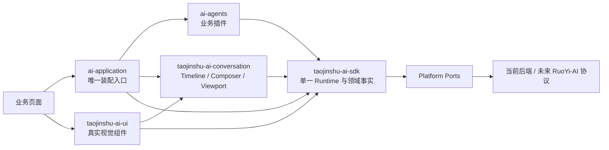

# 淘金树 AI 前端基础设施总体架构与依赖边界

> 真实聊天交互层与应用装配层的跨模块关系以
> [跨模块契约与架构决策](./01-跨模块契约与架构决策.md) 为准。该拆分不改变“单一 Agent Runtime”和“Reducer 唯一领域写入口”。

## 1. 背景与缺陷

当前前端已经具备聊天、SSE、文件、长任务和多种结果展示能力，但这些能力分散在页面、API 类型、公共组件和业务 Store 中，难以被新 Agent 稳定复用。已核验的典型问题包括：

- 消息模型存在多套角色和字段定义，页面类型与 API DTO 相互渗透。
- 流式处理集中在超长 composable 中，同时负责连接、解析、业务分支、消息拼接、错误和 UI 状态。
- 公共 Renderer 反向依赖页面组件，通用层不能独立提取。
- Geo 页面存在 `campaign.status`、`currentStep`、`activeView` 和路由参数等多份状态来源。
- 当前后端接口形态并不统一，但 Creation Assistant V2 已有 `operationId`、`sequence`、`schemaVersion`、事件持久化、重放、取消和幂等能力，可作为后端演进参考。

因此本次改造采用“新内核旁路接入、业务逐页迁移”，不在旧聊天主链路上做大规模原地重构。

## 2. 目标架构



核心约束：页面只发业务命令、读取 ViewModel、触发白名单 Intent；页面不直接解析传输流，也不直接修改 RuntimeState。

## 3. 分层边界

### 3.1 通用 SDK

SDK 只包含跨 Agent、跨平台能力：

- 通用领域：Workspace、Resource、Session、Operation、Message、Artifact。
- 协议：User Command、Runtime Command、Event、Schema、Intent。
- 内核：Decoder、Reducer、State Machine、Projector、Recovery。
- 端口：Transport、Persistence、Clock、Id、Logger、Feature、Capability。
- 平台适配：Web 与 uni-app 的传输、存储、文件和环境能力。
- 渲染数据协议：Schema Registry、RenderModel 和 UiIntent；组件 Registry 与 Intent 执行不属于 SDK。

### 3.2 业务 Agent

每个业务 Agent 位于 `src/ai-agents/<agent-name>/`，包含：

- 业务领域模型和输入校验。
- AgentDefinition、后端描述映射和能力声明。
- Legacy DTO -> v1 Command/Event/Artifact 的 Adapter。
- 业务 Artifact Schema、Projector 和平台 Renderer 注册。

Geo 的 Campaign、Audience、Creative、Report 不进入 SDK；PPT 的 Slide、Theme、Outline 同理。

### 3.3 Conversation 交互层

Conversation 负责 Session 级 Timeline 投影、Composer、草稿、消息交互与 Viewport 状态机。它不解析 SSE、不归约 Agent Event、不持久化 Runtime Snapshot，也不依赖 Vue、DOM 或 uni。

### 3.4 UI 视觉层

UI 负责真实聊天滚动容器、输入框、Message 气泡、Artifact 卡片以及 Web/uni 平台组件。UI 消费 Conversation ViewModel 和 SDK RenderModel，不拥有业务事实。

### 3.5 应用装配层

Application 负责创建 Runtime、选择平台端口、注册 Agent/Schema/Renderer、桥接身份与 Feature Flag。页面和 Pinia 通过该稳定门面接入，不成为 SDK、Conversation 或 UI 的反向依赖。

## 4. 核心决策

### ADR-001：单一 Runtime 门面

采用 `createAgentRuntime(options)` 返回单一 `AgentRuntime`。Reducer、RecoveryCoordinator、SessionManager 等保持内部可测试模块，但不要求页面手动编排。

原因：内部职责拆分可维护，对外单门面可防止生命周期、订阅和错误处理被页面重复实现。

### ADR-002：事件是事实，Reducer 是唯一写入口

所有服务端结果先解码为受信任的 `AgentEventEnvelope`，再由纯函数 Reducer 演进 `RuntimeState`。Projector 只读 State，不能回写。

禁止从 UI 直接设置“任务已完成”、从 HTTP 响应直接插入 Artifact，或让 Pinia 成为第二份领域真相。

### ADR-003：Workspace 是共享上下文边界

关系固定为：

```text
Workspace
  ├─ Resources
  └─ Sessions
       └─ Operations
            ├─ Messages
            └─ Artifacts
```

Workspace 管理跨 Session 复用的文件和上下文；Session 管理一次连续交互；Operation 管理一次执行；
是否可服务端取消、重试或恢复由创建时冻结的 AdapterCapabilities 决定。

### ADR-004：Operation 状态与阶段分离

- `status` 是稳定生命周期：`created | queued | running | waiting_user | completed | failed | cancelled | interrupted`。
- `phase` 是 Agent 定义的业务阶段，如 Geo 的 `planning | researching | synthesizing | reporting`。

State Machine 只校验 status 转移；Agent Projector 解释 phase。不能为每个业务阶段扩展 status。

### ADR-005：Command/Event 分离

- Command 表示“请求发生变化”，具备 `commandId` 和 `idempotencyKey`。
- Event 表示“已经发生的事实”，具备 `eventId`、`operationId`、`sequence` 和 `occurredAt`。
- User Command 可传输；Runtime Command 只能本地执行。

发送 `operation.cancel.request` 不等于已取消，只有消费 `operation.cancelled` 后 State 才变为 `cancelled`。

### ADR-006：Schema/Intent 驱动 UI

后端返回 `schemaName + schemaVersion + data + intents`，前端用可信 Registry 映射 Renderer。后端不得发送组件名或代码。所有 Intent 必须通过白名单执行器二次校验。

### ADR-007：Manifest 双层交集

- `AgentDescriptorDTO` 来自服务端，描述可用性、协议版本、能力和输入/输出 Schema。
- `AgentDefinition` 随前端发布，注册 Adapter、Projector、Renderer 和本地安全策略。
- 仅当两者的 agentType、版本和能力兼容时启用 Agent。

### ADR-008：跨端采用 Hexagonal Architecture

Core 不访问 `window`、DOM、`fetch`、`File`、`Blob`、`localStorage` 或 `uni`。平台差异通过端口注入。Web 和 uni-app 共享协议、Reducer、恢复算法和 conformance tests，但使用各自的 Adapter 和组件实现。

### ADR-009：Persistence 与 Cache 分离

- Persistence 保存事件、Snapshot、Workspace 元数据和恢复游标，参与正确性。
- Cache 只保存可丢弃的派生数据和预览，不能决定任务是否执行、计费或完成。

### ADR-010：Feature Flag 只冻结端口

首期提供 `FeatureProvider` 接口和稳定的求值上下文，不选择具体远程配置供应商。无 Provider 时采用本地默认值；任何 Feature Flag 都不能绕过 Authorization。

## 5. 备选方案与取舍

### 方案 A：直接重构现有聊天页面

优点是短期少建目录；缺点是旧消息模型、页面 Store 和 Renderer 依赖会继续污染新内核，回归风险最大。否决。

### 方案 B：立即建设独立 npm SDK 和 monorepo

优点是物理隔离强；缺点是当前协议尚未经过 Geo/PPT 验证，会提前承担发包、版本、构建和 uni-app 条件编译成本。暂缓。

### 方案 C：仓库内隔离 SDK + 业务插件（采用）

先在 `src/taojinshu-ai-sdk/` 建立严格依赖边界，以 Geo 和 PPT 验证；稳定后无业务改写地迁移到 `packages/taojinshu-ai-sdk/` 并发布 `@taojinshu/ai-sdk`。

## 6. 失败、重试与部分成功

- 所有协议错误归类为 `decode | validation | sequence | compatibility | transport | persistence | authorization | renderer`。
- 只有显式标记为可重试的错误允许自动重试，并采用指数退避和最大次数。
- Operation 可以 `failed`，同时保留已完成的 Artifact；Artifact 各自拥有 status，支持部分成功。
- 重试默认创建新 Operation，并通过 `retryOfOperationId` 建立关系；只有同一连接恢复才继续原 Operation。
- 重放时按 `(operationId, sequence)` 去重；同序列不同 eventId 视为协议冲突并停止投影。

## 7. 版本与兼容策略

独立版本维度：

- SDK SemVer。
- Command/Event `schemaVersion`。
- Agent Manifest `manifestVersion`。
- Artifact Schema `schemaVersion`。

v1 规则：同一 major 内允许新增可选字段和新事件；删除字段、改变语义、改变状态转移或复用既有 event type 均要求升 major。未知事件默认持久化并忽略投影；未知 critical 事件必须停止 Operation 并提示升级。

## 8. 后续提取条件

满足以下条件后才迁移到独立包：

- Geo 和 PPT 两个不同领域通过相同 Core 接入。
- Web 与至少一个 uni-app 目标通过同一 conformance suite。
- SDK 对 `@/pages`、业务 API、Element Plus、Router、Pinia 业务 Store 的依赖扫描为零。
- 公共 API 已连续两个迭代无破坏性变化。
- 文档注释、API Extract、版本兼容和恢复测试成为 CI 门禁。

## 9. ADR-011：Conversation Kit 不是第二个 Runtime

新增 `src/taojinshu-ai-conversation/`，负责 Session 级时间线投影、Composer 状态、草稿、消息交互和 Viewport 状态机。它只消费 `AgentRuntime` 的只读状态和命令门面，不拥有 Transport、Event Decoder、Operation Reducer、Snapshot 或服务端恢复。

`ConversationViewModel` 在 v1 以现有 `SessionId` 为键，不额外引入持久化 `ConversationId`。这与当前路由、Store 和 RuoYi-AI 接口一致，并避免迁移期出现两个语义重叠的 ID。

## 10. ADR-012：Application Composition Root

新增 `src/ai-application/` 作为唯一装配入口，负责创建 Runtime、选择平台端口、注册 Agent/Schema/Renderer、读取用户身份和 Feature Flag。页面不得直接创建 Runtime 或选择 Legacy/v1 Adapter。
