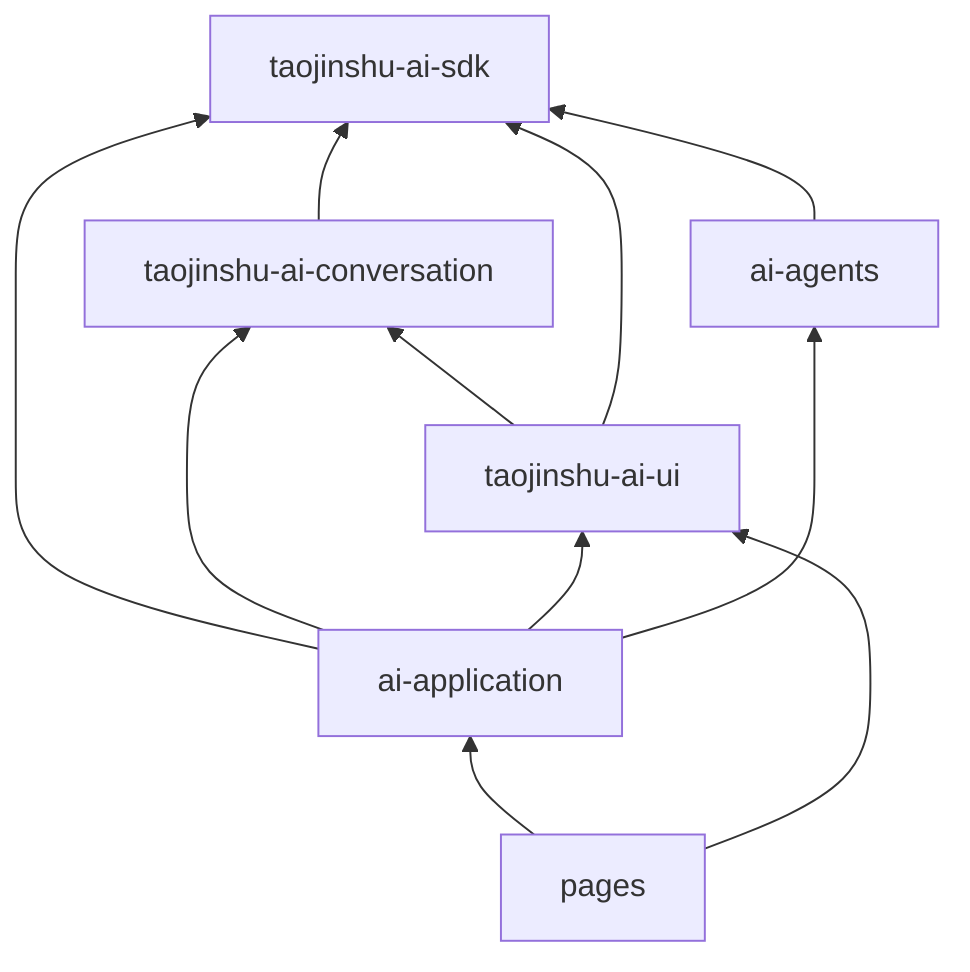

# 跨模块契约与架构决策

## 1. 对外部评审的决策

| 评审意见 | 决策 | 原因与落地方式 |
| --- | --- | --- |
| 增加 Conversation Layer | 采纳 | 当前滚动、Composer、消息交互散落在页面，确需无视觉交互层 |
| Conversation 作为第二 Runtime | 拒绝 | 会与 Agent Runtime 重复处理流、Reducer、恢复和状态真相 |
| 增加 ConversationProjector | 采纳 | 将 Operation、Message、Tool、Artifact 投影为有序 Timeline |
| 增加 Composer Controller | 采纳 | 草稿、IME、资源引用、提交和停止需要跨端可测试逻辑 |
| 增加 Viewport State Machine | 采纳 | 当前 DOM 阈值和定时器无法稳定处理流式、历史加载和恢复 |
| Message Domain 保留在 SDK | 采纳 | Message 是 Agent 事实；展开、未读和动画属于 Conversation ViewState |
| Artifact/Intent 缺失 | 不成立 | v1 文档已将其放入 SDK Domain 与 Schema/Intent 协议 |
| 新增持久化 Conversation 实体 | v1 后置 | 当前前后端均以 Session 表示聊天，新增双 ID 会制造迁移债 |
| Feature Flag、多 Agent 树一次做完 | 后置 | 首期只冻结接口，先完成 Geo 最小闭环 |

## 2. 最终物理分区

```text
src/taojinshu-ai-sdk/                    / Agent 事实、协议、Reducer、Runtime 和恢复内核
src/taojinshu-ai-conversation/           / 无 Vue、无 DOM 的 Session 级聊天交互状态层
src/taojinshu-ai-ui/                     / Web 与 uni-app 的真实视觉组件
src/ai-agents/                           / Geo、PPT、数字人等业务 Domain、Adapter 和 Renderer
src/ai-application/                      / 所有模块的唯一创建、注册、配置和灰度装配入口
src/pages/                               / 路由、页面布局和产品流程
```

## 3. 依赖方向



禁止 `sdk -> conversation`、`sdk -> ui`、`conversation -> ui`、`conversation -> pages`、`ui -> pages`。业务 Agent Core 只依赖 SDK；业务 Renderer 可以依赖 UI 的公开契约，但 UI 不反向依赖具体 Agent。

## 4. 跨模块公共契约

| 生产方 | 消费方 | 唯一交换对象 | 禁止越界对象 |
| --- | --- | --- | --- |
| SDK | Conversation | `ReadonlyRuntimeState`、`AgentRuntime` 命令门面、基础 ViewModel | Transport 实现、Repository、Reducer 私有结构 |
| SDK | UI | `RenderModel`、`UiIntent`、通用 Message/Artifact 只读类型 | Event payload、未校验 Schema data |
| Conversation | UI | `ConversationViewModel`、`ComposerController`、`ViewportController` | Runtime Event、DOM 节点、平台 API |
| Agent | Application | `AgentDefinition`、业务 Schema、业务 Projector、RendererDefinition | 页面实例、Router、Pinia Store |
| Application | Pages | `AiApplication`、Feature Facade、模块 ViewModel | Adapter 构造器、Registry 可写实例、Repository |
| UI | Pages | 组件 Props/Emits/Slots 与受控 Intent 事件 | 页面路由逻辑、业务 API |

各模块的完整目录和 API 由各自规范维护：

- [SDK 规范](./sdk/README.md)
- [Conversation 规范](./conversation/README.md)
- [UI 规范](./ui/README.md)
- [Application 规范](./application/README.md)
- [Geo Agent 规范](./agents/geo-ad/README.md)

## 5. Session 与 Conversation 的 v1 语义

- SDK 的 `AgentSession` 是后端和 Runtime 的会话事实。
- Conversation Layer 的 `ConversationViewModel` 是同一 Session 的聊天时间线投影。
- v1 使用 `SessionId` 作为 ViewModel key，不建立第二份持久化 Conversation ID。
- Workspace 可以包含多个 Session；非聊天 Agent 可创建没有 Timeline UI 的 Session/Operation。
- 当真实需求出现“一条前端 Conversation 聚合多个后端 Session”时，再通过新 ADR 增加映射实体。

## 6. Message 所有权

SDK 保存 Agent 事实：Message、MessageContentBlock、Resource 引用、ToolCall 引用、Artifact 引用、状态和事件序列。Conversation 只保存可丢弃的交互状态：展开、已读、选择、动画、草稿和滚动锚点。

ToolCall、Artifact 和 Resource 不复制进 Message；MessageContentBlock 只保存引用，ConversationProjector 在同一 RuntimeState 快照中联结为 TimelineItem。

## 7. Application Composition Root

`src/ai-application/` 是唯一装配入口。页面只获取 `AiApplication`，不得 new Adapter、直接调用
`createAgentRuntime()`、选择 Legacy/v1 Transport 或读取 EventRepository。其文件结构、创建顺序、
账号切换和销毁规则以 [Application 规范](./application/README.md) 为唯一真源。

## 8. 多人施工原则

1. 每个工作包拥有独立目录、接口、Fixture 和测试命令。
2. 上游先合并接口和 Fake，不要求下游等待真实实现。
3. 下游只依赖上游公共 `index.ts`，禁止深层导入。
4. 每个工作包由开发负责人和测试负责人分别签收。
5. 集成负责人只处理装配与冲突，不替模块补单测。
6. SDK/Conversation/UI/Agent 所有文件、字段和方法继续执行完整中文 TSDoc 门禁。
