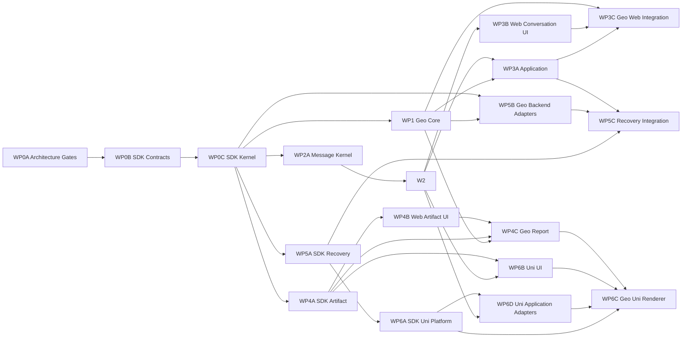

# 模块化施工拆包与交接矩阵

## 1. 拆包目的

WP0–WP6 描述端到端实施顺序；本文件把其中跨模块任务拆成可由不同 Developer 和 QA 独立签收的子工作流。一个人员可以承担多个子工作流，但一次提交不得混合两个模块的私有目录。

## 2. 子工作流

| 子工作流 | 唯一源码范围 | 对应详细任务 | 开发签收 | 测试签收 |
| --- | --- | --- | --- | --- |
| WP0A-Architecture-Gates | 测试配置、`scripts/check-ai-*.mjs` 与浏览器底座 | WP0 Task 1 | DEV-WP0A | QA-WP0A |
| WP0B-SDK-Contracts | `src/taojinshu-ai-sdk/core/{contracts,domain,protocol}/**` | WP0 Task 2 与 Contract PR | DEV-WP0 | QA-WP0 |
| WP0C-SDK-Kernel | `src/taojinshu-ai-sdk/core/{runtime,reducer,state-machine,ports,errors,projector}/**` | WP0 Task 3–5 | DEV-WP0 | QA-WP0 |
| WP1-Geo-Core | `src/ai-agents/geo-ad/{domain,definition,testing}/**`、Mock Adapter | WP1 Task 1–2 | DEV-WP1 | QA-WP1 |
| WP2-Conversation | `src/taojinshu-ai-conversation/**` | WP2 Task 1–5 | DEV-WP2 | QA-WP2 |
| WP2A-Message-Kernel | SDK Message/Event/Reducer 与 Chat Legacy Adapter | WP2A Task 1–4 | DEV-MESSAGE | QA-MESSAGE |
| WP3A-Application | `src/ai-application/**` | WP3 Task 1；WP1 Task 3 的 Facade | DEV-WP3A | QA-WP3A |
| WP3B-Web-Conversation-UI | `src/taojinshu-ai-ui/web/{chat,message,composer}/**` | WP3 Task 2–4 | DEV-WP3B | QA-WP3B |
| WP3C-Geo-Web-Integration | `src/pages/chat/geoAdDelivery/**` 中的新接入点 | WP1 Task 4；WP3 Task 5 | DEV-WP3C | QA-WP3C |
| WP4A-SDK-Artifact | SDK Artifact 状态机、Schema/Intent/RenderModel | WP4 Task 1 与 Task 2 的 SDK 文件 | DEV-WP4A | QA-WP4A |
| WP4B-Web-Artifact-UI | `src/taojinshu-ai-ui/contracts/**`、`web/artifact/**` | WP4 Task 2 的 UI 文件 | DEV-WP4B | QA-WP4B |
| WP4C-Geo-Report | Geo report Schema、Web Renderer 和页面替换点 | WP4 Task 3 | DEV-WP4C | QA-WP4C |
| WP5A-SDK-Recovery | SDK Persistence、Web Persistence、Recovery | WP5 Task 1–2 | DEV-WP5A | QA-WP5A |
| WP5B-Geo-Backend-Adapters | Geo Legacy/v1 DTO 与 Adapter | WP5 Task 3 | DEV-WP5B | QA-WP5B |
| WP5C-Recovery-Integration | Application owner 生命周期和 Geo 刷新恢复 | WP5 Task 4 | DEV-WP5C | QA-WP5C |
| WP6A-SDK-Uni-Platform | `src/taojinshu-ai-sdk/platform/uni/**` | WP6 Task 1–2 | DEV-WP6A | QA-WP6A |
| WP6B-Uni-UI | `src/taojinshu-ai-ui/uni/**` | WP6 Task 3 的通用 UI 文件 | DEV-WP6B | QA-WP6B |
| WP6C-Geo-Uni-Renderer | Geo uni Renderer 与消费工程接入 | WP6 Task 3 的 Geo 文件、Task 4 | DEV-WP6C | QA-WP6C |
| WP6D-Uni-Application-Adapters | `src/ai-application/platform/*uni*` | WP6 Task 2 的草稿与装配文件 | DEV-WP6D | QA-WP6D |

## 3. 依赖与可并行关系



`design-v1.1-frozen` 后只有 WP0A/WP0B 可以施工；`contract-v1.1-frozen` 后 WP0C 开始。
WP0C 完成后 WP1、WP2A、WP4A、WP5A 可并行，WP2 必须等待 WP2A；WP3B 只等待
Message/Conversation 公共 API，WP4B 只等待 Render Contract。页面集成和真机验收留在依赖链末端。

## 4. 模块交接包

每个子工作流交接时必须提供：

1. 根 `index.ts` 或平台子入口公开 API 清单。
2. 完整中文 TSDoc 门禁报告。
3. 正常、失败、取消、重复、乱序和降级场景中适用的 Fixture。
4. 单元测试命令、黑盒测试命令和最后一次通过输出。
5. 已知限制、兼容版本和回滚开关。
6. 禁止消费的内部目录清单。

下游只能依赖交接包的公开入口和 Fixture，不得等待或读取上游私有实现。

WP0A 必须在其他模块提交源码前提供以下独立命令：

```bash
pnpm check:ai-sdk-docs
pnpm check:ai-conversation-docs
pnpm check:ai-ui-docs
pnpm check:ai-application-docs
pnpm check:ai-agents-docs
pnpm check:ai-boundaries
```

各注释命令只扫描自己的源码目录；统一边界命令读取模块白名单并检查所有静态 import 和动态 import。

## 5. 独立测试范围

| QA | 黑盒入口 | 不允许作为断言依据的实现细节 |
| --- | --- | --- |
| QA-WP0 | Command、Event、Runtime、Reducer 公共 API | Reducer 内部分支与私有 Map 结构 |
| QA-WP1 | AgentDefinition、Geo Projector、Adapter conformance | 页面 DOM 与 Pinia 内部字段 |
| QA-WP2 | ConversationController、ComposerController、ViewportController | Vue 组件和真实 DOM |
| QA-WP3A | AiApplication 与 GeoResearchFacade | Registry 私有集合、Adapter 构造顺序 |
| QA-WP3B | Web 组件 Props/Emits/Slots、键盘和滚动行为 | SDK Event 类型和业务 API |
| QA-WP4A | Schema/Intent/Artifact 公共协议 | 具体卡片 CSS 和业务 Schema 字段 |
| QA-WP4B | ArtifactCard、UnsupportedArtifact | Geo 报告内容和后端 DTO |
| QA-WP5A | Persistence conformance、RecoveryCoordinator | Geo 页面和 Legacy DTO |
| QA-WP6A | Uni Port conformance | uni UI 节点结构 |
| QA-WP6B | 跨端语义 Fixture、真机交互 | Web DOM 实现 |
| QA-WP6D | uni Application Adapter、草稿隔离和装配 | SDK/Conversation 私有实现 |

跨模块剧本仍由 [QA 测试责任矩阵](./QA-测试责任矩阵.md) 的集成负责人执行，不能替代模块 QA 签收。

## 6. 提交与合并规则

- Contract PR 先于 Implementation PR，且只包含签名、Fixture、失败测试和文档。
- 每个提交只触碰一个子工作流的私有源码；跨模块接线由 WP3C、WP5C 或 WP6C 提交。
- Agent 业务 Renderer 可以依赖 UI 公共契约，但必须放在 Agent Renderer 目录，由业务 QA 签收。
- SDK 只允许 `core/protocol/schema/render-model.ts` 等平台无关数据契约；组件 Registry 属于 UI contracts，禁止 SDK 出现 `.vue`、DOM 或 uni 组件。
- 公共 API 发生破坏性变化时，暂停所有下游合并，先更新 ADR、Fixture 和消费者测试。
